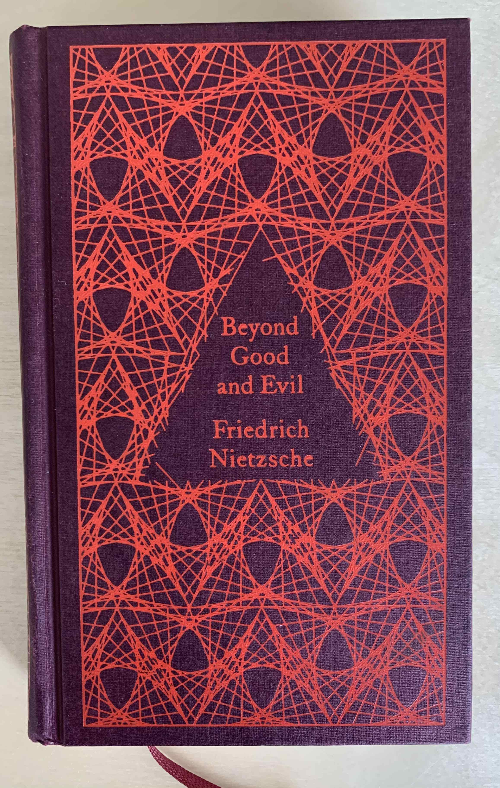

# Review

> "A nihilist is a man who judges that the real world ought not to be and that
> the world as it ought to do not exist. According to this view, our existence
> (action, suffering, willing, feeling) has no meaning: this 'in vain' is the
> nihilists' pathos—an inconsistency on the part of the nihilists." - Friedrich
> Nietzsche.

## On the author

 Nietzsche has a reputation for being a depressive nihilist. This does not seem
 to translate into what I've grasped from his ideas in this book. This general
 thinking comes about from the fact that he suffered from ill for most of his
 life (sick child, war-induced body damages, diseased adult life), and because
 of that, it seems tempting to create a connection between his painful life and
 his 'way too' critical philosophy, therefore labelling it pessimist and/or
 nihilist. However, this seems to be a much flawed statement, given that he
 criticised the nihilist point of view several times - as in the excerpt above -
 and he also, for many times, argued against Schopenhauer's pessimism.

Some critics will elaborate more about the wrong reputation attributed to
Nietzsche, but one thing that stood out to my attention after reading some
reviews, is the common statement that just like Machiavelli is misinterpreted,
so is Nietzsche in the sense that their observations of the way nature and
society come to be, are mistaken for recommendations of how nature and society
should be.

## On reading this book

This book - and translation - is very impenetrable. The text is written in a
form of dramatic conversation. Nietzsche's ideas go far and then come back
again after an exhaustive description and subsequent changes of context that
don't necessary add much to the central topics, but on the contrary, often come
as a bag of words.

Many people on the internet say that you've got to think like Nietzsche (I'd
rather not, actually), without explaining what "thinking like Nietzsche"
entitles. But enough of this; some people will be more prepared to read this
book if they are keen to embrace all the different nuances hidden in the text,
or if they simply, like Nietzsche, have high appreciation for the art of
writing and will therefore enjoy the style of the text in addition to the idea
transmitted in it.

## On the content

Some claims in this book are very ridiculous to start with. The opening phrase
in the book is:"Supposing truth to be a woman..." this sets the tone of what I
meant by 'ridiculous'. It might catch you out of guard, but the book does not
go on sexualising philosophy, but it does bring very misogynist ideas instead.

On another subject, the explanation of (or the lack thereof), master-slave
morality did nothing to convince me of his ideas and takes on morality. The
rants against democracy and socialism also did not make me buy the idea of
'herd mentality' altogether, even though I do agree with those respects in a
marginal level and was somehow prepared to accept it if presented by a sound
argument. On top of that, the criticism against Christianity isn't
spectacularly novel (even at those times), and also one-sided. I do understand
the feeling of 'revenge' against the establishment (Christendom) that many
philosophers had back then (and still have today), for burning books with the
most valuable knowledge after being categorised as heresies. However, I do not
think that there were sound arguments against much of the Christendom regime in
this book, and I do not get why Nietzsche is considers by much as an iconic
atheist.

On the bright side, some of his maxims were interestingly valuable: "Who has
not for the sake of his reputation sacrificed himself?" and the book also
presented interesting critiques against Stoicism that I never thought or heard
of, and other critiques around old philosophers being dogmatic were also
interesting. It is worth nothing, though, that many arguments used to get to
those critiques are obscure and boring, and overall life is too short for
obscurantism.
