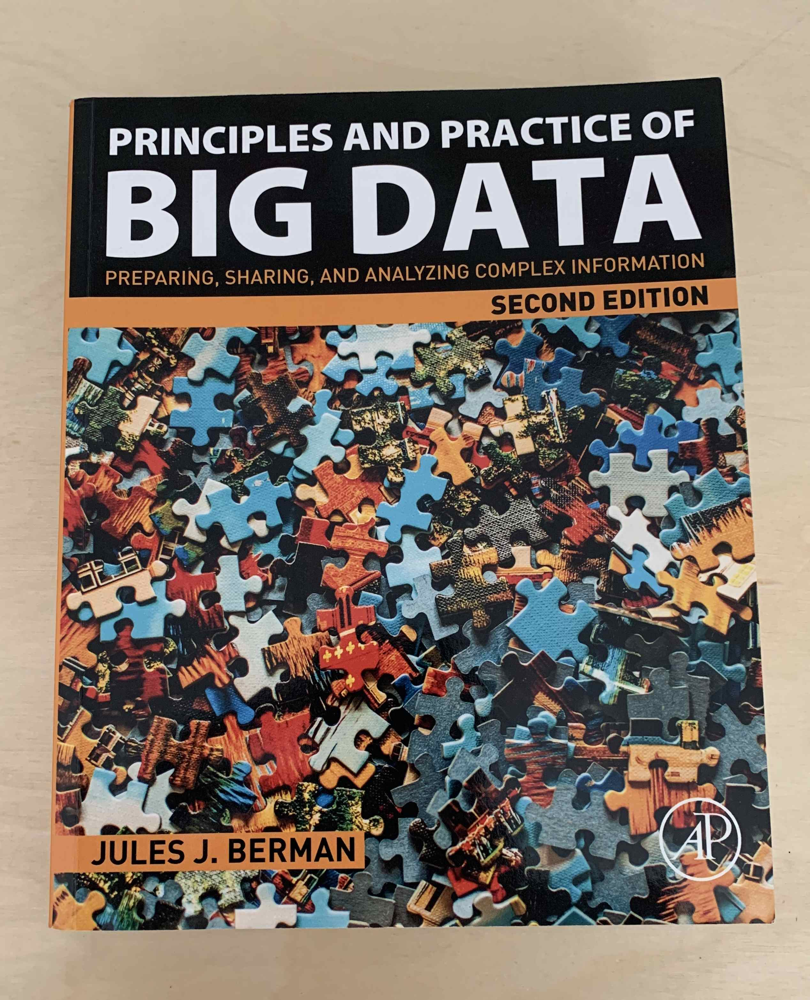

# Review

## The Author

There are many so called "technical" books being published nowadays. Perhaps
more than there should be. One of the best ways to start filtering out books
that are worth attention from the ones that aren't, is by looking into who the
author is and what kind of experience is offered to the reader. Without further
due, let's get to it.

From the book's cover excerpt:

> "Jules J.Berman holds two Bachelor of Science degrees from MIT (Mathematics and
> Earth and Planetary Sciences), a PhD from Temple University, and an MD from the
> university of Miami. (...) In 1998, he transferred to the US National
> Institutes of Health as a medical officer and as the program director for
> pathology informatics in the Cancer Diagnosis Program at the National Cancer
> Institute (...)"

 This biography raised my concern. I thought either this book would have a big
 focus on bio-medicine computing, or the publisher messed up and copied the
 biography from a medicine book writer instead.

Nope. That was all correct.

## Why did I proceed reading this book?

This book was selected as "essential reading" for a Master's module I was
studying at the time called "Big Data, challenges and opportunities". I am not
sure I would ever have found this book otherwise.

## Analysis of the content

 The book is rather basic. Each chapter usually starts with some introduction
 and theory for the main topics, then goes towards the author writing about his
 personal experiences - also related to those topics - and finishes by
 presenting a couple of case studies.

One thing that made me interested out of the gate was the fact that those study
cases were mostly presented through Python code. That only made sense to me. I
wanted to learn big data, and I wanted to use the most used language in
practice. Perfect combo.

But to my disappointment, the Python study cases were, again, rather basic.
These study cases were mostly short, and some times I struggled to understand
why they were being presented within a chapter that somehow seemed disconnected
from the study itself. Or maybe the study was disconnected from the chapter?
Who knows.

This leaves us with the theory and the author's personal experiences.

The rest of the content wasn't much computer science related. Not enough for me
in any case. The author didn't present much of the science behind Big Data, but
rather, focused on the subject from a management and conceptual point of view.
Excusing himself by repeatedly saying that Big Data isn't a well defined area,
and therefore it is very hard to provide much directed content. Those topics
(management and concepts) are really important, but without presenting a few
state-of-the-art ideas and implementations of Big Data architectures, along
with the paradigms that come from the later, the content is deficient and not
much distinct from a book in ordinary database systems.

## What did I take from this book?

- Always spend time studying your application before you get your hands dirty.
- Work hard to normalise your database as an unormalised database is not
  sustainable in any scenario.
- Make sure your data is immutable. Always.
- Big Data is a loose concept and you should be suspicious of any gurus who
  claim to have figured it out.
