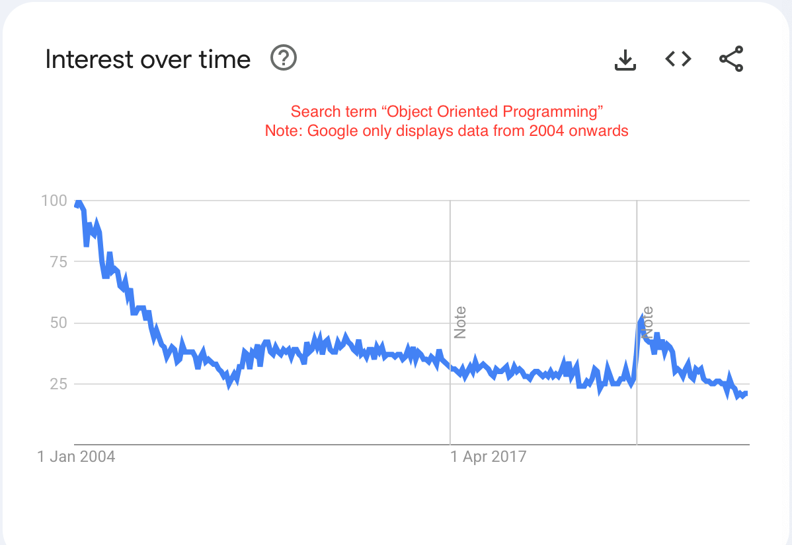
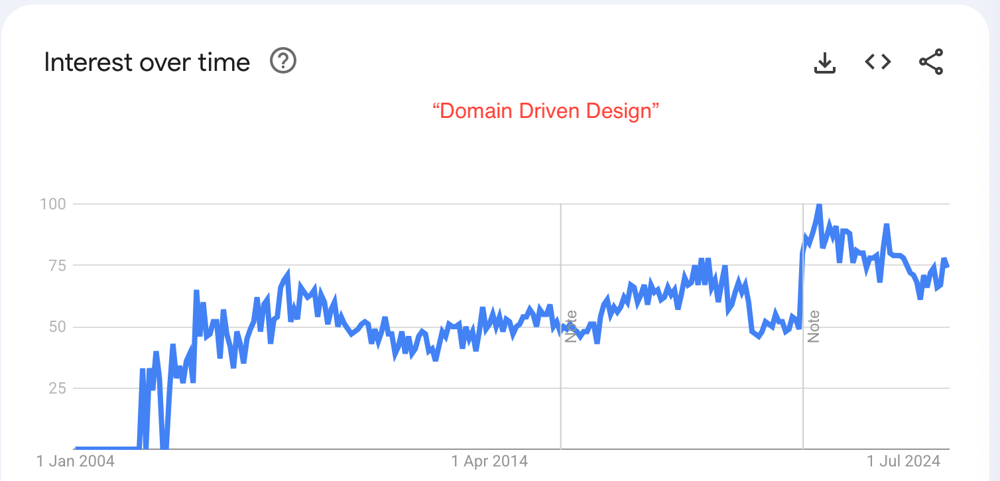

# Domain Driven Design Book Review

```
Created at: 2025-08-17
```

Eric Evan's book, published in 2003, has an emphasis on using OOP as the
spawning ground for the Domain Driven Design (DDD) technique. Naturally, this
book managed to benefit a lot from the OOP spike in popularity from the early
2000's.



But the popularity of the DDD pattern hasn't subdued as OOP became less
in demand. At the time I write this review this book is the #1 best seller on
the "Object-Oriented Software Design Textbooks" on Amazon which includes other
famous books like "Refactoring" by Martin Fowler and "Design Patterns" by the
Gang of Four.

The term "Domain Driven Design" has also been steadily rising on Google trends.



To me, this popularity meant the book would be an interesting read regardless,
because it would either:

1. Be a good book, which is worth reading by itself.
2. Be either bad or "okay", which is still worth reading for understanding the
   historical context and the appeal the book has to other developers and, more
   generally, to the industry.

I should say that the biggest reason why I decided to read this book was
because in 2021 I started working on a large codebase that loosely used DDD
and this book was highly recommended internally. Therefore my experience with
DDD precedes the reading of this book.

I should also say that it's rare to find a great Computer Science book, and
even then no book is perfect, specially when it comes to subjective topics like
Software Architecture.

My perspective on this book is that most of it falls into "not that great"
category due to having many points of disagreement with my own vision of what
good architecture is. But there are some gems to be found regardless of whether
you take the author's advice fully or not.

Here are some of the criticisms I have about this book.

## Disregard For Performance

One of the core elements of the DDD pattern is the concept of "Aggregates".

An Aggregate is a collection of objects that compose a single conceptual unit
of the domain they model. One example (similar to what's shown in the book) is
of an "Order" entity which is the root of an Aggregate which contains several
other objects, such as: line items, parts, prices, etc.

Aggregates can grow wildly depending on the complexity of the domain. You may
end up managing a huge bush of thousands of objects in a single Aggregate
(imagine a really big Order here). In these scenarios you run significant risks
of Phantom Reads, Late-write-wins, and Non-repetable reads. All those can
either happen against the root entity of the aggregate, or any of the
Aggregate's leaves. The bigger the Aggregate and the longer it lives, the
higher are the chances of operating on stale data.

These problems can arise from having competing Aggregates for the same root
being instantiated in parallel requests, all carrying through thousands of
other entities with them when operations are performed.

You can prevent some (but not all) of these issues with techniques such as:

- Acquiring advisory locks every time you do something significant with the
  Aggregate (like a db write) against one or more entities in the Aggregate.
- Using a Serializable isolation-level for such transactions.

Both of these come at the cost of performance and at the cost of having to
analyse with a fine-teeth comb which operations require such treatment.

Another author in the DDD world (Vaughn Vernon) points towards making
Aggregates smaller, which isn't always feasible but does not address some of
the issues above fully. Another author (Vladik Khononov) suggests lazy loading
the data that composes an Aggregate, but this implies having less control of
when the underlying SQL queries will be fired, and by design, requires firing
multiple queries to fetch the data for the aggregate instead of having one fast
and optimised JOIN-based query.

I also personally think that the implementation of lazy-load queries can be
quite confusing for other readers going through the code or for reproducing
bugs - i.e., if you don't know when the query is going to be hit, you don't
know when underlying data fetched by the query changed in the between and how
stale parts of your current Aggregate are in comparison.

Another approach mentioned in the book is "denormalisation". The author refers
to this approach on the example at the end of Chapter 5, where he says that it
might be useful to store information about Value Objects in the Entity table
that uses it.

Simply performing denomarlisation on a table does not necessarily help to
improve overall performance. The way this is presented in the book is also not
very helpful, as it does not provide nuance nor resources to learn more about
**when** to do denormalisation on a DDD Aggregate.

In many cases, denormalisation ends up being worse for performance. For
example, you might have an Entity that is the root of many different Aggregates
(as it happens often in complex systems), to denormalise a Value Object for a
particular Aggregate and store it in the Entity table, *even when many Aggregates won't use that data*,
means that **all SQL queries** against that table that don't require that data
**will have to read more buffers** to satisfy their query results. Reading more
buffers means more potential slow disk access. That happens because the page
entries are wider now with data that is not useful for queries other than the
Aggregate that requires it.

The cases where denormalisation works are for Entity tables that rarely are the
root of many Aggregates and where the use cases for that table require (mostly)
the same data. However, in a real application root Entities get queried in
many different ways and require different SELECT columns at different points,
so this technique does not work there.

### Repositories

A similar performance problem happens to Repositories, which can become a
source of N+1 queries.

In DDD, a Repository will be your Abstraction layer between the application
data and the database.

All querying for a domain must pass through the Repository of a particular
domain.

If you have operations that cross through many domains, we are talking about
querying Repositories in each of those domains, and performing some sort of
assemblage of their data for your operation on the application code.

An SQL query that could've been a JOINed query, now becomes multiple
application calls to Repository classes. Some times complex loops are involved
in the operation and induce the propagation of N+1 queries.

Repositories can't be joined unless you have an intermediate Query Builder
layer to join queries from multiple Repositories together. However, this is
basically reinventing SQL JOINs, which is quite complicated to recreate and
defeats the purpose of using Repositories in the first place.

## The Writing Style

I found the language unnecessarily verbose for a technical book.
Here are some examples:

> Success comes in an emerging set of abstract concepts that makes sense of all
> the details. This distillation is a rigorous expression of the particular
> knowledge that has been found most relevant.

The choice of words in the first sentence isn't very fortunate, but the passive
voice along with the philosophical underlying tone in the second sentence
made me very confused reading this. Even though English is my second language
I have read more complicated books in English that still made more sense than
certain parts of this book.

> Translation blunts communication and makes knowledge crunching anaemic

As the book gets more technical towards the end, this type of writing stops
to come up. I am not the first one to criticise the language used here, another
review on the book raised this one (that I totally missed while reading the
book - perhaps I glanced over!)

> Defining objects that capture concepts of the domain seems very intuitive on
> the surface, but serious challenges are lurking in the shades of meaning.

## Conclusion

I **still** think that the book is worth a read, so that you understand the
theory and get some of the jargon of what people comment on day to day if you
work on a DDD codebase like me.

I do think the bock lacks on information about "when DDD goes wrong" and a
better care to explain performance trade-off's in an honest manner would go a
long way to make the book more useful.

I don't think that the DDD approach is actually "tackling complexity in the
heart of software" as the book suggests on its front cover. The codebase that I
work on, is still very messy, despite following most DDD best practices. In
my opinion, any other architecture would have worked just as well (or as bad).

The most important thing is to have **an** architecture visuon to make code
behave (and live) in expected places so that the large codebase can look
uniform. Whether you achieve this through DDD or by using the recommended way
of a particular framework you use as the backbone of your application does not
really seem to matter too much for me.
