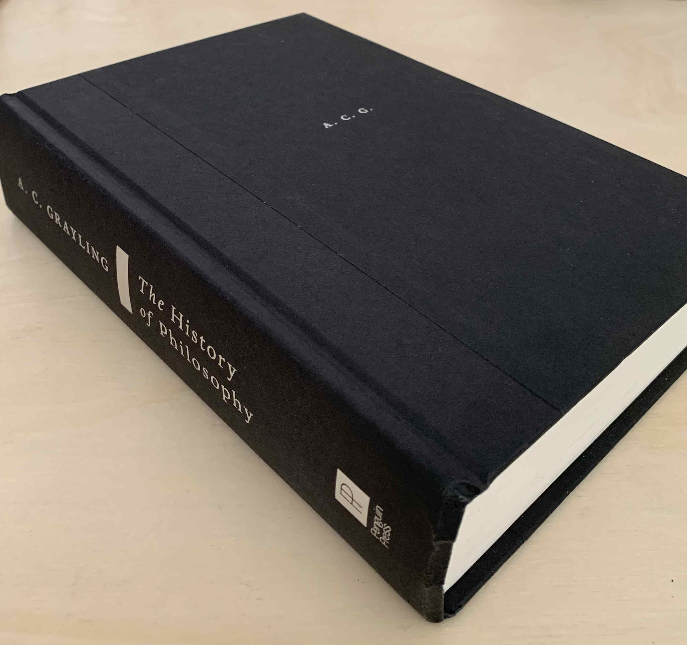

# Review

## The whole history of philosophy?!

A. C. Grayling has put considerable effort into summarising a complex and
extensive subject. He manages to answer the eminent questions that emerge from
someone starting their philosophy studies: "Where to begin? Who should I
include in my studies? How much depth of content can I afford without being
either too superficial or too detailed?"

The list of names studied in this book isn't brief. It starts from the
pre-socratics, goes through Plato, the medievals, the renascence, and finally
arrives at modern philosophy. But the book doesn't end before giving a short
overview of asian, indian, arabic, and african philosophy. It is worth noting
that a short appendix about logic is also included.

## Why?

 I decided to read this book after doing some research on books that best
 accommodate an overview of thinkers, their ideas, and their times. I ended up
 between Grayling, and Bertrand Russell's "A History of Western Philosophy". It
 isn't easy to not choose Russell. The man who wrote the incomparable
 "Principia Mathematica" couldn't have done a poor job at analysing history
 itself. So why didn't I decide to go for Russell's instead? Well, maybe I am
 going to read Russell's book at some point in the future anyway, but for now
 I was actually interested in western philosophy as well as non-western
 philosophy, therefore I had no choice but to go for Grayling.

After reading all the 600+ pages of this book, I finished it with no regrets.
The book isn't perfect, though. The style of writing is not the one that I
prefer the most. There is a lack of active voice in the text that makes
philosophical concepts - that are already hard to grasp - even more distant.
The author uses some philosophic jargon here and there without prior
introduction. Perhaps some very important concepts that evolved through the
course of history, such as "soul", "mind", and "consciousness", should be
covered in such a book, but maybe that is an unfair request, since there are
exclusively dedicated books for these subjects.

Nonetheless, the book is a great reading for the one interested in "how things
came to be" in the realm of philosophy. It also serves as a good catalogue that
comes in handy if one wants to have a high-level view of certain philosopher's
ideas, or school of thoughts.
