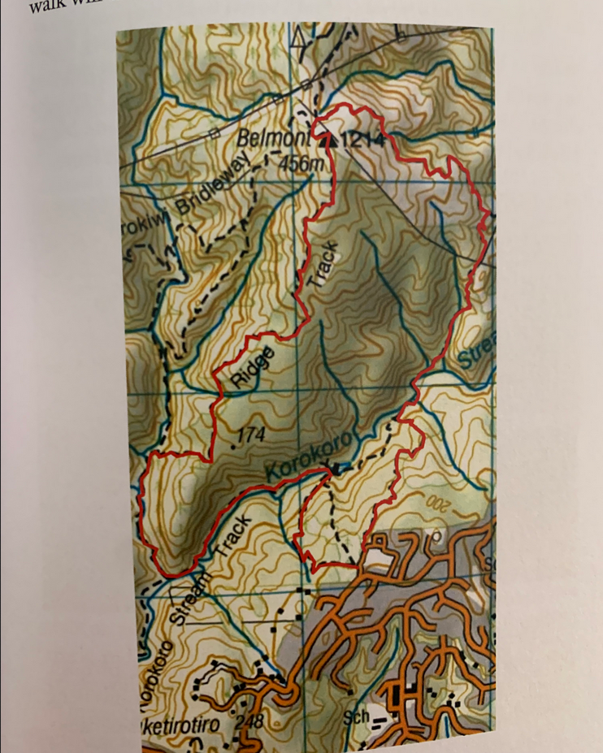
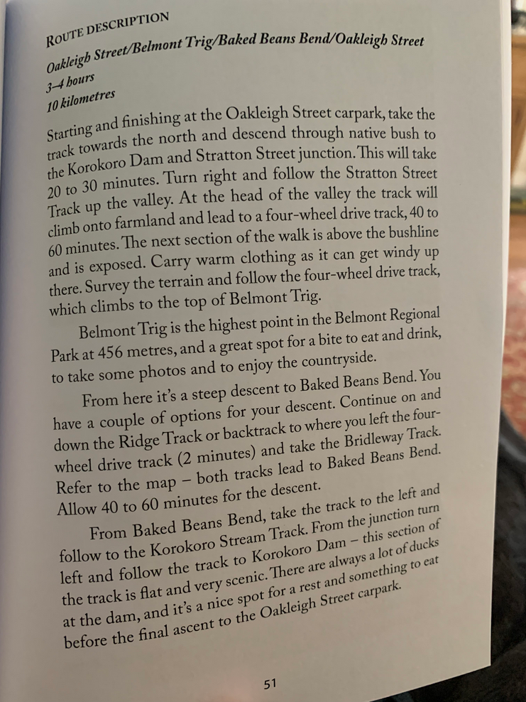
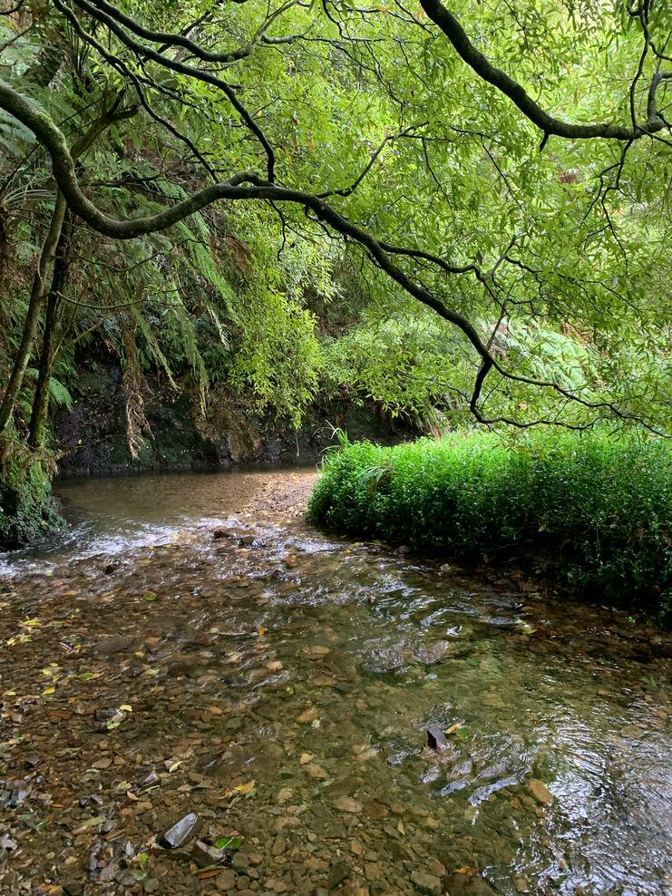
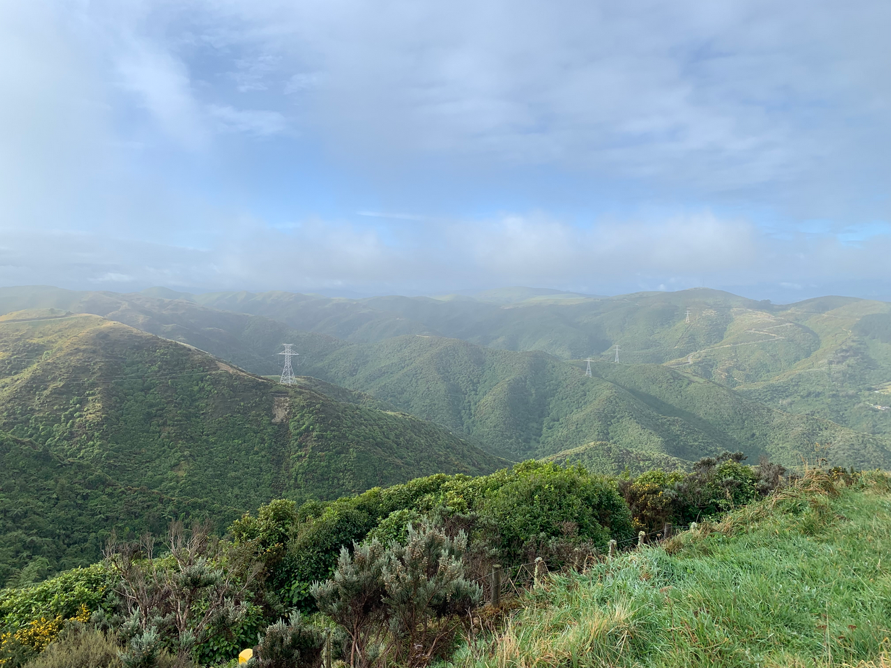
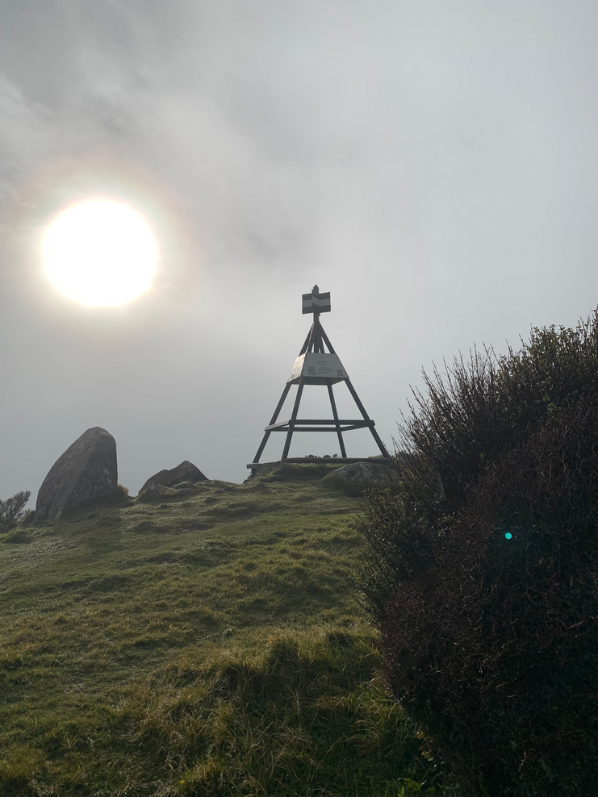
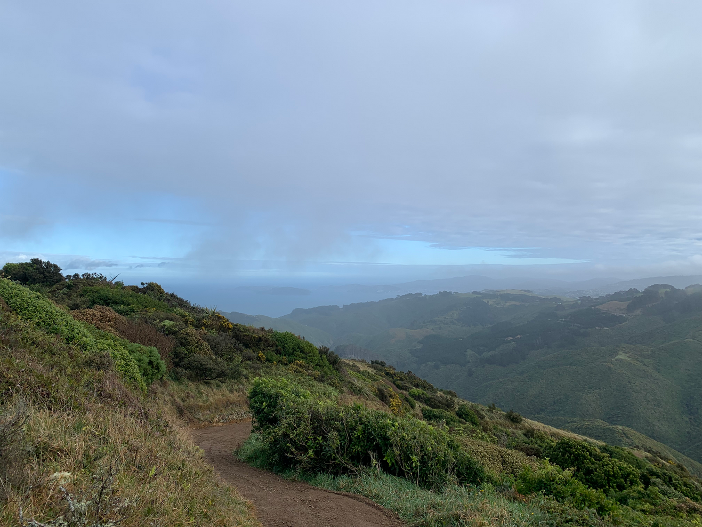
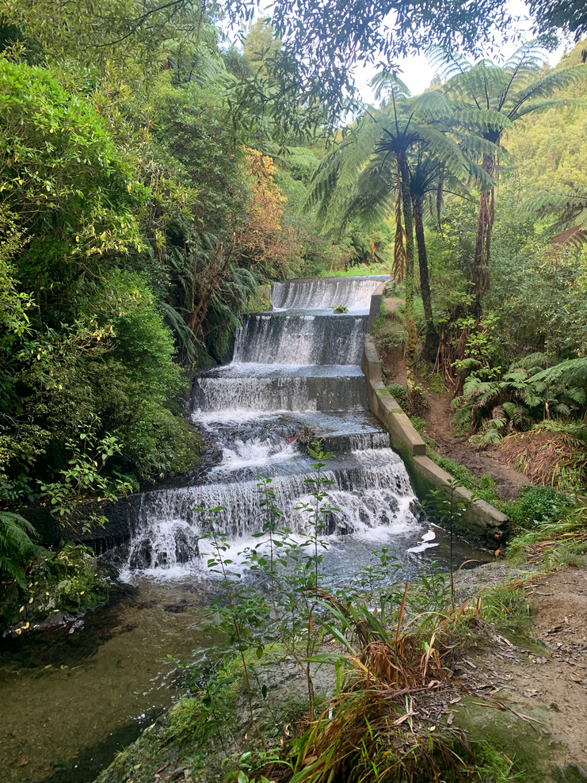

# Belmont Trig

```
Created at: 2026-05-23
```

10km loop with ~430m of elevation.




The bush is incredibly beautiful, with very old native trees.



Before reaching the peak, the track opens up and you have a great view of the valley.



Even if the day isn't that great, it is still a nice walk. I went when it was
overcast and it was still enjoyable. There wasn't much wind which made it much
easier.



After the peak, the view opens up to the ocean with stunning views of the city and the harbour. Somes island is also visible.



The small dam is the last attraction before coming back to the carpark.


