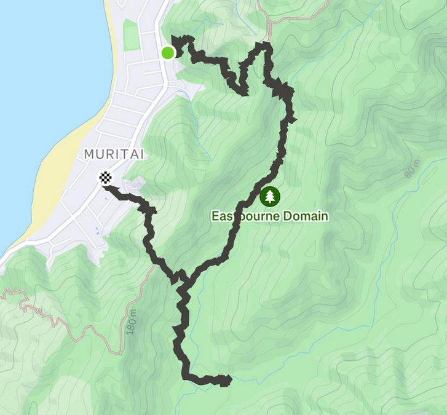
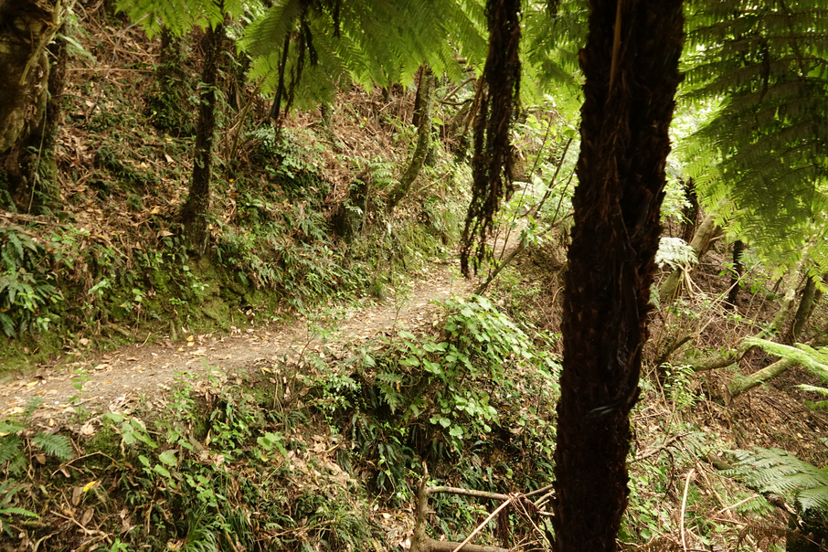
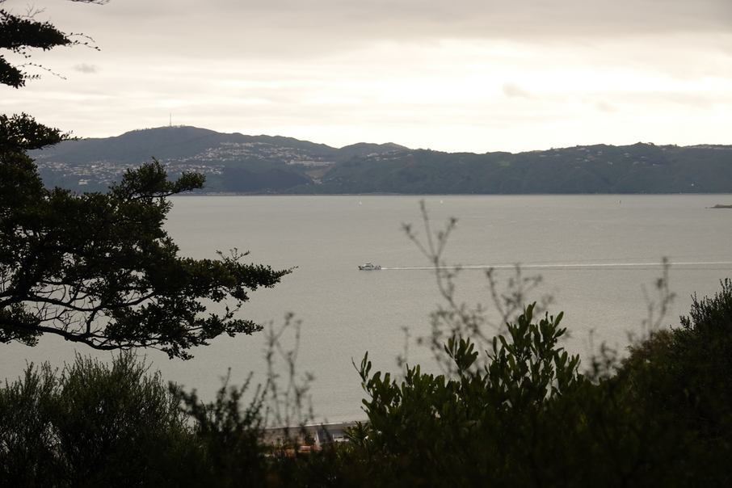
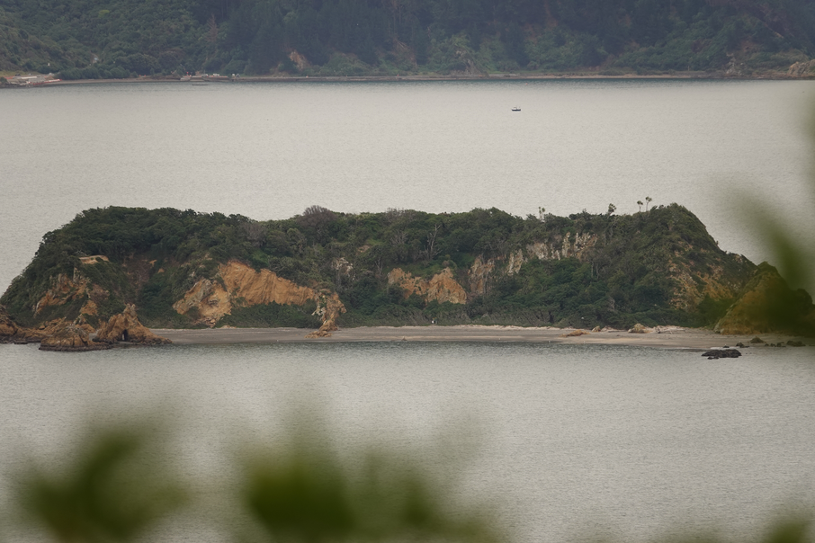
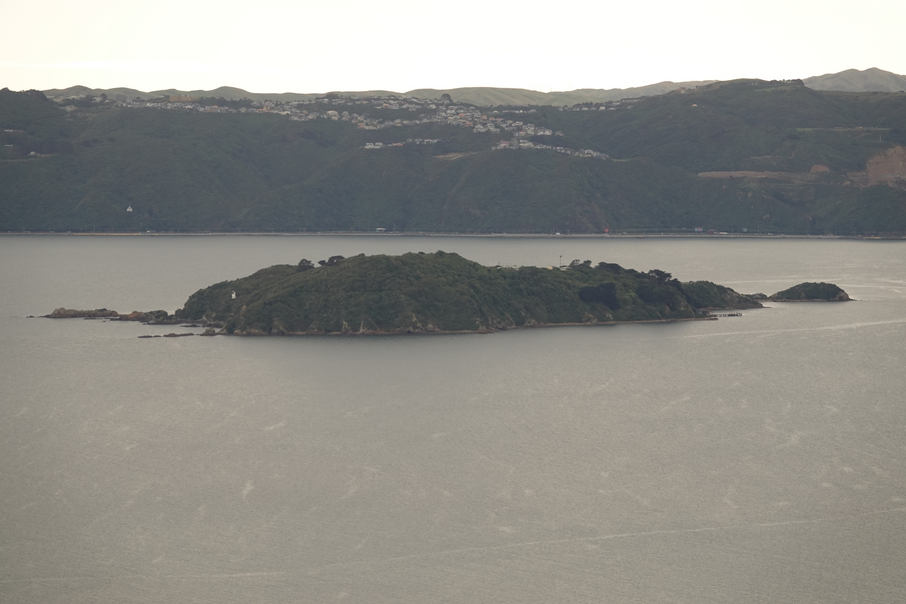
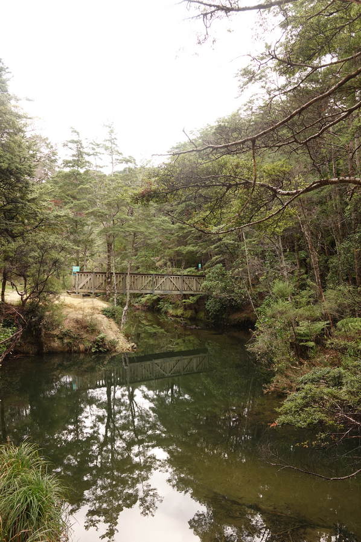
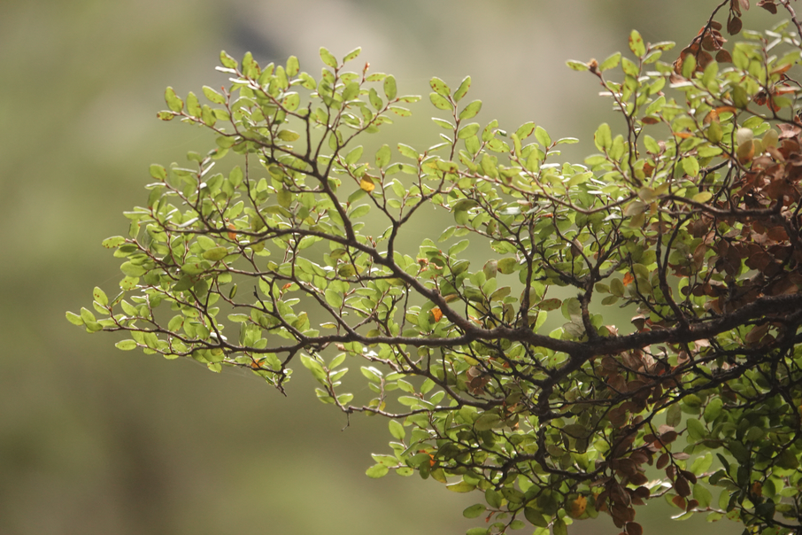
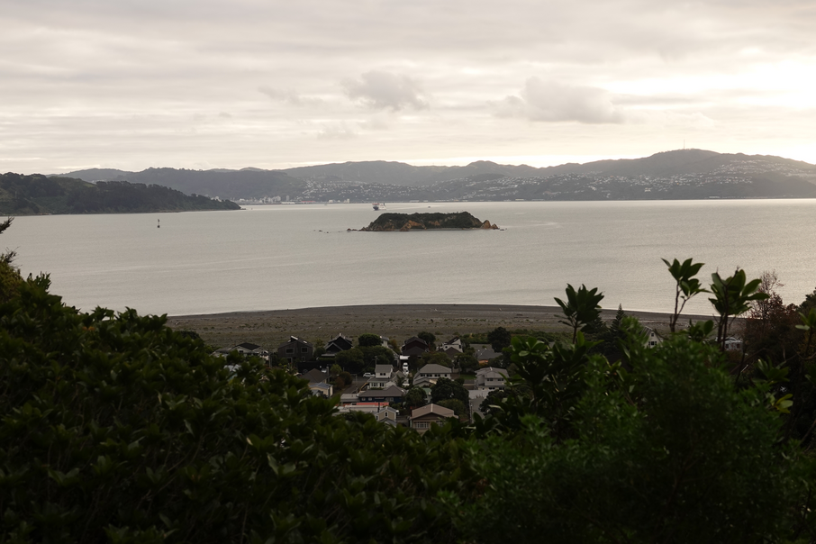

# Butterfly Creek

```
Created at: 2026-05-17
```



- Start from the Muritai Park Track so that the incline isn't as steep.
- 7.5km w/ 350m of elevation gain.
- The camping area is worth visiting (it doesn't connect to anything) it is a short detour.

## Photos



The beginning of the track (Muritai Park)



First view of the beach after the initial climb.



Makaro / Ward Island.



Somes Island



Picnic area



Beech tree



Last view of the track
