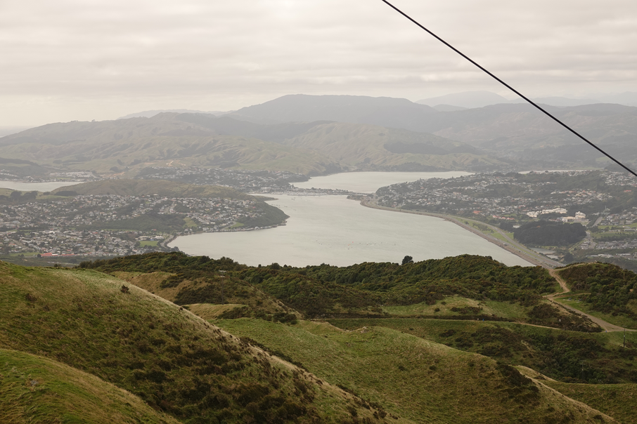
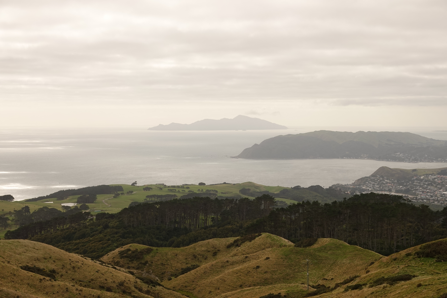
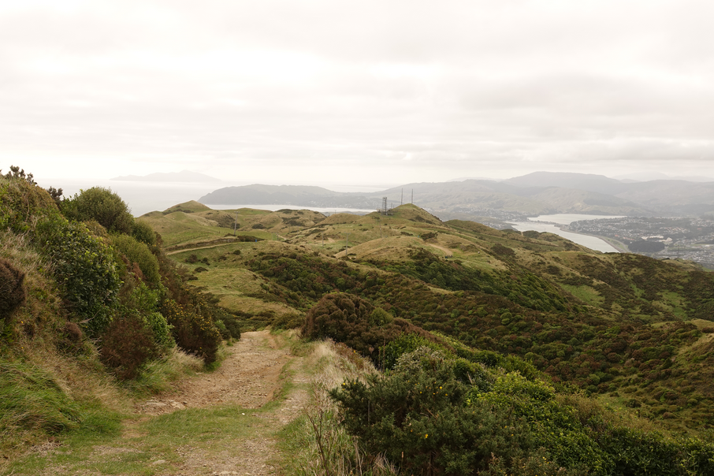
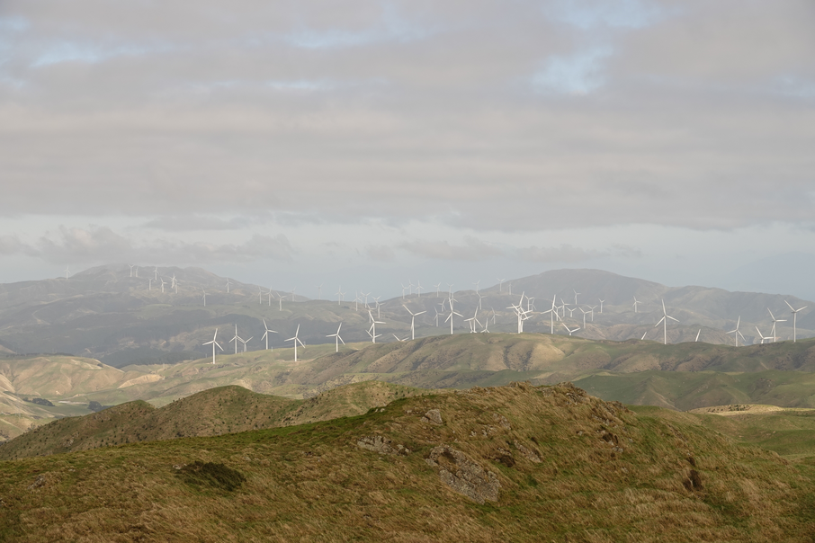
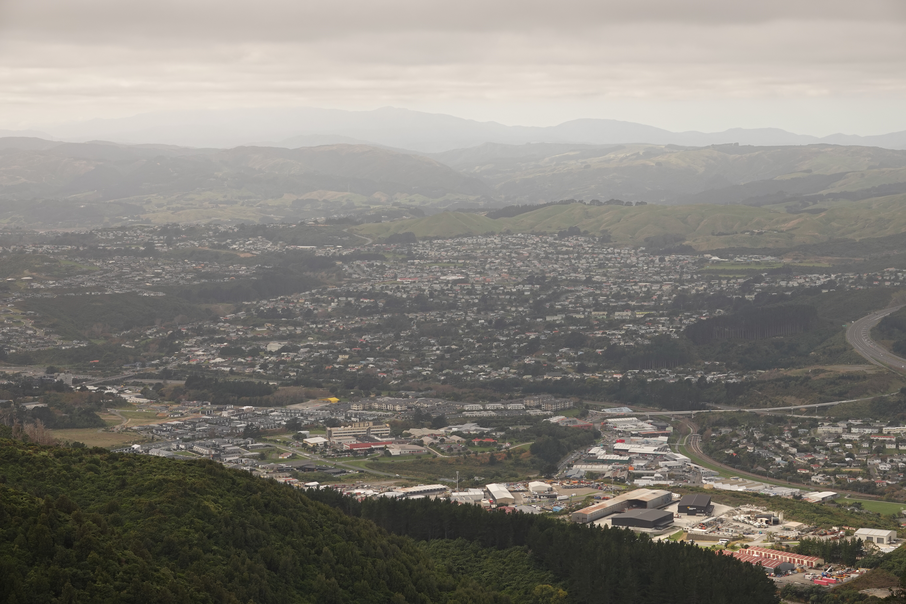
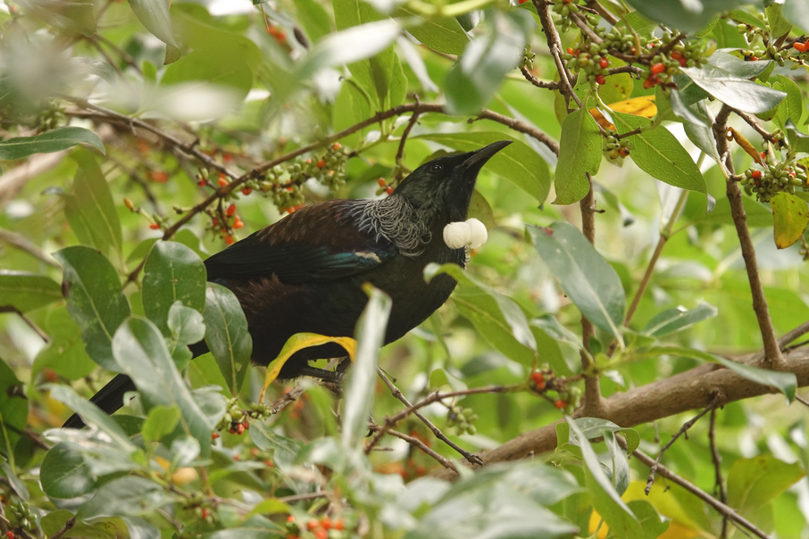
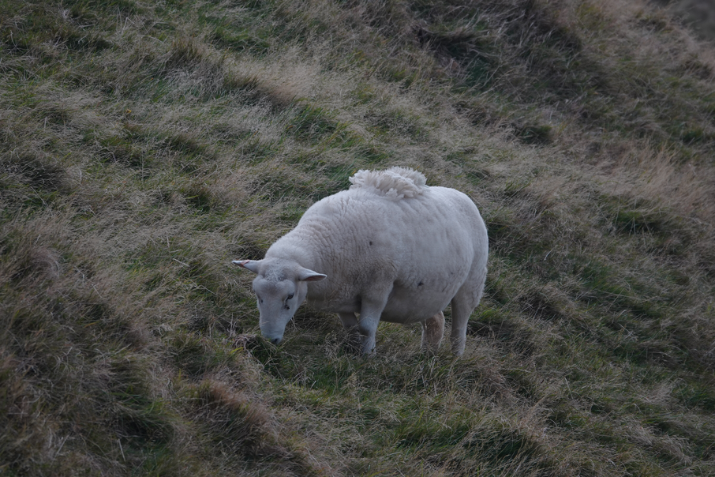

# Colonial Knob

```
Created at: 2026-05-02
```

This is a 10km loop track in Porirua. It is marked by the beautiful views of
the Kapiti coast (and island), Porirua valley and harbour, and the Wellington
city if you squint hard.

The track is well maintained but it can be a bit confusing to figure which
sub track to take at times due to a misc of tramping and mountain bike
tracks. I recommend using a map application to navigate if necessary. It will
be very clear on the map which way you are going and how to return to the car
park.

The track starts and ends just after the little bridge on the right of the car
park. It is a loop track so you can start on either direction. Both sides are
similar in terms of difficulty but doing the track counter-clockwise is a
little less steep. You will miss the view of the Kapiti coast however, so I
recommend doing it clockwise instead so you get the nicer view!














