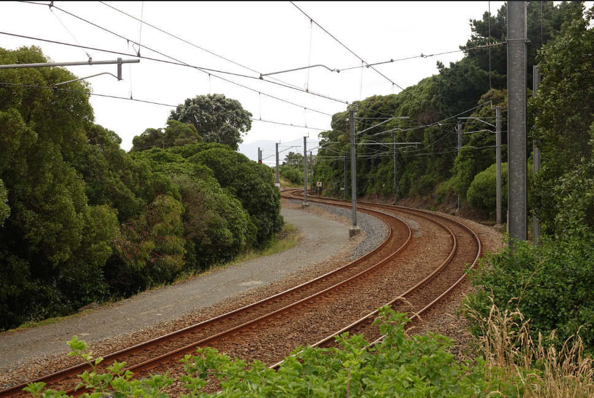
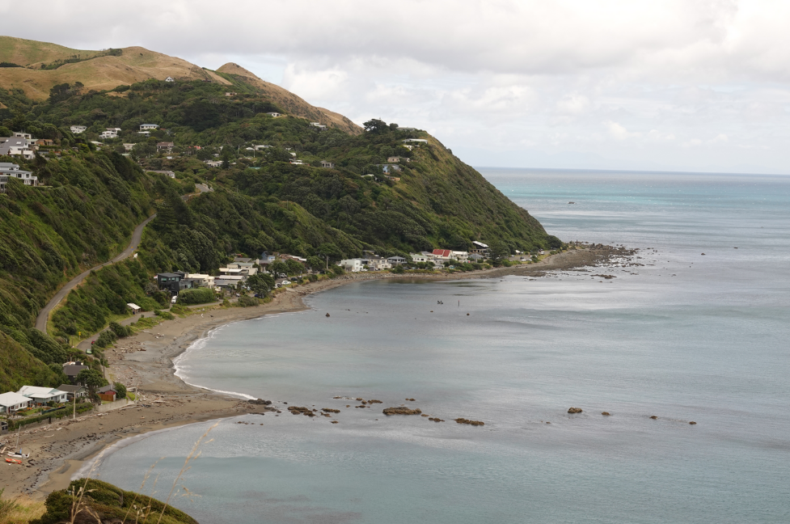
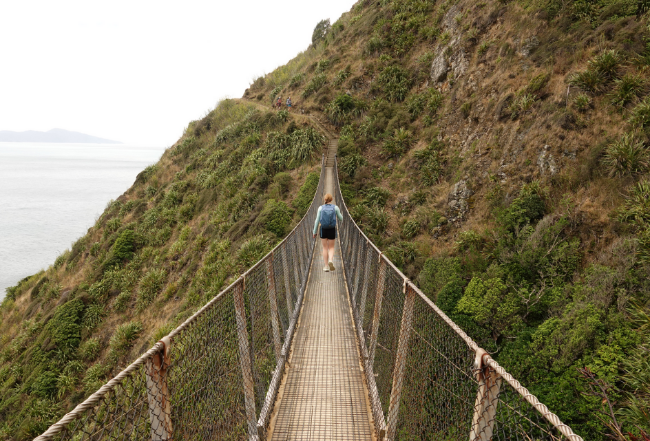
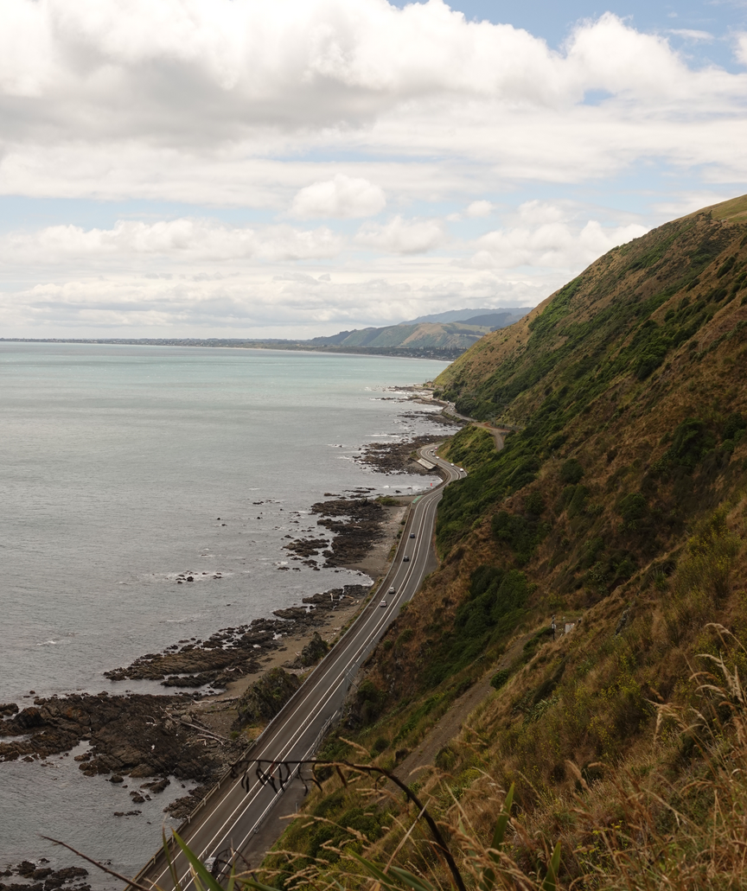

# Escarpment Track

```
Created at: 2026-01-27
```

> escarpment: a long, steep slope, especially one at the edge of a plateau or separating areas of land at different heights.

## Duration

Approximately 1h45min to clear the 10kms.
That considers taking a couple of stops, and alternating between running and
walking.

## Scenery

The track starts next to the rail line:



The bush is thick in the start but it quickly clears out to views of the Kapiti island.


The view of the coast is beautiful, especially on a clear day where you can see the blueness of the new zealand ocean.



A classic feature of the walk is the bridge



And how steep it is



The view of the kapiti coast at the end is great


And you can see so much of the Kapiti island at different points on the track


The track ends at Paekakariki, which is a small coastal town. Right next to the
end of the track there are several cafes available for the hungry and tired.
