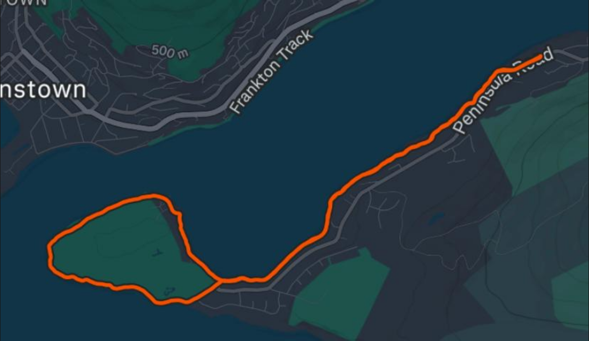
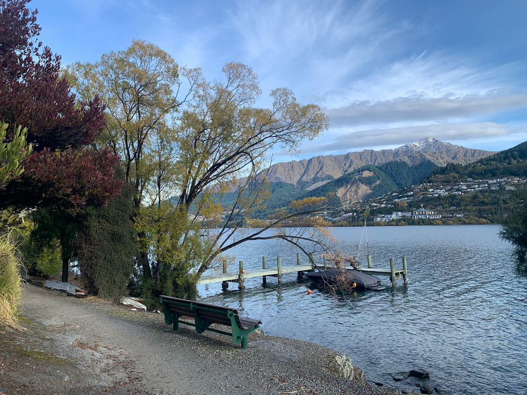
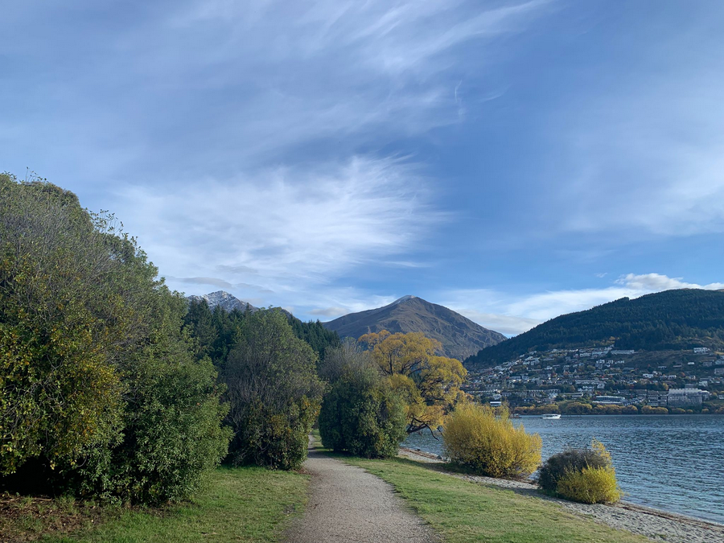
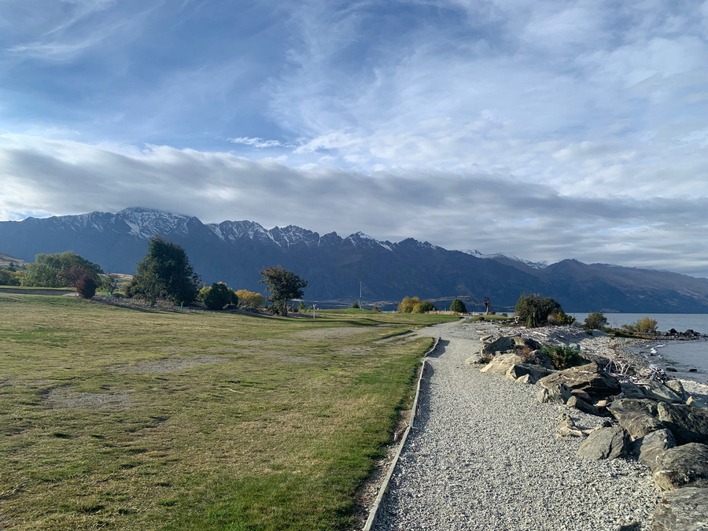

# Frankton Arm (10km)

```
Created at: 2026-04-27
```



A very easy 10km with only 93m of elevation gain. The track is mostly flat and
has incredible views of the lake and mountains.



The views of the lake are incredible.



The track is very visible and well maintained.



When going around the golf course loop, you can see the Remarkables in the distance.
