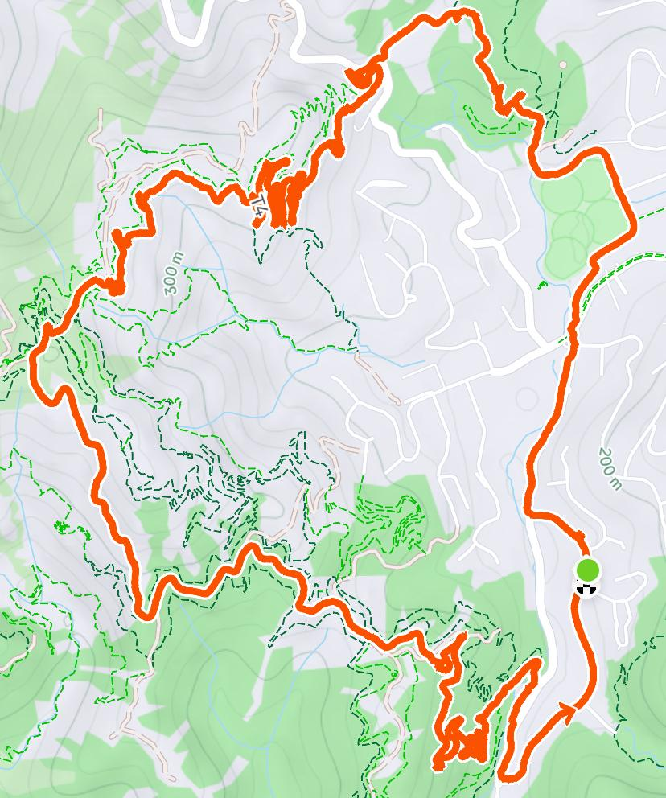
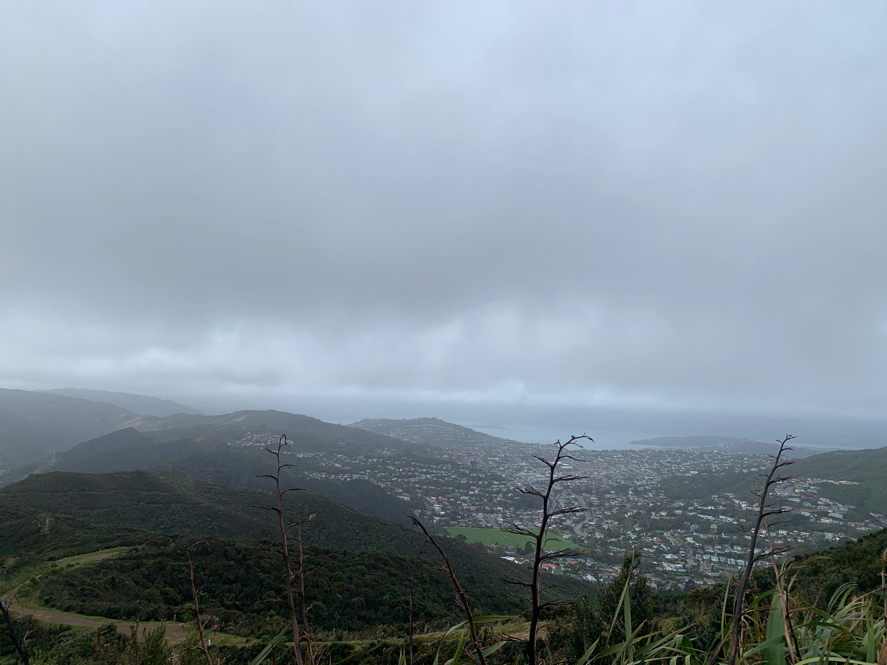

# Karori T4

```
Created at: 2026-05-09
```

A 10km run with 315m of elevation gain. You can start from various places in
Karori, but the entrance that I'd recommend is the one at the end of the
football field.

This is a challenging 10km but the elevation grain is gradual and the track is
well maintained with good opportunities to check the views (when the weather is
good).



