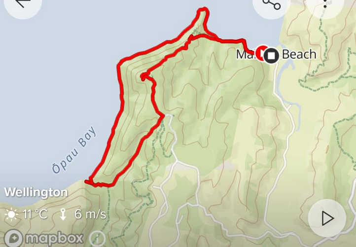
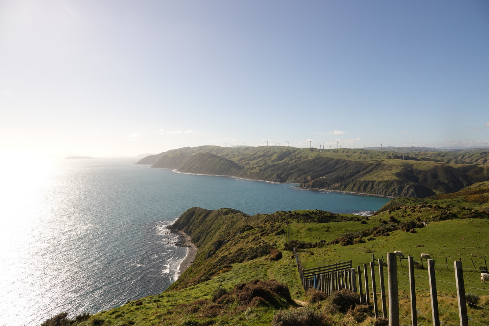
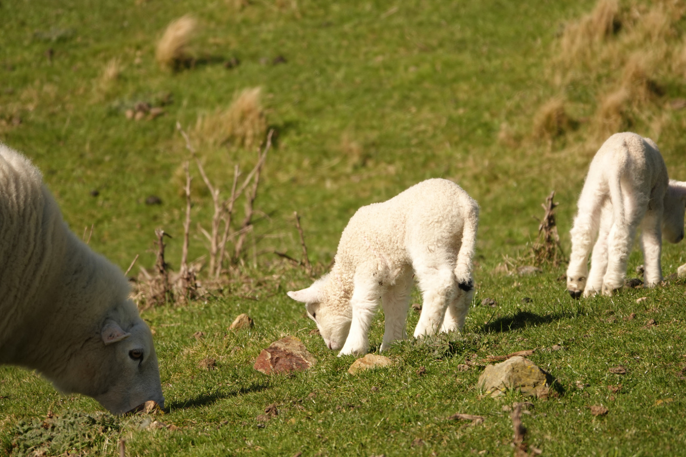
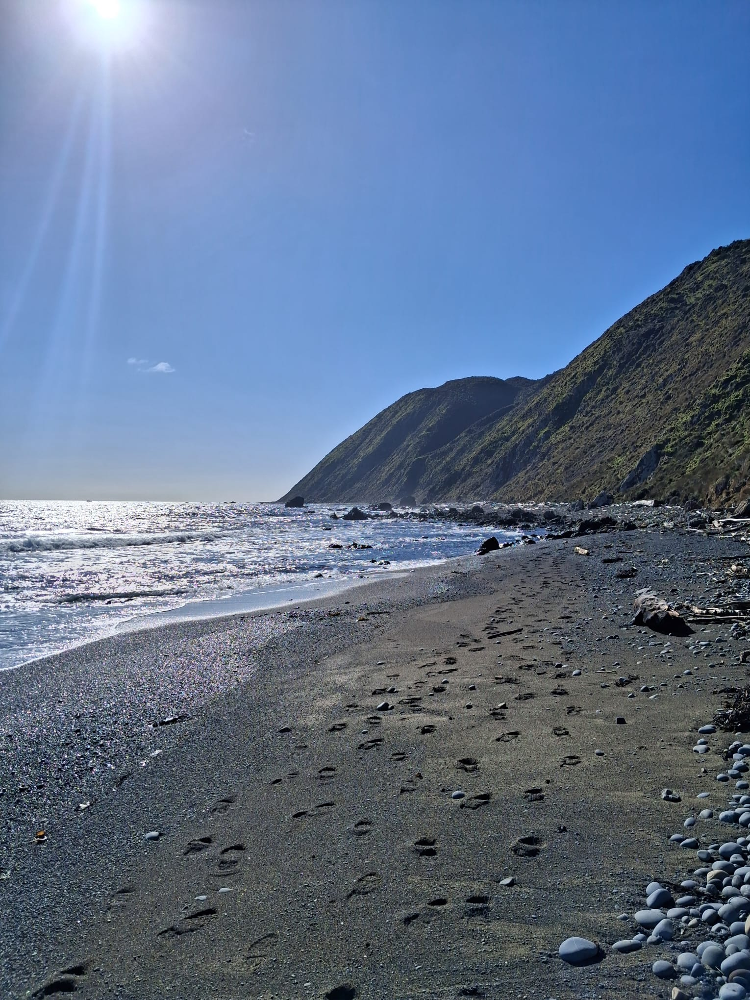

# Makara Loop

```
Created at: 2026-08-02
```



This loop is a combination of very steep terrain with very flat beach walks.
Starting with the steep terrain, you have around 195m of elevation gain in the
first half of the loop. Then you descend onto the beach, which is a steep rocky
beach, a little bit hard to walk on.

There are views of both the South Island and the Kapiti Island from the track.
Worth going on a good day. I have also been there on a bad day and the wind on
exposed places can be quite strong.



There is a private farm right next to the track, so you can see a lot of sheep.



The beach section has a lot of logs, this is a picture of a section that *does not*
have a lot of logs on it.


