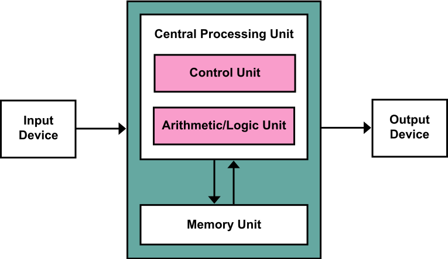

This architecture stores the program data and the instructions in the same
memory unit.

The basic elements are:

- **Processing unit**: Contains both the arithmetic/logic unit and the
  processor registers.
- **Control unit**: Contains an instruction register and program counter.
- **Memory**: Storing _both_ data and instructions.
- **External Mass Storage**
- **I/O mechanisms**

> The term "von Neumann architecture" has evolved to refer to any
> stored-program computer in which an instruction fetch and a data operation
> cannot occur at the same time (since they share a common bus). This is
> referred to as the von Neumann bottleneck, which often limits the performance
> of the corresponding system.[3]

> Because the single bus can only access one of the two classes of memory at a
> time, throughput is lower than the rate at which the CPU can work. This
> seriously limits the effective processing speed when the CPU is required to
> perform minimal processing on large amounts of data. The CPU is continually
> forced to wait for needed data to move to or from memory. Since CPU speed and
> memory size have increased much faster than the throughput between them, the
> bottleneck has become more of a problem, a problem whose severity increases
> with every new generation of CPU. 

[source](http://web.archive.org/web/20240411141041/https://en.wikipedia.org/wiki/Von_Neumann_architecture)

This architecture is simpler than the Harvard Architecture which includes a
dedicated set of addresses to host the program instructions, and another
set of addresses plus data buses for reading and writing to memory.
