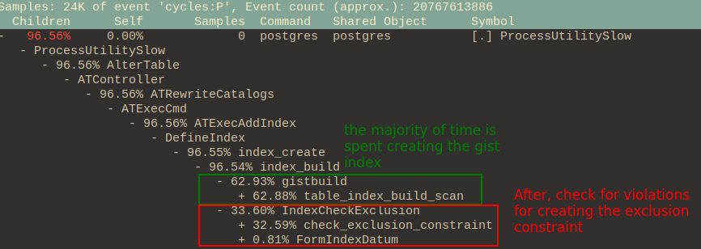
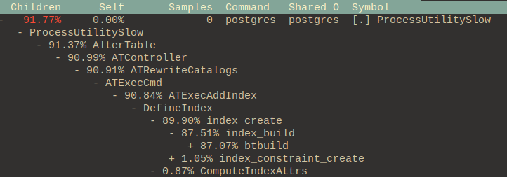
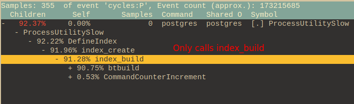
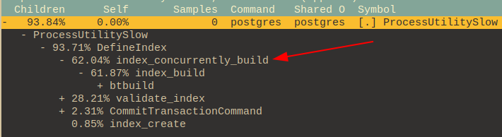

# EXCLUDE USING

```
Created at: 2024-10-27
```

## Definition

> The EXCLUDE clause defines an exclusion constraint, which guarantees that if
> any two rows are compared on the specified column(s) or expression(s) using
> the specified operator(s), not all of these comparisons will return TRUE. If
> all of the specified operators test for equality, this is equivalent to a
> UNIQUE constraint, although an ordinary unique constraint will be faster.
> However, exclusion constraints can specify constraints that are more general
> than simple equality. For example, you can specify a constraint that no two
> rows in the table contain overlapping circles (see Section 8.8) by using the
> && operator. The operator(s) are required to be commutative.

```sql
CREATE TABLE circles (
    c circle,
    EXCLUDE USING gist (c WITH &&)
);
```

[source](https://www.postgresql.org/docs/15/ddl-constraints.html#DDL-CONSTRAINTS-EXCLUSION)


## Internals

The following script creates a sandbox for testing an exclusion constraint.

```sql
CREATE DATABASE exclusion_test_db;
-- then connect via \c exclusion_test_db;

-- Postgres requires a GIST index for exclusion constraints.
CREATE EXTENSION IF NOT EXISTS btree_gist;

DROP TABLE IF EXISTS bookings;
CREATE TABLE bookings (
    id SERIAL PRIMARY KEY,
    resource_id INT NOT NULL,
    start_date DATE NOT NULL,
    end_date DATE NOT NULL
);

-- Add 100,000 rows to the table
INSERT INTO bookings (resource_id, start_date, end_date)
SELECT
    generate_series(1, 100000) AS resource_id,
    '2024-01-01'::DATE AS start_date,
    '2024-01-10'::DATE AS end_date;

VACUUM ANALYZE bookings;

-- Can't book the same resource_id in overlapping dates.
ALTER TABLE bookings
ADD CONSTRAINT no_date_overlap_for_resource_id
EXCLUDE USING gist (
    resource_id WITH =,
    daterange(start_date, end_date, '[]') WITH &&
);
```

The creation of this constraint happens in two stages:

- A GIST index is created by Postgres.
- Postgres uses this index to backup the constraint.

Most of the time is spent on the index creation.



Compare this with creating a unique constraint:

```sql
ALTER TABLE bookings
ADD CONSTRAINT "unique_resource_id"
UNIQUE ("resource_id");
```



Note that in this case the `IndexCheckExclusion` is not called. The code says:

```c
	/*
	 * In src/backend/catalog/index.c
	 *
	 * If it's for an exclusion constraint, make a second pass over the heap
	 * to verify that the constraint is satisfied.  We must not do this until
	 * the index is fully valid.  (Broken HOT chains shouldn't matter, though;
	 * see comments for IndexCheckExclusion.)
	 */
	if (indexInfo->ii_ExclusionOps != NULL)
		IndexCheckExclusion(heapRelation, indexRelation, indexInfo);
```

My question is: Could this second pass over the heap happen another time? It
takes a considerable amount of time (1/3 of the ATExecAddIndex execution in my
machine).

What I'd like to do is:

1. Create the gist index first, CONCURRENTLY.
2. Use the existing index to create the constraint, at which point we'd call
   IndexCheckExclusion and perform this second pass.

For example, when a unique constraint is created from an existing index, we
first need to create the index:

```sql
CREATE UNIQUE INDEX unique_resource_id ON bookings (resource_id);
```

Which produces:



Alternatively, if I had used `CONCURRENTLY`:



Followed by an ALTER TABLE ... USING INDEX

```sql
ALTER TABLE bookings
ADD CONSTRAINT unique_resource_id UNIQUE USING INDEX unique_resource_id;
```


You can see that the operation `ATExecAddIndexConstraint` is called. The only
type of index this operation accepts is a unique one:

```c
	/* In src/backend/commands/tablecmds.c */
	/* this should have been checked at parse time */
	if (!indexInfo->ii_Unique)
		elog(ERROR, "index \"%s\" is not unique", indexName);


	/* Note we currently don't support EXCLUSION constraints here */
	if (stmt->primary)
		constraintType = CONSTRAINT_PRIMARY;
	else
		constraintType = CONSTRAINT_UNIQUE;
```

Why is an EXCLUSION constraint not supported? I can't find the real explanation
in the commit that added those [changes](https://github.com/postgres/postgres/commit/88452d5ba6b3e8ad49133ac1a660ce0725710f8c)

I started a proposal in the mail list [here](https://www.postgresql.org/message-id/CAM2F1VO6ymp%2BGGZQxDxAQvftTiqmux%2Br%2BBEpR71fZ7_2gaaPEA%40mail.gmail.com)
