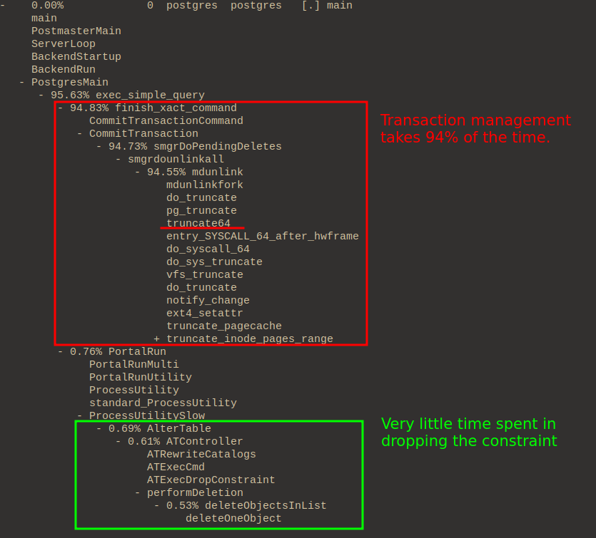
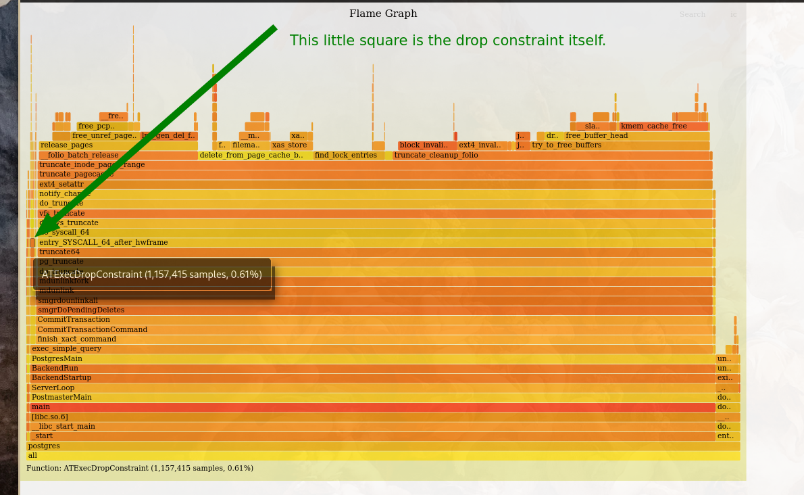

# Profiling Postgres

```
Created at: 2024-10-24
```

This post is about profiling Postgres **on Linux**. The profiling tools used
here are not OS agnostic. Alternatives for BSD and MacOs may exist.

The main goal is to check what happens when a Postgres query is triggered.

## Building Postgres From Source

I prefer to build from source whenever possible. This practice allows me to
better control compilation flags that are useful for profiling.

Besides that, if I am running multiple different versions of Postgres locally,
I don't have to mingle with my Linux package manager or resort to using Docker.

The authoritative guide to installing Postgres from source can be found in
the official [documentation](https://www.postgresql.org/docs/current/installation.html).

What comes below is _my own way of installing Postgres_, which is done in a
particular way so that I can profile and trace underlying functionality in a
practical way.

## Getting The Source Code

Go to Postgres' [ftp server in this link ](https://www.postgresql.org/ftp/source/)
and grab the version of Postgres you are interested in.

Aim for the file with the `.bz2` extension, and decompress it like this:

```sh
tar xf postgresql-version.tar.bz2
```

This will create a new folder `postgresql-version` in your current directory
with the source code.

## Configure

In the source directory, there is a bash script called `./configure`.

```sh
VERSION=15
PREFIX="$(pwd)/build"

./configure \
    CC='gcc' \
    CFLAGS="-fno-omit-frame-pointer -ggdb" \
    --prefix=${PREFIX} \
    --with-pgport=54${VERSION} \
    --enable-debug
```

Flags:

- `--prefix`: The default configuration installs Postgres on
  **/usr/local/pgsql**. I plan to have multiple versions of Postgres running,
  so I want to change the folder where I'll install each of them. I prefer
  to use a "build" folder so that both source and build live in the same
  directory.
- `--with-pgport`: The default port is 5432, but again, since I am running
  multiple Postgres versions, I usually use 54${version_number} in this case my
  version is 15, so 5415. This makes it easier for me to know which version a
  service runs just by looking at the port number. It also makes it easier to
  run multiple versions at the same time.
- `--enable-debug`: I want debug symbols. When using GCC as a compiler this
  doesn't affect performance too badly.
- `--enable-profiling`: This is for use with GNU gprof. Upon exit, a subfolder
  will be created with a `gmon.out` file containing the results of the
  profiler. I am not using this at the moment as I haven't been lucky to get
  gprof to work yet - In either case, `perf` is better.
- `CFLAGS`: These options allow support for capturing the whole user-space call
  stack.

The option `-fno-omit-frame-pointer` is necessary because the profiler may be
using a frame pointer-based approach for reading the stack. This may come with
an ~1% performance cost. From the Systems Performance book (Gregg):

> Incomplete stack traces are unfortunately common, and are usually caused by a
> confluence of two factors: 1) the observability tool using a frame
> pointer-based approach for reading the stack trace, and 2) the target binary
> not reserving a register (RBP on x86) for the frame pointer, instead reusing
> it as a general-purpose register as a compiler performance optimisation. The
> observability tool reads this register expecting it to be a frame pointer,
> but in fact it could now contain anything: numbers, object address, pointers
> to strings, etc. The observability tool tries to resolve this number in the
> symbol table and, if it is lucky, it doesn't find it and can print
> "[unknown]". If it is unlucky, that random number resolves to an unrelated
> symbol, and now the printed stack trace has a function name that is wrong,
> confusing you, the end user.

Note that the tool I am going to use (`perf(1)`) supports DWARF-based stack
walking, which is not stack-based. So we could skip this flag. But for the sake
of being able to use other tools later if needed, we'll compile with frame
pointers optimisation disabled anyway.

## Make

I use `bear` here so that I can get a `compile_commands.json` file after
running `make`. This is for my clangd LSP. It allows me to have jump to
definitions and the likes when I need to look at source code.

```sh
# Remove existing file if it exists.
rm -f src/compile_commands.json build

# `make` will take a bit of time to finish.
bear --output src/compile_commands.json -- make
make install
```

## Optional (extensions)

If you need to install extensions, like `btree_gist`:

```sh
# Extensions are added under `contrib`.
cd contrib/btree_gist
make && make install
cd ../..
```

## Initialising and starting the server

```sh
VERSION=15
PORT="54${VERSION}"
DBNAME=postgres${VERSION}

# This will initialise configuration for the database.
build/bin/initdb -D build/data

# Add our specific port to the configuration file.
# The step above doesn't do that.
echo "port = 54${VERSION}" >> build/data/postgresql.conf

# This initialises the database server.
build/bin/pg_ctl -D build/data -l logfile start

# Create the default db "postgres${VERSION}".
build/bin/createdb --port=${PORT} ${DBNAME}

# Add handy scripts so that I don't have to rememeber these
# commands from the top of my head.
echo "rm -f logfile && build/bin/pg_ctl -D build/data -l logfile start" > server_start.sh
echo "build/bin/pg_ctl -D build/data stop" > server_stop.sh
echo "build/bin/psql --port=${PORT} --dbname=${DBNAME} \$@" > psql.sh

chmod +x server_start.sh
chmod +x server_stop.sh
chmod +x psql.sh

# I often find it a good idea to initialise a git repository. If I need to
# alter the code, I can track my changes if I need to revert or submit a patch.
git init

cat <<EOF > .gitignore
build/
src/.cache/
logfile
perf.data
perf.data.old
EOF

git add .
git commit -m "Initial Commit"
```

## Profiling with perf

This is my summarised version of two much completer pages:
- [Postgres wiki](https://wiki.postgresql.org/wiki/Profiling_with_perf)
- [blog post](https://web.archive.org/web/20220814090539/https://www.2ndquadrant.com/en/blog/tracing-postgresql-perf/).

`perf record` runs a command and records its profile into `perf.data`.

Flags:

- `-a`: System-wide collection from all CPUs (this is the default).
- `-g`: Records both kernel space and user space call-graph.
- `-s`: Records per-thread event counts.
- `-p`: Records events on existing process ID.
- `--call-graph`: using the `dwarf` option instead of `fp` (frame pointer)
  means we don't have to worry about `--fomit-frame-pointer`.

```sh
# Allow use of almost all events by all users.
# This will be reset if you reboot your computer.
sudo sysctl -w kernel.perf_event_paranoid=-1

# Run psql to grab the process id.
# Use this query:
# select pg_backend_pid();
./psql.sh

# You now must run this in another shell!
PID=220177
perf record -a -g -s --call-graph dwarf -p ${PID}

# Then print the report. This will look at perf.data in the current directory.
# You can use + to expand the stack trace.
perf report -n
```

## Example

What happens when we are dropping a unique constraint in Postgres?

```sql
-- Table with a single integer field.
DROP TABLE IF EXISTS example_table;
CREATE TABLE example_table (
    id SERIAL PRIMARY KEY,
    int_field INTEGER
);

-- Add the constraint with a name of our choice.
ALTER TABLE example_table
ADD CONSTRAINT unique_int_field UNIQUE (int_field);

-- Insert 20,000,000 rows.
INSERT INTO example_table (int_field)
SELECT generate_series(1, 20000000);

VACUUM FULL;
VACUUM ANALYZE;

-- Insert an extra 900,000 rows that will be made into dead tuples.
INSERT INTO example_table (int_field)
SELECT generate_series(20000001, 20900000);

-- Make the dead tuples
UPDATE example_table
SET int_field = int_field + 10000000
WHERE int_field > 20000000;

-- Check number of dead rows, it should be about 900,000
SELECT n_dead_tup FROM pg_stat_user_tables WHERE relname = 'example_table';

-- Print the process id.
select pg_backend_pid();
```

Note, if you already have something running on that psql shell, another way
of grabbing that pid is to open a new shell and run:

```sql
select pid, query from pg_stat_activity
where application_name = 'psql' and pid != pg_backend_pid();
```

Now open a new terminal, and start the profiler:

```sh
PID=110540
#perf record -a -g -s --call-graph dwarf -p ${PID}
perf record -a -s --call-graph dwarf -p ${PID}
```

Back on the psql shell, drop the constraint and then close the psql process to
stop profiling:

```sql
ALTER TABLE example_table
DROP CONSTRAINT unique_int_field;
```

Open the report for quick inspection:

```sh
perf report -n
```



Another way of seeing the profile is via flamegraph.

```sh
git clone --depth 1 https://github.com/brendangregg/FlameGraph
mv FlameGraph build
FLAME="build/FlameGraph"

mkdir ${FLAME}/out
perf script --header > ${FLAME}/out.stacks

${FLAME}/stackcollapse-perf.pl < ${FLAME}/out.stacks > ${FLAME}/collapsed.txt
${FLAME}/flamegraph.pl --hash ${FLAME}/collapsed.txt > ${FLAME}/out.svg

$BROWSER ${FLAME}/out.svg
```



## Analysis

Dropping the constraint itself is very quick. It only involves updating the
catalogue. However, the place that takes a lot of time is in committing the
transaction.

The `mdunlink` function is a function that helps manage relations that reside
on magnetic disk. In this case, the constraint is backed by an index, and this
index needs to be deleted. Ultimately this function will call truncate(1) with
zero (removing it).
