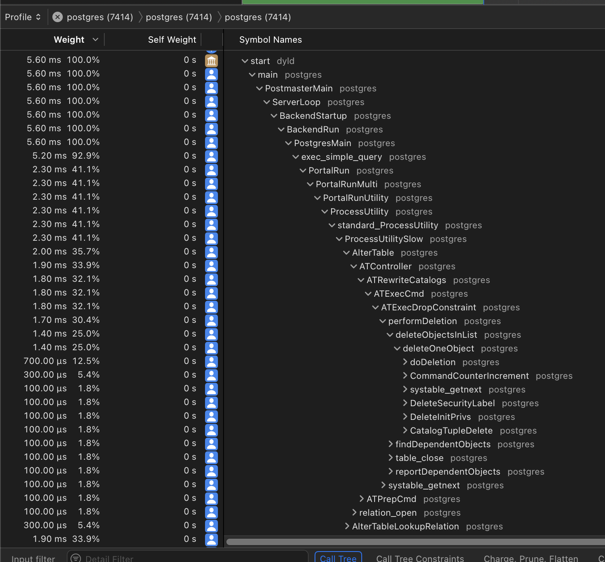

# Profiling Postgres On Mac

```
Created at: 2024-10-24
```

This post is about profiling Postgres **on Mac**. The profiling tools used here
are not OS agnostic. Alternatives for Linux and BSD exist. I have written a
separated note for Linux, so check that out if you are interested.

The main goal is to check what happens when a Postgres query is triggered.

## Building Postgres From Source

Follow my note called "Building From Source".

## Profiling with Instruments

"Instruments" is an application that is part of the macos XCode platform (now
an app).

Instruments let's you profile all sorts of different things:

- Memory allocations
- CPU profiling
- Time-based sampling
- Activity Monitor
- etc...

## Time Profiler

This profiler is very similar to the Linux `perf` program. It let's you track
which parts of an application have run and for how long. Note that it uses
sampling so not all bits that have run will necessarily have been sampled.

By default Instruments will try to profile all the process running in your
machine, and you don't want that. You can "click" at the top of the navigation
bar at the top, that shows your Mac device name, and select which running
process you want to profile.

The configurations available for selection are self-explanatory, but I use:

- Recording Mode: deferred.
- Time Profile: High frequency.

## Example

What happens when we are dropping a unique constraint in Postgres?

```sql
-- Table with a single integer field.
DROP TABLE IF EXISTS example_table;
CREATE TABLE example_table (
    id SERIAL PRIMARY KEY,
    int_field INTEGER
);

-- Add the constraint with a name of our choice.
ALTER TABLE example_table
ADD CONSTRAINT unique_int_field UNIQUE (int_field);

-- Insert 200,000 rows.
INSERT INTO example_table (int_field)
SELECT generate_series(1, 200000);

VACUUM FULL;
VACUUM ANALYZE;

-- Insert an extra 90,000 rows that will be made into dead tuples.
INSERT INTO example_table (int_field)
SELECT generate_series(200001, 290001);

-- Make the dead tuples
UPDATE example_table
SET int_field = int_field + 10000000
WHERE int_field > 200000;

-- Check number of dead rows, it should be about 90,000
SELECT n_dead_tup FROM pg_stat_user_tables WHERE relname = 'example_table';

-- Print the process id.
select pg_backend_pid();
```

Now go back to the Instruments interface, and try to find the terminal
executing the process id printed by the `pg_backend_pid` commmand.

Hit the "record" and perform this query:

```sql
ALTER TABLE example_table
DROP CONSTRAINT unique_int_field;
```



```sh
5.60 ms  100.0%	0 s	 postgres (7414)
5.60 ms  100.0%	0 s	  Main Thread  0xe633
5.60 ms  100.0%	0 s	   start
5.60 ms  100.0%	0 s	    main
5.60 ms  100.0%	0 s	     PostmasterMain
5.60 ms  100.0%	0 s	      ServerLoop
5.60 ms  100.0%	0 s	       BackendStartup
5.60 ms  100.0%	0 s	        BackendRun
5.60 ms  100.0%	0 s	         PostgresMain
5.20 ms  92.9%	0 s	          exec_simple_query
2.30 ms  41.1%	0 s	           PortalRun
2.30 ms  41.1%	0 s	            PortalRunMulti
2.30 ms  41.1%	0 s	             PortalRunUtility
2.30 ms  41.1%	0 s	              ProcessUtility
2.30 ms  41.1%	0 s	               standard_ProcessUtility
2.30 ms  41.1%	0 s	                ProcessUtilitySlow
2.00 ms  35.7%	0 s	                 AlterTable
1.90 ms  33.9%	0 s	                  ATController
1.80 ms  32.1%	0 s	                   ATRewriteCatalogs
1.80 ms  32.1%	0 s	                    ATExecCmd
1.80 ms  32.1%	0 s	                     ATExecDropConstraint
1.70 ms  30.4%	0 s	                      performDeletion
1.40 ms  25.0%	0 s	                       deleteObjectsInList
1.40 ms  25.0%	0 s	                        deleteOneObject
700.00 µs  12.5%	0 s	                         doDeletion
300.00 µs   5.4%	0 s	                         CommandCounterIncrement
100.00 µs   1.8%	0 s	                         systable_getnext
100.00 µs   1.8%	0 s	                         DeleteSecurityLabel
100.00 µs   1.8%	0 s	                         DeleteInitPrivs
100.00 µs   1.8%	0 s	                         CatalogTupleDelete
100.00 µs   1.8%	0 s	                       findDependentObjects
100.00 µs   1.8%	0 s	                       table_close
100.00 µs   1.8%	0 s	                       reportDependentObjects
100.00 µs   1.8%	0 s	                      systable_getnext
100.00 µs   1.8%	0 s	                   ATPrepCmd
100.00 µs   1.8%	0 s	                  relation_open
300.00 µs   5.4%	0 s	                 AlterTableLookupRelation
1.90 ms  33.9%	0 s	           finish_xact_command
700.00 µs  12.5%	0 s	           start_xact_command
300.00 µs   5.4%	0 s	           pg_parse_query
200.00 µs   3.6%	0 s	          ReadCommand
100.00 µs   1.8%	0 s	          AbortCurrentTransaction
100.00 µs   1.8%	0 s	          EmitErrorReport
```

You can change at the top of the tab to show a flamegraph instead of a call
chain.
