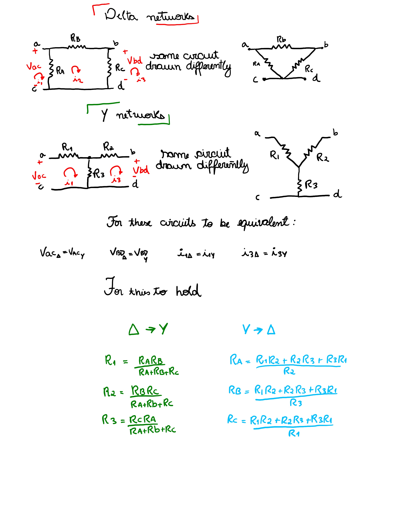

# Δ-Y (Delta-Wye) Conversion

```
Created at: 2025-11-22
```

When parallel/series simplifications are not available, delta-wye conversions
can help.

Delta-wye conversions come from the principle that if the two networks are
equivalent, then the terminal voltages and currents must be equal.


