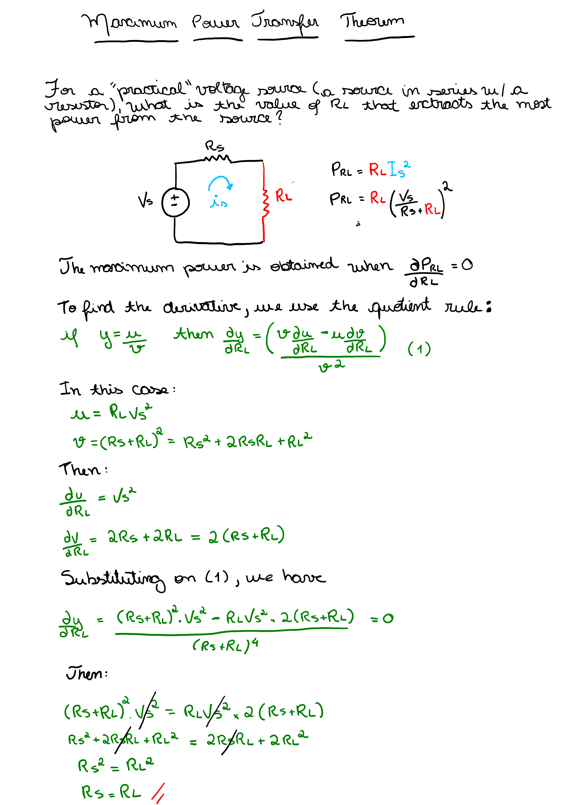
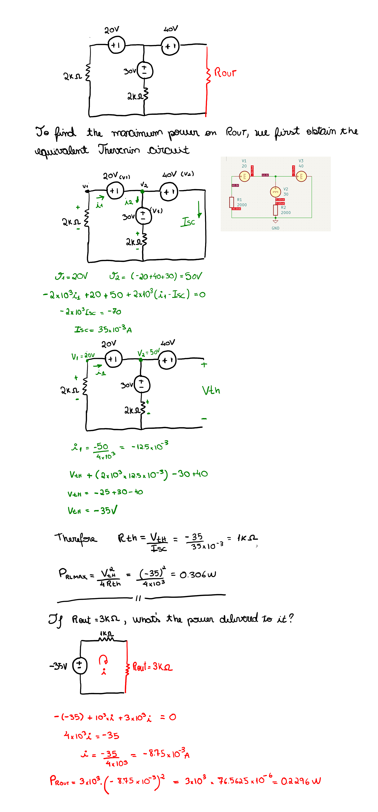

# Maximum Power Transfer

```
Created at: 2025-11-21
```




## Consequences

1. A network delivers its maximum power to a load resistor Rl when Rl is equal
   to the thevenin resistance of the network

2. This theorem helps us specify a particular load to draw the maximum amount
   of power from the equivalent thevenin network.

## Examples


