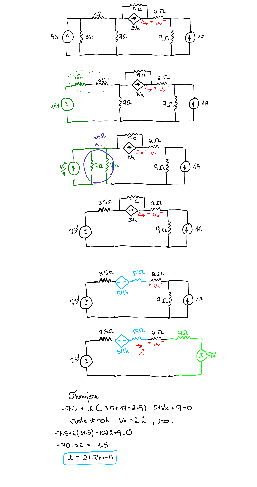

# Source Transformations

```
Created at: 2025-11-18
```

1. A common goal in source transformation is to end with either all current
   sources or all voltage sources to make nodal/mesh analysis easier.
2. The resistor value does not change during a source transformation - but the
   currents or voltages **won't** be the same as before.
3. If the voltage/current associated with a resistor is used as a controlling
   variable for a dependent source it should not be included in any source
   transformation.
4. Same as above for any particular element of interest.
5. The head of the current source arrow corresponds to the "+" terminal of a
   voltage source.

Make sure that the resistor is really in parallel for a I->V transformation or
that the resistor is in series for a V->I transformation.

## Examples


