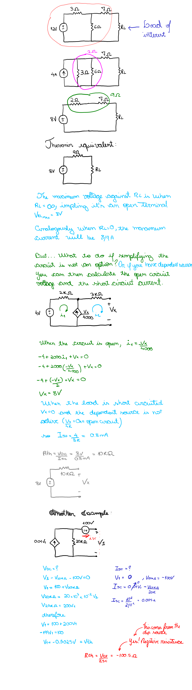

# Thevenin and Norton Equivalent Circuits

```
Created at: 2025-11-19
```

If you need to make a *partial* analysis of a circuit, for example, defining
the current/voltage/power delivered to a single "load" resistor by the
remainder of the circuit (which can be fairly complex), and perhaps you want to
find the response for different values of the load resistor, thevenin theoram
tells you that it is possible to replace everything except the load resistor
with an independent voltage source in series with a resistor. Or if you are
using the Norton equivalent, an independent current source with a parallel
resistor.

## Examples


