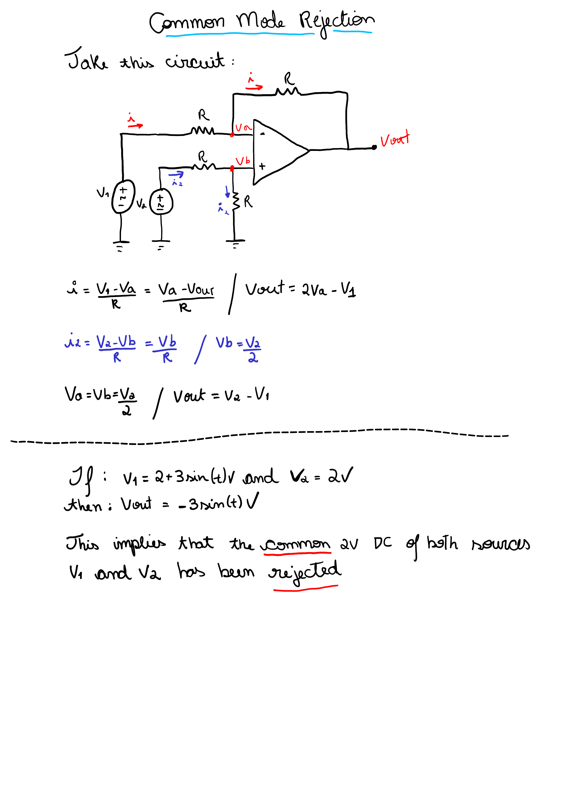

# Common-mode rejection

```
Created at: 2025-11-27
```

> In electronics, the common mode rejection ratio (CMRR) of a differential
> amplifier (or other device) is a metric used to quantify the ability of the
> device to reject common-mode signals, i.e. those that appear simultaneously
> and in-phase on both inputs. An ideal differential amplifier would have
> infinite CMRR, however this is not achievable in practice.
> (wikipedia).

> In electrical engineering, a common-mode signal is the identical component of
> voltage present at both input terminals of an electrical device. In
> telecommunication, the common-mode signal on a transmission line is also
> known as longitudinal voltage. 

Why do we need to reject "common mode signals"?

> In electrical engineering, a common-mode signal is the identical component of
> voltage present at both input terminals of an electrical device. In
> telecommunication, the common-mode signal on a transmission line is also
> known as longitudinal voltage.

## Common-mode rejection ratio (CMRR)

This is a measure of how well a differential amplifier can reject common-mode
signals. A higher CMRR indicates a better ability to suppress unwanted noise.


