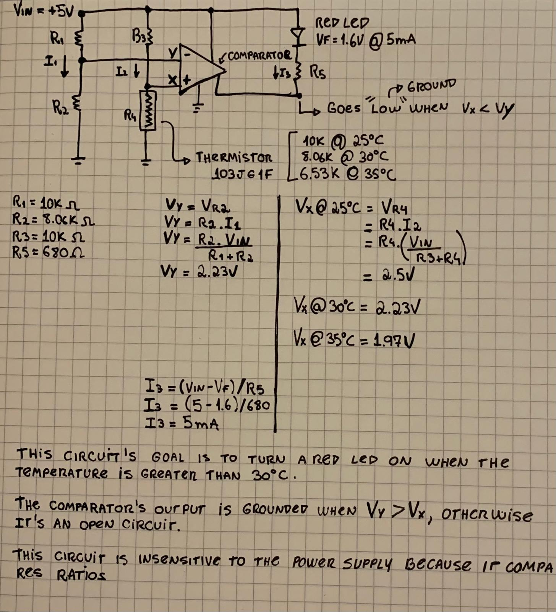

# Using Voltage Dividers With Comparators

## Example

This circuit's goal is to turn a red LED on when the temperature is greater
than 30c.

The comparator's output is grounded when Vy > Vx, otherwise it's an open
circuit.

Note: This circuit is insensitive to the power supply because it compares
ratios!

The voltage divider on the left is not variable with the temperature, whereas
the one on the right is.

Both voltage dividers are identical when Temperature=30c, after that, the right
voltage-divider output starts to go down and the LED turns on.
