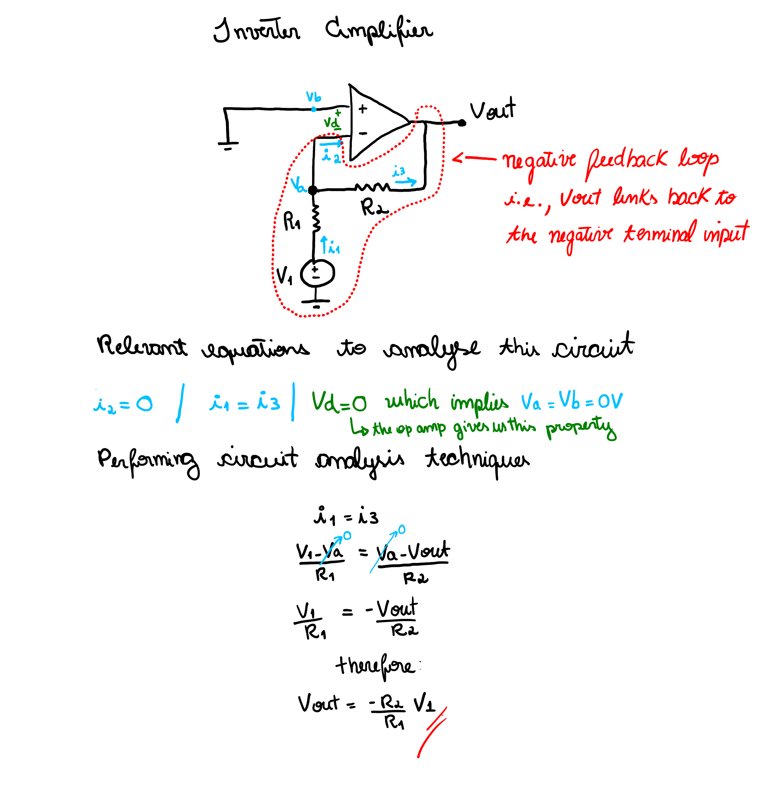

# Inverter Amplifier

```
Created at: 2025-12-01
```

This is a stable circuit as it uses negative feedback (the output is connected
to the negative input of the op amp). See my Circuit Analysis notes on feedback
and op amps for more information.



