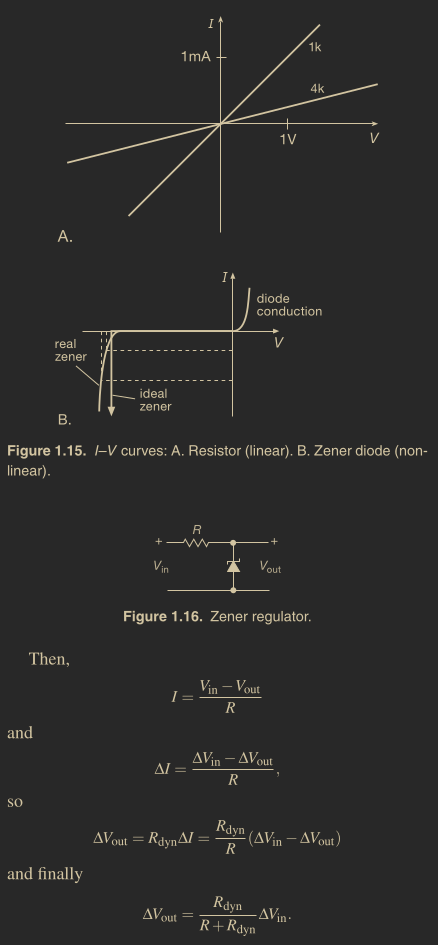
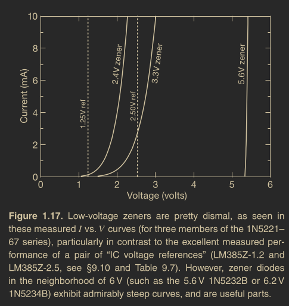

# Zener Diode

```
Created at: 2025-02-02
```



Zeners are used to create a constant voltage inside a circuit somewhere, simply
done by providing them with a (roughly constant) current derived from a higher
voltage within the circuit.

Included in the specifications of a zener will be its dynamic resistance, given
at a certain current. For example, a zener might have a dynamic resistance of
10 Ω at 10 mA, at its specified zener voltage of 5 V. Using the definition of
dynamic resistance, we find that a 10% change in applied current will therefore
result in a change in voltage of:

```
Rdyn = dynamic resistance

ΔVout = Rdyn*ΔI = 10 × 0.1 × 0.01 = 10 mV
or
ΔVout/V = 0.002 = 0.2%
```

thus demonstrating good voltage-regulating ability.

Note that ΔVout only depends of Rdyn and ΔI because of the phisical
representation of a zener diode!

> It’s a useful fact, when dealing with zener diodes, that the dynamic
> resistance of a zener diode varies roughly in inverse proportion to current.
> It’s worth knowing, also, that there are ICs designed to substitute for zener
> diodes; these “two-terminal voltage references” have superior performance –
> much lower dynamic resistance (less than 1 Ω, even at currents as small as
> 0.1 mA; that’s a thousand times better than the zener we just used), and
> excellent temper ature stability (better than 0.01%/C).

> When thinking about zeners, it’s worth remembering that low-voltage units
> (e.g., 3.3 V) behave rather poorly, in terms of constancy of voltage versus
> current (Figure 1.17); if you think you need a low voltage zener, use a
> two-terminal reference instead


