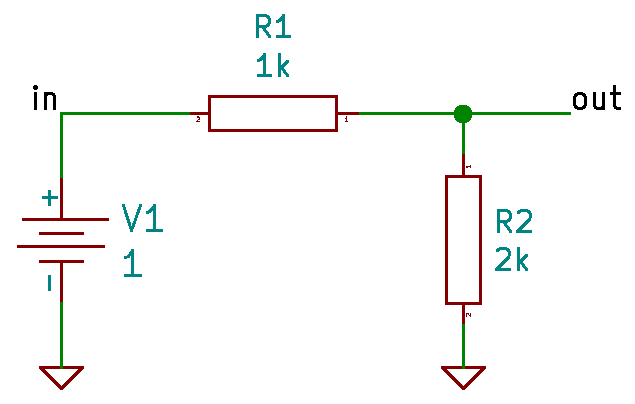

# Operation Point

```
Created at: 2025-11-02
```

Operation point means DC steady-state: It finds the voltages and currents in a
circuit when all signals have settled to a constant, non-time-varying value.

Given the following voltage divider:



A simple file to describe this circuit can be:

```sp
Voltage Divider

* netlist details
V1 in 0 1
R1 in out 1k
R2 out 0 2k
.end
```

Then on ngspice run:

```sh
# Operation point
op

# Print all variables
print all

in = 1.000000e+00
out = 6.666667e-01
v1#branch = -3.33333e-04
```
