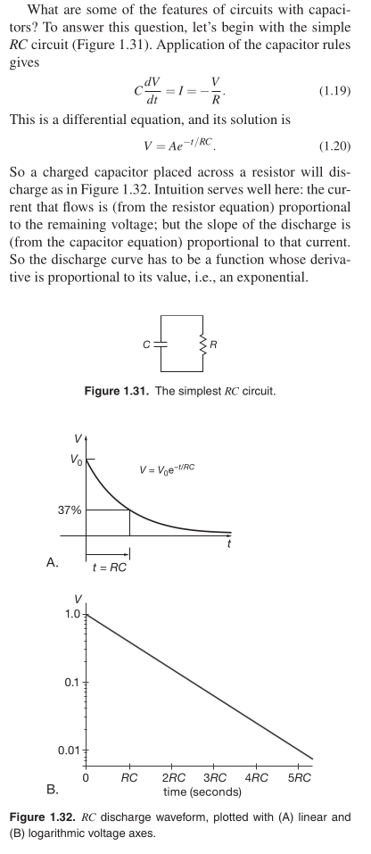

# RC Circuits

```
Created at: 2025-02-16
```



RC circuits can be used to filter a signal by blocking certain frequencies and
passing others. The two most common RC filters are the high-pass filters and
low-pass filters; band-pass filters and band-stop filters usually require RLC
filters, though crude ones can be made with RC filters.

## Concepts

> The product RC is called the time constant of the circuit. For R in ohms and
> C in farads, the product RC is in seconds. A microfarad across 1.0k has a
> time constant of 1 ms; if the capacitor is initially charged to 1.0 V, the
> initial current is 1.0 mA. TAOE 3rd

## Gotchas

> Presenting the “5RC rule of thumb”: a capacitor charges or decays to within
> 1% of its final value in five time constants.

> You might ask the obvious next question: what about V (t) for arbitrary
> Vin(t)? (...) In practice, you seldom ask this question. Instead, you deal in
> the frequency domain, in which you ask how much of each frequency component
> present in the input gets through. TAOE 3rd
