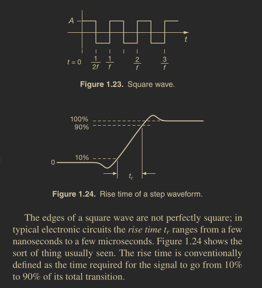

# Square Wave

```
Created at: 2025-02-09
```



Like the sinewave, the square wave is characterized by amplitude and frequency
(and perhaps phase).

For a square wave, the peak amplitude and the rms amplitude are the same.

## Interesting Points

- A linear circuit driven by a square wave rarely responds with a square wave.
