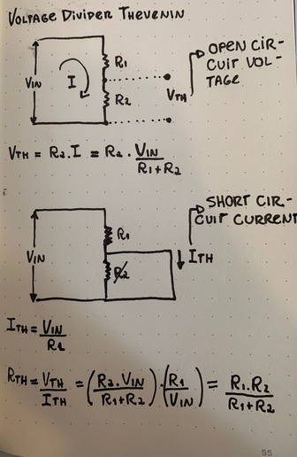

# Thevenin Theorem

```
Created at: 2025-01-29
```

Definition: Any two terminal chain of resistors and voltage sources can be
simplified to a single resistor in series with a voltage source.

This implies that any messed up configuration of multiple batteries and
resistors can be simplified to a single battery and a single resistor.

## Representation


## How to find V and R of the Thevenin Circuit

V = the open-circuite voltage of the equivalent circuit.
R = is find through the short-circuit current of the equivalent circuit.

## Example: Voltage Divider Thevenin


