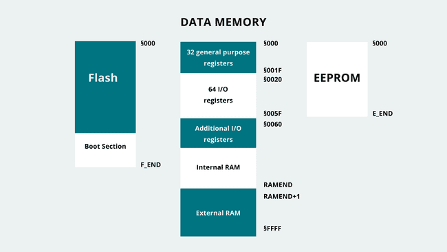

2024-04-16

>  In Harvard-based AVR architecture, memory is organized as shown in the image
>  below:



[source](http://web.archive.org/web/20240414220510/https://docs.arduino.cc/learn/programming/memory-guide/)

The arduino uno, which is the one I currently have in hand, uses the above
architecture.

## Recap: Assembly sections

When you think about Assembly sections, you think about these three main
sections:

- data: Where initialised data is, and data items defined in this section will
  increase the size of the executable file (in Linux world):
```asm
SECTION .data
    MyData db 0x7
```
- bss (block start symbol): Where uninitialised data lives. Data in this
  section does not increase the size of the executable file (in Linux world) as
  the OS allocates space in memory when fetching the executable from disk:
```asm
section .bss
    some_memory resq 1 ; Reserve 1 quadword (64 bits)
```
- text: Where the code itself is.

## Assembly sections in Arduino

### .text in the Flash Memory

Arduino stores the text (code itself) in the flash memory. This is important
because flash memory is persistent and persists even when the Arduino is
powered down.

Instructions in the AVR architecture are encoded into either 2 or 4 bytes.
This means that the flash memory is "paged" into double byte pages when it is
accessed by external hardware or when executing jump and branch operations.

When programs are being uploaded to the flash memory or read from the flash,
the smallest amount of data that can be accessed is 2 bytes, and an individual
byte cannot be accessed individually.

Anything that is stored in the flash memory, must thus, have an even number of
bytes. An array of strings with an odd number of characters receives a final
`0x0` at the end.

For example, to write the string "Hello", one would have:

1. "He" == 0x48 (H) 0x65 (E)
2. "ll" == 0x6C (L) 0x6C (L)
3. "o"  == 0x6F (O) 0x00 (NULL)

At any point, the instruction address being executed by the microcontroller is
stored in the instruction pointer (IP) also called program counter (PC), which
is stored in a register. For AVR this register is mostly 16 bits at the time
this note is being written.

Usually the address of the instruction pointer is incremented by a page size,
except for some instructions that are 4 bytes long, or when there is a jump or
a branch, that takes the instruction pointer straight to another page address.

However, when the program is running, and trying to read or write to the flash
memory, the program uses byte-addressing instead of page-addressing.

So any time a particular program needs to read "Hello" from the flash, it will
do so byte per byte. This dual-address scheme might be confusing at first, but
makes sense over time.

### bootloader

On the arduino, the lowest flash addresses are reserved for the bootloader. The
bootloader is the code that looks at the flash for the Arduino sketch that
needs to run. This happens every time the Arduino board is reset, and it comes
configured from factory if you buy an arduino board (or equivalent).

Usually the bootloader will wait a bit for an incoming Serial/UART connection.
If this connection comes, it expects it to be code that needs to be stored in
the flash (this is the sketch).

However, if no incoming Serial/UART connection shows up, it loads the program
that already exists in the flash.

The bootloader can't be reprogrammed as a regular sketch.
Usually the bootloader code is small (512 bytes approx on Arduino).

### .data and .bss in the RAM

The data in both these sections is stored in RAM. The .data section is
initialised by the start up code included in the firmware (stored in the flash
memory).

## Moving to the RAM

From the picture at the top of this note, the RAM is divided into 5 sections

### 32 General Purpose Registers

They occupy the first 32 addresses from 0x00 to 0x1F and thus can be accessed
like any other memory. However, it's better to use the special instructions
they have for performance reasons.

In hardware, these registers are storage units that are directly linked to the
CPU. In the arduino uno's ATMega328p, those are 8bits wide.

In assembly, these registers are referred to as R0 to R31, and not every
register can perform every operation, despite the name "general purpose".

For example:
- Constant values, also known as immediate values, can only be loaded into the
  last 16 registers.
- Register pairs R27:R26, R29:R28, and R31:R30 are reserved and named X, Y, and
  Z. These pairs are used to store 16-bit RAM addresses and are referred to as
  pointer registers. They have specialized instructions for operations.
- The Z register pair includes special instructions for incrementing or
  decrementing its value after loading the pointed-to value.

### 64 I/O registers (special function)

These registers are also 8bits wide.

Changing the current value in these registers will change the behaviour of the
hardware or the program. Some examples are setting timers and interrupts,
resetting watchdog timers, enabling interrupts.

The program may read the value of these registers to figure out the state of
the program.

The I/O registers (also referred to as **I/0 ports**), may be changed to affect
or cause a physical change on the pins of the microcontroller.

Each physical pin needs 3 bits to manage its state fully. One bit determines if
the pin is set as an input or output, another bit sets its high or low state,
and an additional bit stores the pin's state when it's configured as an input.
Consequently, a group of 8 pins requires 24 bits (equivalent to 3 bytes) for
control. IO ports are thus categorized into three types based on their
functionality.

- Data Direction Ports (labelled as DDRA, DDRB, etc.)
- Digital Output Ports (labelled as PORTA, PORTB, etc.)
- Digital Input Ports (labelled as PINA, PINB, etc.)

Activating a bit in the Data Direction Port configures its associated pin as an
output, while deactivating it switches the pin to input mode. In a Digital
Output Port, toggling a bit sets its respective pin to a high state, and
unsetting it sets the pin to low, provided the pin is in output mode. For pins
in input mode, toggling the bit activates or deactivates the internal pull-up
resistor for the pin. In input mode, the state of a pin can be determined by
reading its corresponding bit in the Digital Input Port.

Note that some bits in certain ports may remain unused.

### SRAM (Internal RAM - also General Purpose RAM)

This can be used by the program to store its objects, variables, arrays, and
what not.

It starts at the address RAMEND, and grows towards the special function
registers address.

AVR microcontrollers utilize two dedicated registers to manage the current
function's stack frame: the "SPL" (Stack Pointer Low) and "SPH" (Stack Pointer
High) registers. Together, they form the Stack Pointer, indicating the end of
the active stack frame. Given that AVR microcontrollers use 2-byte RAM
addresses, these registers store the low and high bytes separately. For
instance, on the ATmega328P Arduino uno, where RAMEND holds a value of 0x08FF
(equivalent to 2303 in decimal, aligning with the 2K bytes of SRAM specified in
the datasheet), the SPL register should start with a value of 0xFF, while the
SPH register should begin with 0x08.

### eFuse (electronic fuse)

> an eFuse (electronic fuse) is a microscopic fuse put into a computer chip.
> This technology was invented by IBM in 2004[1] to allow for the dynamic
> real-time reprogramming of chips. In the abstract, computer logic is
> generally "etched" or "hard-wired" onto a chip and cannot be changed after
> the chip has finished being manufactured. By utilizing a set of eFuses, a
> chip manufacturer can allow for the circuits on a chip to change while it is
> in operation.

[source](http://web.archive.org/web/20240413134439/https://en.wikipedia.org/wiki/EFUSE)

In the AVR board, these can be seen as super-special registers. These fuses can
only be changed by a **programmer** (not a real person, but a device that
programs the board).

AVR has a fuse calculator that allows you to configure the fuses and upload
them by using a tool (like avrdude).

These fuses can control information about the clock frequency of the MCU,
information for debugging, etc.

Changing these fuses might create finicky and subtle bugs, like your code might
expect the clock value to be the default of 16MHz, but one of the fuses is
changed and ended-up dividing that value by 8 (CKDIV8)!

[source](http://web.archive.org/web/20240330064156/https://www.engbedded.com/fusecalc/)

## Other resources

[reading resource](http://web.archive.org/web/20231103004009/https://dumblebots.com/2022/07/31/programming-arduino-and-avr-microcontrollers-using-the-assembly-language/)
