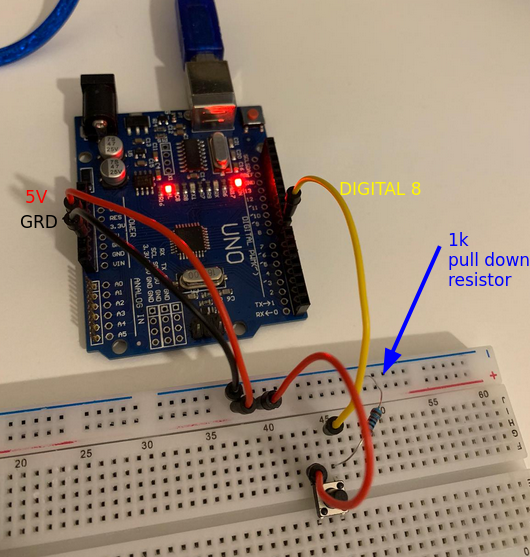

2024-04-28

## Types of interrupt

The ATMega328P has three kinds of interrupts:

- `external interrupts`: E.g. a change in voltage on an external pin.
- `timer interrupts`: E.g. when the timer reaches a certain value or overflows.
- `serial communication interrupts`: E.g. a particular event from UART or SPI
  triggers an interrupt.

## How interrupts work

When an interrupt occurs, the microcontroller suspends the current execution
of the program (changing the instruction pointer register), and jumps to a
place in memory that points to an **interrupt vector table**.

The interrupt vector table contains the address of functions that need to be
called for particular interrupts.

These functions are often called interrupt service routine (ISR), or simply
"interrupt handler".

The interrupt vector table is available on section 11.1 of the manual.

## Disabling / Re-enabling interrupts

Interrupts can be disabled temporarily by calling `cli()` and can then be
re-enabled by calling `sei()`:

```c
#include <avr/interrupt.h>

int main() {
    // Disable interrupts
    cli();
    // Critical section without interrupts
    // (e.g., accessing shared resources)
    // Re-enable interrupts
    sei();
    // Rest of the code with interrupts enabled
}
```

## When to disable interrupts

- `Multi-byte objects`: Always disable interrupts before updating multi-byte
  objects.
- `Updating multiple variables atomically`: If you rely on a pack of variables
  to be set in a particular way, you should disable interrupts first, lest you
  end up with half of the pack updated, and the other half out of date.
- `Hardware access`: Some hardware expect a sequence of read-modify-write
  operations to be handled.
- `Bootloader of firmware update`: No interrupts here otherwise the system will
  become corrupted.
- `Real time constraints`: With interrupts you lose some of the deterministic
  aspect of real-time systems.

## Example

The script below prints "I have been pressed!", every time the button has been
pressed. It can print to usart and picocom if you're using the usart script
from my previous note: [usart](embedded_development/atmega328p/usart.md)

```c
#include <avr/interrupt.h>
#include <stdio.h>
#include "../include/usart.h"

void configure_interrupt() {
  /*
   * Interrupt that happens when PB0 is "pressed".
   * In arduino, this is digital 8.
   *
   * 1. Set PB0 as input with pull-up resistor.
   * 2. Activate interrupts in PCINT7..0.
   * 3. But only enable interrupts for PB0.
   * 4. Enable interrupts globally.
   *
   * Note: PCINT0 is another name (special function) for PB0.
   */
  DDRB &= ~(1 << PB0);
  PORTB |= (1 << PB0);
  PCICR |= (1 << PCIE0);
  PCMSK0 |= (1 << PCINT0);
  sei();
}

static void button_interrupt() {
  /*
   * Code that runs when the button is pressed.
   *
   */
  printf("I have been pressed!\r\n");
}

ISR(PCINT0_vect) {
  if (!(PINB & (1 << PB0))) {
    button_interrupt();
  }
}

int main(void) {
  usart_init();
  configure_interrupt();
  printf("Let's go boys\r\n");
  while (1) {
  }
  return 0;
}
```

The board can be wired like in the picture below. It is important to set up
the pull-down resistor, otherwise the button will be in a floating state and
won't work.


