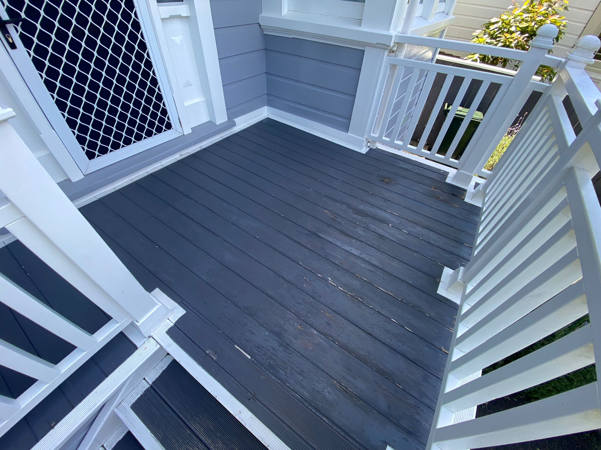

# Painting A Deck

```
Created at: 2025-01-04
```

## Fresh deck

I haven't painted a fresh deck yet but will do it soon.
I'll update this note then.

In the meanwhile, I have touched up an existing deck, what I called
"Maintenance mode".

## Maintenance mode

In this example, the deck was already painted, and only a new layer of paint
was needed.

Steps:

1. Wash the deck, then wait for it to dry.
2. Brush off any dust or dirt remaining.
3. If there are bits that shouldn't be painted, use a painters tape.
4. With a paint brush, start to paint.
5. Wait for it to dry, and add another layer if necessary.

Colour: British Paints Rhino Grey.

### Before




### After


