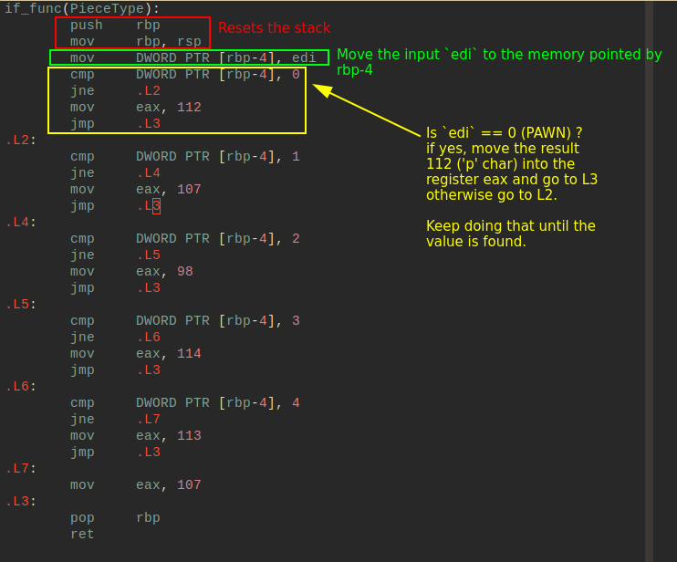
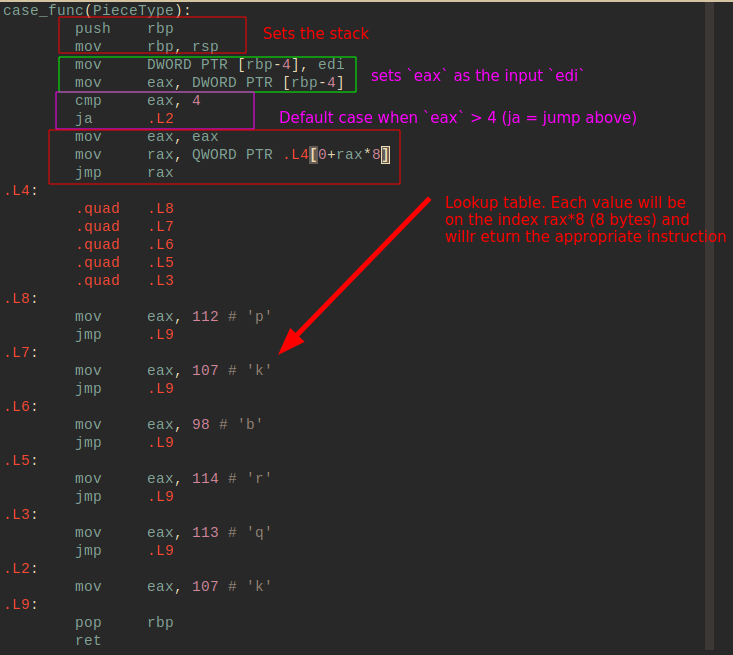
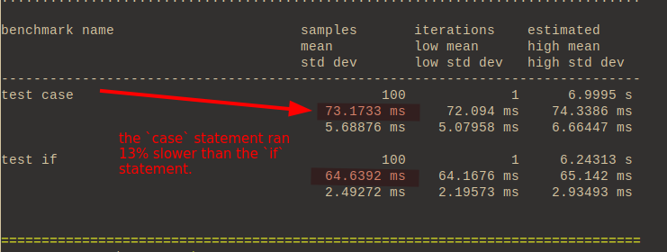
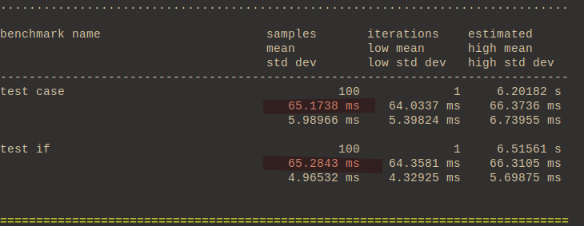
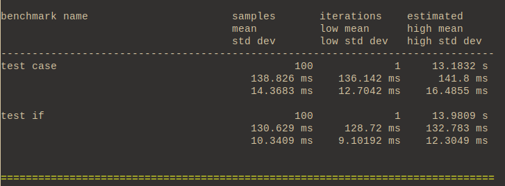
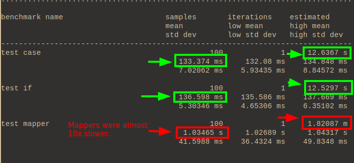

# if versus case versus map


```
Created at: 2023-03-06
Updated at: 2024-07-29
```

Note 2024-03-23: I need to make this more agnostic by adapting it to C. Also
remove the images in favour of listings.

Note 2024-07-29: The following information from the CSAPP book (3rd) is
relevant to this discussion:

> The advantage of using a jump table over a long sequence of if-else
> statements is that the time taken to perform the switch is independent of the
> number of switch cases. Gcc selects the method of translating a switch
> statement based on the number of cases and the sparsity of the case values.
> Jump tables are used when there are a number of cases (e.g., four or more)
> and they span a small range of values.

## The introduction

There're a many misconceptions about how `if` and `case` statements are
compiled, and how they perform. As those statements grow large (20+
lines) code-reviewers commonly recommend refactoring the conditional chains
into a mapper to improve code clarity.

So the idea here is to check whether or not the code is cleaner, and how much
we pay in performance in order to have "cleaner" (TBD) code.

## The example

Let's start with a simple example. Say you're developing a game of chess and
you need to return a `char` representation of the chess piece at hand. Easy:

```cpp
enum Pieces {PAWN, KNIGHT, BISHOP, ROOK, QUEEN, KING};
```

Our first function will use `if` statements:

```cpp
char if_func(PieceType piece) {
  if (piece == PAWN) { return 'p'; }
  if (piece == KNIGHT) { return 'k'; }
  if (piece == BISHOP) { return 'b'; }
  if (piece == ROOK) { return 'r'; }
  if (piece == QUEEN) { return 'q'; }
  return 'k';
};
```

And here is another example using case statements.

```cpp
char case_func(PieceType piece) {
  switch(piece) {
    case PAWN: return 'p';
    case KNIGHT: return 'k';
    case BISHOP: return 'b';
    case ROOK: return 'r';
    case QUEEN: return 'q';
    default: return 'k';
  }
};
```

Before going any further, let's compare the assembly code generated from these
two functions.

## Assembly code

Firstly, let's start with the assembly code for the `if` statement version:



Very straightforward. Store the input value in a register, compare with the
integers corresponding to the enum (0, 1, 2, 3, 4, 5) in a sequence and spit
out the equivalent `char` (as an int).

How does this compare to the `case` statement?



The `case` statement seems more complicated for the programmer unfamiliar with
Assembly language. However, the code is just a producing a lookup table.

## Benchmarking

Before proceeding to the "clean" code approach, let's run some benchmarking
to see how the if statement compares to the case one.

Our test bench will look like this:

```cpp
#include <catch2/catch.hpp>
std::vector<PieceType> pieces = {PAWN, KNIGHT, BISHOP, ROOK, QUEEN, KING};

void test_if() {
  for (int i = 0; i < 1000000; i++) {
    for (const auto &piece : pieces) {
      if_func(piece);
    }
  }
};

void test_case() {
  for (int i = 0; i < 1000000; i++) {
    for (const auto &piece : pieces) {
      case_func(piece);
    }
  }
};

TEST_CASE("IF vs CASE") {
  BENCHMARK("test case") { return test_case(); };
  BENCHMARK("test if") { return test_if(); };
}
```

We will run through the vector one million times for each sample, and then
we'll analyse how they compare.



This is an unfortunate scenario for our `case` statement. Lookup tables get
better as the number of different `case`s raises. But in this function we only
have a few `case`s and their occurrence is evenly distributed due to the way
the benchmark code was set. That's why our `if` statement with many `cmp`s and
`jmp`s somehow managed to perform better.

In other words, the worst case scenario for our `if` statement (when it
receives a 'king' and it needs to jump all the way down the assembly
instruction chain) only happens 1 out of 6 times. Whereas the `case` function
needs to always use the lookup table no matter what.

I used this example on purpose, because generally speaking developers say that
`case` statements are faster than `if` statements. While this is true for many
scenarios, this isn't **always** true.

If we had cherry picked our vector of pieces to only contain Kings, the result
would be different. Consider substituting this line:

```cpp
// std::vector<PieceType> pieces = {PAWN, KNIGHT, BISHOP, ROOK, QUEEN, KING};

std::vector<PieceType> pieces = {KING, KING, KING, KING, KING, KING};
```

The results are quite different as we've reached the worst case scenario more
times.



Now we finally reached equivalence by unbalancing our sampling data. In real
life it will be difficult to tell how the distribution of our samples will look
like, so why don't we run this example with a Gaussian distribution?

```cpp
// std::vector<PieceType> pieces = {KING, KING, KING, KING, KING, KING};
std::vector<PieceType> pieces = {
  PAWN,
  KNIGHT, KNIGHT,
  BISHOP, BISHOP, BISHOP, BISHOP,
  ROOK, ROOK, ROOK, ROOK,
  QUEEN, QUEEN,
  KING,
};
```

That looks fair! Let's see the results:



With 6 different variables to switch from, our `if` statement is comparable to
a `case` statement. For anything less than that, `if` statements will usually
be faster, and for anything more than that, they will usually be slower.

I'm being really picky here, in real-life situations this difference probably
doesn't matter, but now you know.

## The clean code alternative

Let's have a brief pause on benchmarking here to talk about something that
happens in my daily at my job.

A code reviewer will look at our `if` or `case` function and will block the
Pull Request saying:

> Mmmm, this doesn't look super clean. Can we move it to a mapper instead?

So you end up with something like this:

```cpp
std::unordered_map<PieceType, char> mapper = {
  {PAWN, 'p'},
  {KNIGHT, 'k'},
  {BISHOP, 'b'},
  {ROOK, 'r'},
  {QUEEN, 'q'},
  {KING, 'k'},
};

char mapper_func(PieceType piece) {
  return mapper[piece];
}
```

So much cleaner, right?! The reviewer will be happy that you reduced a
monstrous chain of `if` (or `case`) statements into a single, clean, 1 line
function.

More over, a common argument is that "it's easier to test, and therefore to
obtain high coverage". And indeed, it's easy to obtain coverage if all you're
doing is making sure that the return line is hit, but if you want to have real
coverage that branches out to all paths, your test will actually look
identical for either case.

In reality I haven't seen any substantial evidence to actually convince me that
this is indeed cleaner or more useful - and it will most likely come down to
personal preference, which is unfortunate for the reviewer and for the person
who created the PR.

But the central question still is: why use a full on hash table just for
looking up 6 different values? Isn't this too overkill? Does the clean code
excuse really matters here? Is the alternative if or case statement even
"dirty"?

Let's see how this performs. We'll add another benchmarking using this new
mapper function and rerun the code.

```cpp
void test_mapper() {
  for (int i = 0; i < 1000000; i++) {
    for (const auto &piece : pieces) {
      mapper_func(piece);
    }
  }
};

// ...
  BENCHMARK("test mapper") { return test_mapper(); };
// ...
```



This is too slow! We are running almost 10x slower now on our "clean" code
approach. This is obvious, we don't need a hash table here, we're just
returning based on a enum of 6 different types.

## Conclusion

 - Beware of "clean code" conventions without reason. If some of they propagate
   throughout your code base you end up with much slower code.
 - If you have too many conditionals (say more than 6) prefer using
   `switch`/`case` statements, otherwise `if` is fine.

## Benchmark code

```cpp
#define CATCH_CONFIG_MAIN
#define CATCH_CONFIG_ENABLE_BENCHMARKING
#include <catch2/catch.hpp>
#include <vector>
#include <unordered_map>

enum PieceType {PAWN, KNIGHT, BISHOP, ROOK, QUEEN, KING};

std::unordered_map<PieceType, char> mapper = {
  {PAWN, 'p'},
  {KNIGHT, 'k'},
  {BISHOP, 'b'},
  {ROOK, 'r'},
  {QUEEN, 'q'},
  {KING, 'k'},
};

char mapper_func(PieceType piece) {
  return mapper[piece];
}

char if_func(PieceType piece) {
  if (piece == PAWN) { return 'p'; }
  if (piece == KNIGHT) { return 'k'; }
  if (piece == BISHOP) { return 'b'; }
  if (piece == ROOK) { return 'r'; }
  if (piece == QUEEN) { return 'q'; }
  return 'k';
};

char case_func(PieceType piece) {
  switch(piece) {
    case PAWN: return 'p';
    case KNIGHT: return 'k';
    case BISHOP: return 'b';
    case ROOK: return 'r';
    case QUEEN: return 'q';
    default: return 'k';
  }
};

#include <catch2/catch.hpp>
/* std::vector<PieceType> pieces = {PAWN, KNIGHT, BISHOP, ROOK, QUEEN, KING}; */
std::vector<PieceType> pieces = {
  PAWN,
  KNIGHT, KNIGHT,
  BISHOP, BISHOP, BISHOP, BISHOP,
  ROOK, ROOK, ROOK, ROOK,
  QUEEN, QUEEN,
  KING,
};

void test_if() {
  for (int i = 0; i < 1000000; i++) {
    for (const auto &piece : pieces) {
      if_func(piece);
    }
  }
};

void test_case() {
  for (int i = 0; i < 1000000; i++) {
    for (const auto &piece : pieces) {
      case_func(piece);
    }
  }
};

void test_mapper() {
  for (int i = 0; i < 1000000; i++) {
    for (const auto &piece : pieces) {
      mapper_func(piece);
    }
  }
};

TEST_CASE("IF vs CASE vs MAP") {
  BENCHMARK("test case") { return test_case(); };
  BENCHMARK("test if") { return test_if(); };
  BENCHMARK("test mapper") { return test_mapper(); };
}
```
