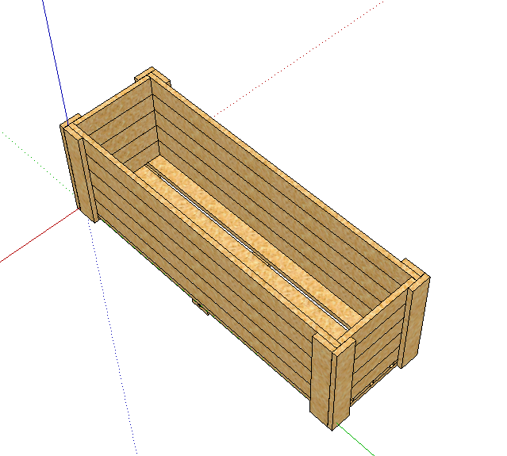
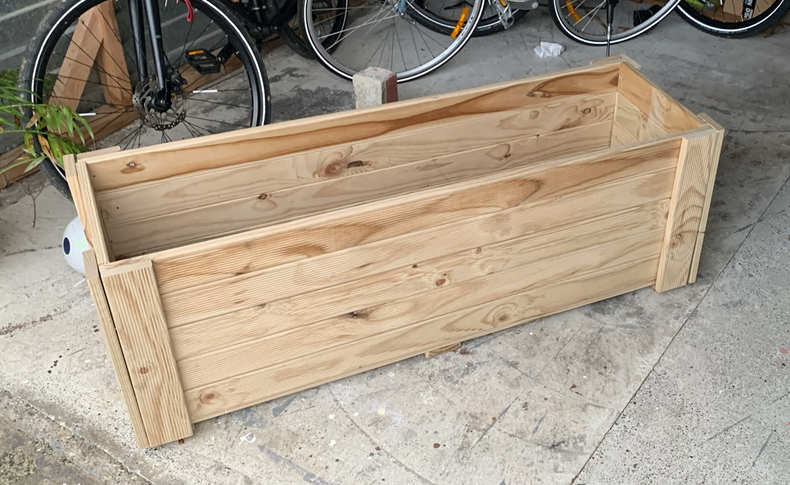

# Garden Box

```
Created at: 2026-07-16
```

This is my first garden box project. Althought it is just about the easiest
project to work on, I learned a heap of things by doing it.

Here is what I designed in SketchUp:



Here is how it came out:



## What I have learned

1. The wood that I chose was advertised at bunnings as being 88x22mm. In fact
   it is slightly thicker than that. More like 91x22mm or so. This is important
   because I measured the length of the "legs" of the boxs by the width of the
   wood. So the legs were too short!
2. It is important to align EVERYTHING else the box does not "close" very well
   around the walls. I managed to hammer some of the gaps with the nail, but
   when there is no gap to close and the wood is slightly longer than it
   should, then there is nothing to hammer in! So maybe it is better to be a
   little bit short than a little bit long.
