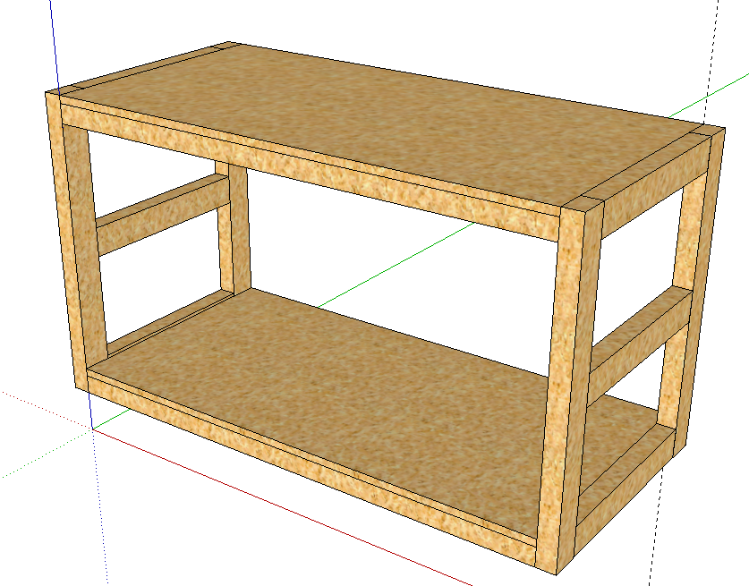
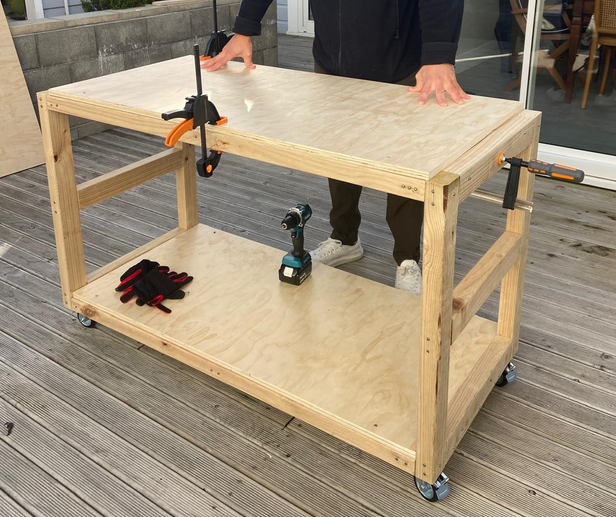

# Mobile workbench

```
Created at: 2026-08-01
```



This table has been my hardest effort so far.
I made several mistakes, and learned a good deal out of it.

Here is what it looks like in real life:



## Learnings

1. If you are nailing a nail on an angle, make sure you got a good view of how it is going in.
2. If you get the nails wrong, and they go through the wood, you can use a hacksaw to cut them off.
3. For the casters (wheels), it is fundamental that the area you are putting
   them in is flat. You will also need at least 3 screws to hold them in place
   if they are the 4-holes ones. That saved me because I often had 3 flat
   areas. You can fix any gaps by putting a coin under the caster and then
   tightening the screws.
4. Do not hit nails too close to the edge of the wood, or they will split it.
5. Clamps are your friend. Use them to hold the wood in place while you are nailing it.
6. Glue the base, and then nail it. This will make it stronger. The other parts
   you might not need to glue. I didn't glue the frames for example. Let's see
   how they go!
7. Long screws are a pain! I am still unsure if my drill is good enough for
   them. I choose a 100mm-long screw and I had a lot of trouble with it. I
   destroyed a few of them and had to use pliers to get them out, which wasn't
   a pleasent experience. I much preferred nails for this job - just make sure
   to wear ear muffers.

## Further Improvements

I noticed that the table was "wabbly" when horizontal force was applied at the
top.

I applied these horizontal 45-degree braces to the back of the table, and it is
now much more stable.
