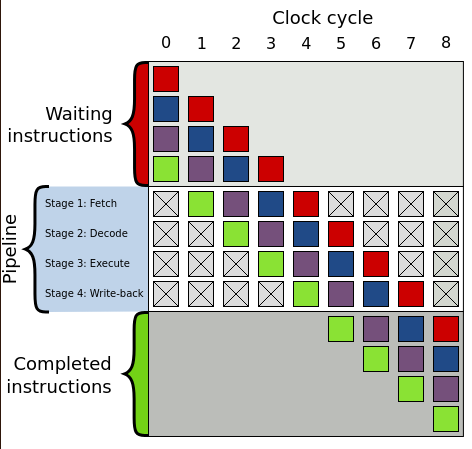

# Branchless Programming Experiments in C++ and Python

```
Created: 2023-08-22
Updated: 2024-07-28
```

This article talks about high-level theoretical concepts of branchless
programming, along with examples of branchless programming in C++ and Python.

## What's branchless programming and why does it matter?

A branchless program is a program that doesn't include any conditional
operator (`if`, `else`, `switch`, ...).

The reason why people would go through the trouble of branchless programming is
onefold: performance.

Modern CPUs try to read future instructions before they are executed so that
they can stay ahead of the game. This is called "instruction pipelining", and
is meant to implement instruction-level parallelism on single processors.

However, when the CPU is pipelining and a branch is present, the CPU won't be
able to know what path it needs to run, so it takes a guess. When this guess is
incorrect, the CPU discards the instructions previously read, and read the
new instruction set for the correct path. This takes time and valuable clock
cycles.

UPDATE: According to the author of the CSAPP book, microprocessors are
architected in a way to achive branch prediction success rates of about 90%.
The author also provides an estimation of 15 to 30 clock cycles of wasted work
when the branch prediction fails.

## How does Instruction Pipelining work?

The CPU is composed of multiple processor units. Each processor unit performs
an instruction such as adding two numbers, comparing two numbers, jumping to a
different part of a program, loading and storing data in memory, etc. Those
operations are hardwired into the circuitry of the processor inside the CPU.

When the CPU is asked to perform an instruction, it will receive an `opcode`,
which is just a unique binary number that the CPU will decode into
controlling signals that will orchestrate the behaviour of the CPU.

The CPU executes an instruction by fetching it from memory (either the
computer's memory or the CPU cache), following up by decoding the `opcode`,
executing the instruction itself in the processor, and storing it back to
memory.

In a nutshell, a pipeline is consisted of four stages: **fetch**, **decode**,
**execute**, **write-back**.

Each one of those stages will be handled by a circuit in the CPU. So whenever
a instruction needs to be run, there are **4 high-level steps until the result
is finally stored in memory.**

## Pipeline analogy time

Imagine you are going to a buffet restaurant with 4 different dishes. This is
a peculiar restaurant, and you need to wait for the person in front of you to
go through all the 4 dishes and pay for it before you can go down and start
serving yourself.

This is a waste of time. A better way of serving people is to only wait for
the person in front of you to go through the first dish before you start
serving yourself.

This is what CPUs try to do by "pipelining" the work. While one instruction
is being `decoded`, the following one is already being `fetched`. When the
first instruction is decoded and starts being executed, now the second one
starts being decoded, and a third one is fetched, and so on so forth...

This is how it looks visually (image borrowed from wikipedia):



What happens if the person in front of you in the buffet grabbed all the chips
from the buffet plate, and if you had known that in advance, you would go back
and put another spoon of mashed potatos on your plate?

That happens *a lot* in the CPU when the next instruction depends on the
execution of the current one. In this case, the CPU needs to wait for the
first instruction to resolve before executing the next one, and this incurs a
time penalty.

In the example below, during cycle 3 the purple instruction can only be decoded
once the green one is executed. A bubble is created to represent that during
cycle 3 the `decode` step will be idle, and subsequently on cycle 4 the
`execute` step will be idle and so on so forth until the bubble is out of
the pipeline - at which point execution resumes normally.


Sometimes it is even worse than this, you might have an `if/else` statement
in your code, and the CPU tried to guess which one to load beforehand, but it
it guessed the wrong one. Now it has to flush all of those instructions out of
the pipeline and load the correct ones.

Here is where branchless programming comes handy. Code that doesn't have
conditionals will likely have less erroneously-guessed instructions loaded as
the equivalent code with conditionals.

## How do branches look in assembly language?

Let's start with the strawman example. Here's some simple C++ code with a
branch:

```cpp
int max(int a, int b) {
  if (a > b) {
    return b;
  } else {
    return a;
  }
};
```

And the resulting assembly code (note: no optimisation flag turned on):

```assembly
max(int, int):
        push    rbp
        mov     rbp, rsp
        mov     DWORD PTR [rbp-4], edi
        mov     DWORD PTR [rbp-8], esi
        mov     eax, DWORD PTR [rbp-4]
        cmp     eax, DWORD PTR [rbp-8]
        jle     .L2
        mov     eax, DWORD PTR [rbp-8]
        jmp     .L3
.L2:
        mov     eax, DWORD PTR [rbp-4]
.L3:
        pop     rbp
        ret
```

You will notice that we have two conditional jumps. The equivalent branchless
code looks like this:

```cpp
int max(int a, int b) {
    return a*(a > b) + b*(b >= a);
};
```

```assembly
max(int, int):
        push    rbp
        mov     rbp, rsp
        mov     DWORD PTR [rbp-4], edi
        mov     DWORD PTR [rbp-8], esi
        mov     eax, DWORD PTR [rbp-4]
        cmp     eax, DWORD PTR [rbp-8]
        setg    al
        movzx   eax, al
        imul    eax, DWORD PTR [rbp-4]
        mov     edx, eax
        mov     eax, DWORD PTR [rbp-8]
        cmp     eax, DWORD PTR [rbp-4]
        setge   al
        movzx   eax, al
        imul    eax, DWORD PTR [rbp-8]
        add     eax, edx
        pop     rbp
        ret
```

This looks a bit more convoluted, and it has more instructions. However, we
got rid of those jumps.

This example is terrible, and it's chosen on purpose. The first function, can
be very easily optimised by the compiler if we use the flag `-O3`. Generating
this assembly code:

```assembly
max(int, int):
        cmp     edi, esi
        mov     eax, esi
        cmovle  eax, edi
        ret
```

Whereas for the second code, even with the optimisation flag on, the underlying
assembly code is worse as the compiler can't optimise it further:

```assembly
max(int, int):
        xor     eax, eax
        cmp     edi, esi
        cmovle  edi, eax
        cmovg   esi, eax
        lea     eax, [rdi+rsi]
        ret
```

In this case, the branchless C++ code fell apart due to the compiler being
really good at optimisations. One of such optimisations is using branchless
programming itself! However, this illustrates why it's important to actually
see what the compiled code looks like. However, all things being equal,
branchless code **will** be faster on an assembly level, and there will be many
times where the compiler can't optimise the code (like when you have `volatile`
variables all over).

## What about interpreted languages?

Many interpreted languages don't have the cleverness for optimisation of a GCC
compiler, and in many cases, code ran by the virtual machine is murky to the
outsiders eyes. Nevertheless, I work with Python at the moment and it would be
interesting to see what happens once branchless programming takes over.

Using the same example in Python we have:

```python
def max(a, b):
    if a > b:
        return a
    else:
        return b
```

And this is the disassembled Python byte code into mnemonics:

```
  2           0 LOAD_FAST                0 (a)
              2 LOAD_FAST                1 (b)
              4 COMPARE_OP               4 (>)
              6 POP_JUMP_IF_FALSE        6 (to 12)

  3           8 LOAD_FAST                0 (a)
             10 RETURN_VALUE

  5     >>   12 LOAD_FAST                1 (b)
             14 RETURN_VALUE
```

First things first, what is happening under the hood? For every bytecode
instruction that is executed, the interpreter will branch out many times.
The comparison operator `>` for example, requires a branch to check for the
opcode equivalent of `>`, another branch to verify if the object being
compared has a `__gt__` method, more branches to verify if both objects
being compared are valid for the comparison being performed, and many other
branches until the value of the function call is actually computed and
returned.

We cannot compare Python bytecode with a single machine-level instruction,
because a single bytecode instruction will perform many machine-level
instructions inside the interpreter. Also, some Python bytecode instructions
like calling a function are more expensive than other simpler ones like
performing a mathematical operation like adding.

With all the conditional compilation clutter removed from CPython, the code
that evaluates a piece of bytecode into a C instruction is as follows:

```c
PyObject* _PyEval_EvalFrameDefault(/* ... */ ) {
    // context setup
    for (;;) {
        // periodic check
        switch (opcode) {
            case TARGET(LOAD_FAST): {
                PyObject *value = GETLOCAL(oparg);
                if (value == NULL) {
                    format_exc_check_arg(/* ... */ );
                    goto error;
                }
                Py_INCREF(value);
                PUSH(value);
                FAST_DISPATCH();
            }
            case TARGET(STORE_FAST): {
                PyObject *value = POP();
                SETLOCAL(oparg, value);
                FAST_DISPATCH();
            }
            case TARGET(BINARY_MULTIPLY): {
                PyObject *right = POP();
                PyObject *left = TOP();
                PyObject *res = PyNumber_Multiply(left, right);
                Py_DECREF(left);
                Py_DECREF(right);
                SET_TOP(res);
                if (res == NULL)
                goto error;
                DISPATCH();
            }
        /* ... */
        }
    }
error:
    // exception unwinding
}
    // context cleanup
}
```

The full implementation is [here](https://github.com/python/cpython/blob/3.8/Python/ceval.c#L1323).
The interesting bit is that even for a simple instruction like `LOAD_FAST`, we
can see a branch in the top-level case statement handler.

This means that to get a rough estimation of how two functions compare, we'll
need to check how many bytecode instructions there are, and how expensive those
bytecode instructions are.

At the moment of writing, I haven't found a handy table of Python bytecodes
ordered from more-overhead to less-overhead, so we'll analyse one by one.

Our `max(a, b)` function above had the following instructions:

1. `LOAD_FAST` (4x): Performs an index lookup in the local variables array to
    load the variable. This is pretty fast.
2. `COMPARE_OP` (1x): Has a very high overhead when the comparison operator
    is not just checking object identity as it needs to look at what is
    in the dunder method for the particular comparison.
3. `POP_JUMP_IF_FALSE` (1x): Has a low overhead from the interpreter's
    perspective as the next position to jump to is not hard to find out by
    reading the bytecode.
4. `RETURN_VALUE` (2x): This just pops the stack, nice and easy.

How about the branchless version?

```python
def max(a, b):
    return a*(a > b) + b*(b >= a)
```

opcodes:

```
  2           0 LOAD_FAST                0 (a)
              2 LOAD_FAST                0 (a)
              4 LOAD_FAST                1 (b)
              6 COMPARE_OP               4 (>)
              8 BINARY_MULTIPLY
             10 LOAD_FAST                1 (b)
             12 LOAD_FAST                1 (b)
             14 LOAD_FAST                0 (a)
             16 COMPARE_OP               5 (>=)
             18 BINARY_MULTIPLY
             20 BINARY_ADD
             22 RETURN_VALUE
```

We already can tell that this will not be light on the interpreter due to
having double `COMPARE_OP` instructions. The other differences here are:

1. `BINARY_MULTIPLY`: Surprisingly this has a considerable amount of overhead.
    The interpreter needs to figure out the types being multiplied and find
    their underlying multiply function before they can actually be multiplied.
    So a "binary multiply" does not mean the interpreter will just process a
    C `*` between the two operands.
2. `BINARY_ADD` is very similar to the above, curiously enough it seems like
    someone tried to optimise int summation [but failed](https://github.com/python/cpython/blob/3.8/Python/ceval.c#L1547).

```c
/* NOTE(haypo): Please don't try to micro-optimize int+int on
   CPython using bytecode, it is simply worthless.
   See http://bugs.python.org/issue21955 and
   http://bugs.python.org/issue10044 for the discussion. In short,
   no patch shown any impact on a realistic benchmark, only a minor
   speedup on microbenchmarks. */
```

In conclusion this kind of branchless optimisation does not quite work with
Python. However, due to time, I haven't really analysed other branchless
techniques that are superior in many situations like bit masking.
