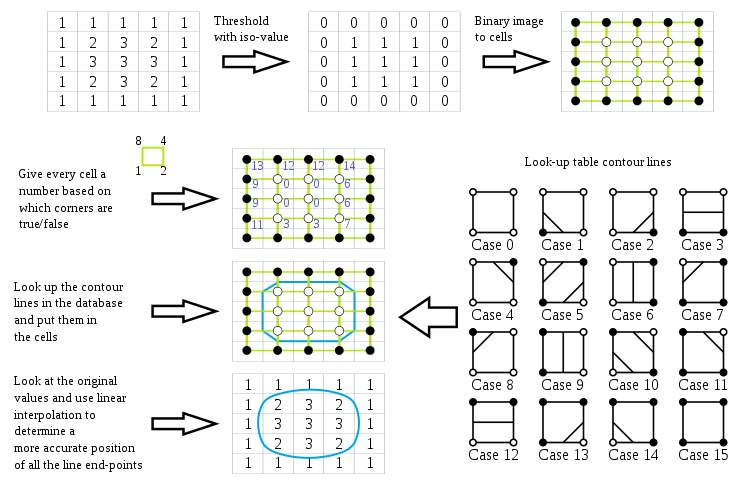
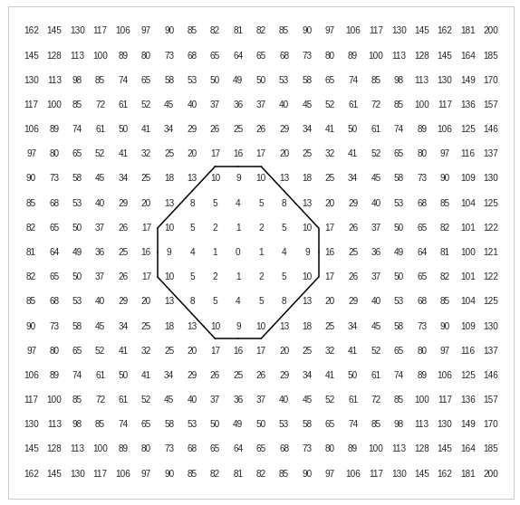

March 21, 2021

## Definition

Isolines are lines on a map (or graph) connecting datapoints of the same value.
Isolines are often used in Geography for studying patterns of temperature,
height, rain, etc.

## Example

Suppose that a client's marketing department wants you to plot an isoline graph
in order to identify customers with the same budget capabilities. The dataset
is normalized to 200 and is shown below:

19x21 matrix:

```python
[[162,145,130,117,106,97,90,85,82,81,82,85,90,97,106,117,130,145,162,181,200],
[145,128,113,100,89,80,73,68,65,64,65,68,73,80,89,100,113,128,145,164,185],
[130,113,98,85,74,65,58,53,50,49,50,53,58,65,74,85,98,113,130,149,170],
[117,100,85,72,61,52,45,40,37,36,37,40,45,52,61,72,85,100,117,136,157],
[106,89,74,61,50,41,34,29,26,25,26,29,34,41,50,61,74,89,106,125,146],
[97,80,65,52,41,32,25,20,17,16,17,20,25,32,41,52,65,80,97,116,137],
[90,73,58,45,34,25,18,13,10,9,10,13,18,25,34,45,58,73,90,109,130],
[85,68,53,40,29,20,13,8,5,4,5,8,13,20,29,40,53,68,85,104,125],
[82,65,50,37,26,17,10,5,2,1,2,5,10,17,26,37,50,65,82,101,122],
[81,64,49,36,25,16,9,4,1,0,1,4,9,16,25,36,49,64,81,100,121],
[82,65,50,37,26,17,10,5,2,1,2,5,10,17,26,37,50,65,82,101,122],
[85,68,53,40,29,20,13,8,5,4,5,8,13,20,29,40,53,68,85,104,125],
[90,73,58,45,34,25,18,13,10,9,10,13,18,25,34,45,58,73,90,109,130],
[97,80,65,52,41,32,25,20,17,16,17,20,25,32,41,52,65,80,97,116,137],
[106,89,74,61,50,41,34,29,26,25,26,29,34,41,50,61,74,89,106,125,146],
[117,100,85,72,61,52,45,40,37,36,37,40,45,52,61,72,85,100,117,136,157],
[130,113,98,85,74,65,58,53,50,49,50,53,58,65,74,85,98,113,130,149,170],
[145,128,113,100,89,80,73,68,65,64,65,68,73,80,89,100,113,128,145,164,185],
[162,145,130,117,106,97,90,85,82,81,82,85,90,97,106,117,130,145,162,181,200]]
```

We want to plot the isoline for the isovalue of 11.

Before building the algorithm from scratch, let's use matplotlib's countour
function to see what we are looking at:


```python
import matplotlib
import numpy as np
import matplotlib.cm as cm
import matplotlib.pyplot as plt

x = np.arange(1, 22, 1)
y = np.arange(1, 20, 1)
X, Y = np.meshgrid(x, y)

Z = [[162,145,130,117,106,97,90,85,82,81,82,85,90,97,106,117,130,145,162,181,200],
[145,128,113,100,89,80,73,68,65,64,65,68,73,80,89,100,113,128,145,164,185],
[130,113,98,85,74,65,58,53,50,49,50,53,58,65,74,85,98,113,130,149,170],
[117,100,85,72,61,52,45,40,37,36,37,40,45,52,61,72,85,100,117,136,157],
[106,89,74,61,50,41,34,29,26,25,26,29,34,41,50,61,74,89,106,125,146],
[97,80,65,52,41,32,25,20,17,16,17,20,25,32,41,52,65,80,97,116,137],
[90,73,58,45,34,25,18,13,10,9,10,13,18,25,34,45,58,73,90,109,130],
[85,68,53,40,29,20,13,8,5,4,5,8,13,20,29,40,53,68,85,104,125],
[82,65,50,37,26,17,10,5,2,1,2,5,10,17,26,37,50,65,82,101,122],
[81,64,49,36,25,16,9,4,1,0,1,4,9,16,25,36,49,64,81,100,121],
[82,65,50,37,26,17,10,5,2,1,2,5,10,17,26,37,50,65,82,101,122],
[85,68,53,40,29,20,13,8,5,4,5,8,13,20,29,40,53,68,85,104,125],
[90,73,58,45,34,25,18,13,10,9,10,13,18,25,34,45,58,73,90,109,130],
[97,80,65,52,41,32,25,20,17,16,17,20,25,32,41,52,65,80,97,116,137],
[106,89,74,61,50,41,34,29,26,25,26,29,34,41,50,61,74,89,106,125,146],
[117,100,85,72,61,52,45,40,37,36,37,40,45,52,61,72,85,100,117,136,157],
[130,113,98,85,74,65,58,53,50,49,50,53,58,65,74,85,98,113,130,149,170],
[145,128,113,100,89,80,73,68,65,64,65,68,73,80,89,100,113,128,145,164,185],
[162,145,130,117,106,97,90,85,82,81,82,85,90,97,106,117,130,145,162,181,200]]

fig, ax = plt.subplots()
CS = ax.contour(X, Y, Z, levels=[10, 20, 30, 50, 80, 130, 180])
ax.clabel(CS, inline=True, fontsize=10)
ax.set_title('Isolines graph')
```

## Marching Squares

"Marching squares" is an algorithm that
efficiently helps us to build isolines. The
algorithm is better explained via the image
below (courtesy of wikipedia):



## Step 1. Create the threshold matrix

The threshold matrix is created by going over the original matrix and
substituting the original values by:

- 1 when when the original value is above the
  isovalue.
- 0 when the original value is below the
  isovalue.

For the isovalue of 11, we then have the following threshold matrix:

```python
[[1, 1, 1, 1, 1, 1, 1, 1, 1, 1, 1, 1, 1, 1, 1, 1, 1, 1, 1, 1, 1],
[1, 1, 1, 1, 1, 1, 1, 1, 1, 1, 1, 1, 1, 1, 1, 1, 1, 1, 1, 1, 1],
[1, 1, 1, 1, 1, 1, 1, 1, 1, 1, 1, 1, 1, 1, 1, 1, 1, 1, 1, 1, 1],
[1, 1, 1, 1, 1, 1, 1, 1, 1, 1, 1, 1, 1, 1, 1, 1, 1, 1, 1, 1, 1],
[1, 1, 1, 1, 1, 1, 1, 1, 1, 1, 1, 1, 1, 1, 1, 1, 1, 1, 1, 1, 1],
[1, 1, 1, 1, 1, 1, 1, 1, 1, 1, 1, 1, 1, 1, 1, 1, 1, 1, 1, 1, 1],
[1, 1, 1, 1, 1, 1, 1, 1, 0, 0, 0, 1, 1, 1, 1, 1, 1, 1, 1, 1, 1],
[1, 1, 1, 1, 1, 1, 1, 0, 0, 0, 0, 0, 1, 1, 1, 1, 1, 1, 1, 1, 1],
[1, 1, 1, 1, 1, 1, 0, 0, 0, 0, 0, 0, 0, 1, 1, 1, 1, 1, 1, 1, 1],
[1, 1, 1, 1, 1, 1, 0, 0, 0, 0, 0, 0, 0, 1, 1, 1, 1, 1, 1, 1, 1],
[1, 1, 1, 1, 1, 1, 0, 0, 0, 0, 0, 0, 0, 1, 1, 1, 1, 1, 1, 1, 1],
[1, 1, 1, 1, 1, 1, 1, 0, 0, 0, 0, 0, 1, 1, 1, 1, 1, 1, 1, 1, 1],
[1, 1, 1, 1, 1, 1, 1, 1, 0, 0, 0, 1, 1, 1, 1, 1, 1, 1, 1, 1, 1],
[1, 1, 1, 1, 1, 1, 1, 1, 1, 1, 1, 1, 1, 1, 1, 1, 1, 1, 1, 1, 1],
[1, 1, 1, 1, 1, 1, 1, 1, 1, 1, 1, 1, 1, 1, 1, 1, 1, 1, 1, 1, 1],
[1, 1, 1, 1, 1, 1, 1, 1, 1, 1, 1, 1, 1, 1, 1, 1, 1, 1, 1, 1, 1],
[1, 1, 1, 1, 1, 1, 1, 1, 1, 1, 1, 1, 1, 1, 1, 1, 1, 1, 1, 1, 1],
[1, 1, 1, 1, 1, 1, 1, 1, 1, 1, 1, 1, 1, 1, 1, 1, 1, 1, 1, 1, 1],
[1, 1, 1, 1, 1, 1, 1, 1, 1, 1, 1, 1, 1, 1, 1, 1, 1, 1, 1, 1, 1]]
```

The above already give us a clue about where the isolines will be drawn. Check
the location where we have groups of zeros.

## Step 2. Map each cell to a number that corresponds to which corners are true/false

The threshold matrix can be mapped into squares, where each data value is the
vertex of a square. These corners can either be true or false. This gives us
the following amount of combinations:

(true or false) * (true or false) * (true or false) * (true or false) = 2 * 2 * 2 * 2 = 16

We can then proceed with the following mapping of cases:

- Case 0 - All corners are True
- Case 1 - All corners except the bottom left are True
- Case 2 - All corners except the bottom right are True
- Case 3 - Only the top corners are True
- Case 4 - All corners except the top right are True
- Case 5 - Left upper corner and low right corner are True
- Case 6 - Left top/bottom corners are True
- Case 7 - Only the top left corner is True
- Case 8 - All corners except the top left are True
- Case 9 - Right top/bottom corners are True
- Case 10 - Top right corner and bottom left corner are True
- Case 11 - Only the top right corner is True
- Case 12 - Only the bottom corners are True
- Case 13 - Only the bottom right corner is True
- Case 14 - Only the bottom left corner is True
- Case 15 - No corners are True

An example of Python algorithm to rewrite the threshold matrix into the cases
matrix:

```python
case_0 = [[1,1],[1,1]]
case_1 = [[1,1],[0,1]]
case_2 = [[1,1],[1,0]]
case_3 = [[1,1],[0,0]]
case_4 = [[1,0],[1,1]]
case_5 = [[1,0],[0,1]]
case_6 = [[1,0],[1,0]]
case_7 = [[1,0],[0,0]]
case_8 = [[0,1],[1,1]]
case_9 = [[0,1],[0,1]]
case_10 = [[0,1],[1,0]]
case_11 = [[0,1],[0,0]]
case_12 = [[0,0],[1,1]]
case_13 = [[0,0],[0,1]]
case_14 = [[0,0],[1,0]]
case_15 = [[0,0], [0,0]]

cases = [
    case_0, case_1, case_2, case_3,
    case_4, case_5, case_6, case_7, 
    case_8, case_9, case_10, case_11, 
    case_12, case_13, case_14, case_15
]

cases_mapper = {str(case): i for i, case in enumerate(cases)}

def get_corners_matrix(row, column):
    """
    Get the corners matrix:
      [[top_left, top_right], [bottom_left, bottom_right]]

    where top_left is the position of the entry itself.
    """
    return [
        [
            threshold_matrix[row][column],
            threshold_matrix[row][column + 1],
        ],
        [
            threshold_matrix[row + 1][column],
            threshold_matrix[row + 1][column + 1],
        ]
    ]

mapped_matrix = []

for row in range(len(threshold_matrix) - 1):
    mapped_row = []
    for column in range(len(threshold_matrix[0]) - 1):
        corners_matrix = get_corners_matrix(row, column)
        mapped_row.append(cases_mapper[str(corners_matrix)])
    mapped_matrix.append(mapped_row)
```

Note: The mapped matrix has the dimension M-1,N-1 since the last row and the
last column aren't mapped.

## Step 3. Draw the patterns



```python
x_threshold = 21
y_threshold = 19

# graph configuration
plt.style.use('seaborn-whitegrid')
plt.grid(b=None)
plt.xticks([])
plt.yticks([])
plt.xlim([-1,x_threshold])
plt.ylim([-1,y_threshold])

def plot_line(x,y,case):
    middle_y_left = [x, (y_threshold -1) - y - 0.5]
    middle_y_right = [x + 1, (y_threshold -1) - y - 0.5]
    middle_x_top = [x + 0.5, (y_threshold -1) - y]
    middle_x_bottom = [x + 0.5, (y_threshold -1) - y - 1]

    if case in [1, 14]:
        from_point = middle_y_left
        to_point = middle_x_bottom
    elif case in [2, 13]:
        from_point = middle_x_bottom
        to_point = middle_y_right
    elif case in [3, 12]:
        from_point = middle_y_left
        to_point = middle_y_right
    elif case in [4, 11]:
        from_point = middle_x_top
        to_point = middle_y_right
    elif case == 5:
        # case 5 is a composition of case 2 + case 7
        plot_line(x, y, case=2)
        plot_line(x, y, case=7)
        return
    elif case in [6, 9]:
        from_point = middle_x_top
        to_point = middle_x_bottom
    elif case in [7,8]:
        from_point = middle_y_left
        to_point = middle_x_top
    else:
        # Never draw for case 0 or 15
        return
    x = [from_point[0],to_point[0]]
    y = [from_point[1],to_point[1]]
    plt.plot(x, y, color='black')

for r_index, row in enumerate(mapped_matrix):
    for c_index, column in enumerate(row):
        plot_line(x=c_index, y=r_index, case=column)

for r_index, row in enumerate(Z):
    for c_index, column in enumerate(row):
        label = str(column)
        plt.annotate(
            label,
            (c_index,r_index),
            ha='center',
            va='center',
        )
```

## Step 4. Linear interpolation

This is the last step to get our final isoline. It is also the most complex one
to code. I'll update this in the future if I ever get the patience! (sorry, but
let me know if you want this to happen by flicking me an email). Step 3 should
give you a good approximation nonetheless.
