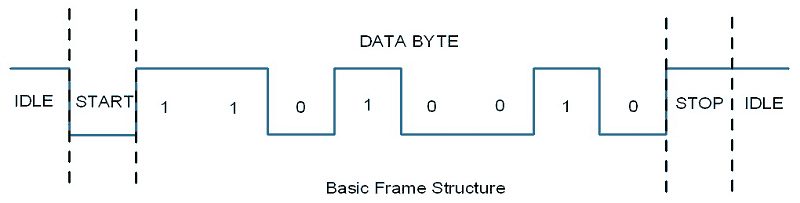

# Building an UART with (System)Verilog

Sources:
- https://nandland.com/uart-serial-port-module/
- https://www.electronicwings.com/raspberry-pi/raspberry-pi-uart-communication-using-python-and-c

## What is an UART

UART stands for universal asynchronous receiver-transmitter. An UART is a
computer hardware that facilitates asynchronous serial communication.

UARTs usually send information bit by bit. Starting from the least significant
to the most significant one.

There're usually 3 major components in a UART:

1. **START bit**: Is a bit that indicates that the communication has started.
   Note that if the value of the START bit is 0 it means that the UART
   transmitter is ready to send data, whereas a value of 1 means that it is not
   ready. It can be counter intuitive to some.
2. **Payload**: This is the information itself, normally a 8-bit (1 byte)
   information is sent, but this can vary from 5-9 bits.
3. **STOP bit**: Signals that the payload is now completely sent.



## Example codes in Verilog

For these examples we're going to use:

- 10 MHz clock
- 125000 bits per second (baud rate)

This means that each bit will be sent in

10,000,000 / 125000 = 80 clock cycles.

## (System)Verilog UART receiver

```verilog
module uart_transmiter(
  input clock,
  input reset,
  input has_incoming_data,
  input [7:0] incoming_byte;
  output start_bit;
  output stop_bit;
  output bit;
);

  parameter CLOCKS_PER_BIT = 80;

  enum {IDLE, START_BIT, PROCESSING, STOP_BIT, RESET} status = IDLE;
  reg [7:0] payload = 8'b0;

  always @(posedge clock or posedge reset) begin
    case (status)
      IDLE:
        begin
          start_bit <= 1'b1;
          stop_bit <= 1'b1;
          if (has_incoming_data)
            begin
              status <= START_BIT;
            end
          else
            begin
              status <= IDLE;
            end
        end

      START_BIT:
        begin
          start_bit <=

    endcase
  end


endmodule

```


