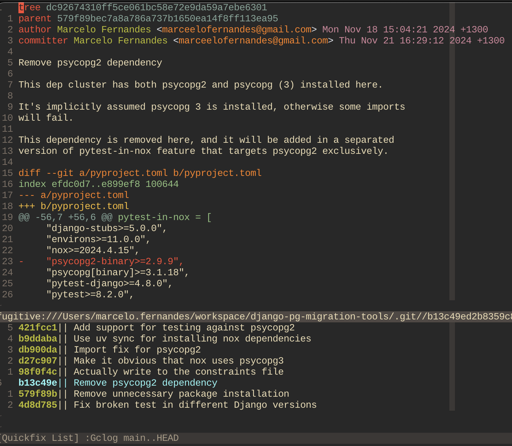

# Code Reviews In Vim

```
Created at: 2024-11-21
```

A common way of reviewing code today is by performing the review using the
repository host UI (GitHub, GitLab, etc.).

I have done that for awhile, and I still do it when code changes are trivial.

"Trivial" means I don't need to play with the branch locally first to have
confidence the changes are correct.

However, often I will work with code that is hard to "only see" and feel
confident it does the right thing.

For more complex cases, having the branch locally allows me to inspect and
alter the code better than I can using the repository host UI.

## Fetching

The first step is to get the branch locally:

```sh
git fetch origin branch_name && git checkout branch_name
```

You can simplify this command and skip to `git checkout` if you always fetch
the entire remote (which I don't do because it takes too much space/time).

## Showing the commits

The next step is to find exactly which commits the new branch includes.

```sh
git log -p master..HEAD
```

This command basically means "show me all the commits that this branch (HEAD)
introduced since it diverged from master".

This effectively shows the commits created by the branch author and nothing
else.

The `-p` (patches) includes the diffs for each commit in the result. I skip
this sometimes if I am visualising the patches in a different way.

When in Vim, I use the vim-fugitive plugin. Running the same command through
the plugin wrapper gives me a quick-fix window containing the commits from the
pull request.

Running `:Gclog master..HEAD` looks like this:



Now I can quickly navigate between commits to see what's changed.

If you are using a different tool but still want to see the commit changes in
your editor, you can try:

```sh
git show <commit_hash>
```

## Checking Out Each Commit

I currently work on codebases that use atomic commits.
This essentially means that for each commit:

1. The test suite must fully pass.
2. The integrity of the codebase isn't in jeopardy (no half-done changes
   between commits).
3. The codebase is in a deployable state.
4. A commit explains a single change, not multiple.

For example, a commit title "Change X **and** Y" is an indication that the
commit isn't atomic. Multiple things are changing in the same commit.

Having atomic commits means that I can code-review a Pull Request
commit-by-commit.

Of course there are many more benefits of this practice. For example, I can use
`git blame` effectively. No change will be part of a 40-commits rebased
branch with lack of detailed explanation in the commit description.

So after I have run `git log -p master..HEAD`, I will go through each commit
and perform:

```sh
# Checkout the relevant commit I want to play with
git checkout <commit hash>
```

If I have messed things up, I can just check the reflog and go back to the
place where I got the branch from.

```sh
# List the "reference logs" to find the record when the tip of the branch
# reference changed.

git reflog

# Now go back to the hash representing the time I checked the branch at the
# first time. It will look something like:
# 43c0eb3 HEAD@{3}: checkout: moving from main to my_branch

git checkout 43c0eb3
```

## Taking Notes

If I am reviewing a complicated branch, I will usually open a new file in the
`/tmp/` folder to take some notes in.

There isn't anything fancy about that. It comes from the principle of wanting
to have vim-editing capabilities when writing down a comment on a pull request.

Often, I will write code blocks in reply to a commit anyway, so editing
comments in vim makes it easier to edit the comment than say, the GitHub UI.

Note: There are ways to embed vim into a browser nowadays, but it often feels
strange. I prefer to not use an embedded vim.

