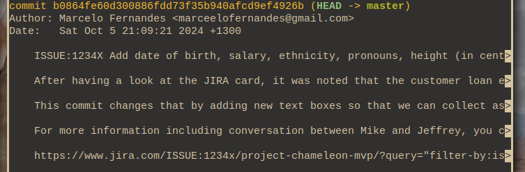
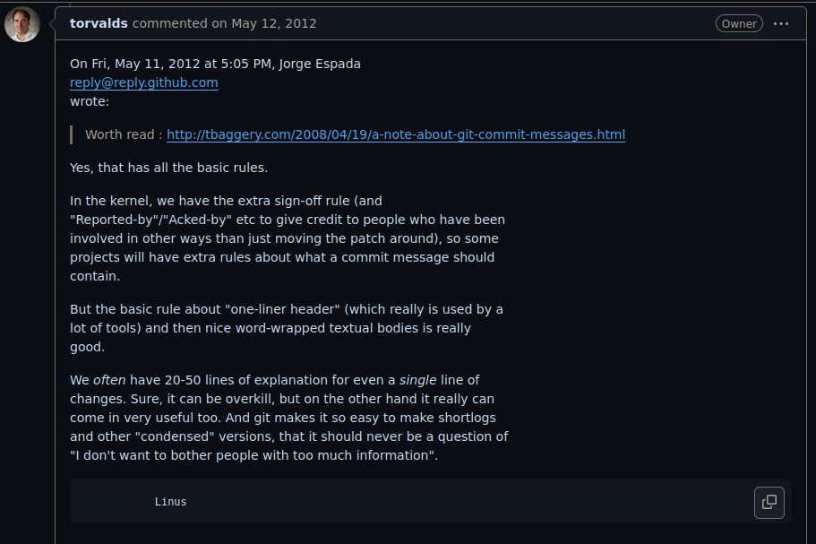

# On Git Commit Messages

```
Created at: 2024-10-05
```

There are two web pages that provide a great summary on Git Commits best
practice.

I recommend reading them before going through the rest of this post:

- [Git Commit Good Practice - OpenStack](http://web.archive.org/web/20241003132241/https://wiki.openstack.org/wiki/GitCommitMessages)
- [Tim Pope's note about commit messages](http://web.archive.org/web/20240930112522/https://tbaggery.com/2008/04/19/a-note-about-git-commit-messages.html)

Those articles are "old". One is from 2008 and the other is from 2014. This
means that the following occasional comment pops up now and then:

> _It's 2024, do we **really** have to restrict ourselves to 72-long commit
> titles? I think it's acceptable to simply:_

```
git -m "ISSUE:1234X Add date of birth, salary, ethnicity, pronouns, height (in centimetres), salary text fields, and more, to the request loan submit form for Chameleon MVP."
```

> _We also have so many good tools around git that make it easier to see the
> changes and the diffs. We can also link to rich context on JIRA and Asana,
> why are we focusing so much on terminal limitations?_
>
> _We are agile and always fix forward. We never have use for the old bits of
> git like git bisect, git revert, or even git log... What do these do
> again?!..._

Given that I have little to contribute to the excellent content in the
articles above, I'll limit my contribution to talking about the reason these
posts have aged so well.

## A Disclaimer

Learning a tool like git takes time. To make the most of git, one needs to
learn it well. The same way there are programmers who debug exclusively with
`print()`, there are programmers who only use three git commands: `pull`,
`commit`, and `push`.

That is fine. You can go a long way without ever needing more advanced git
commands (or debugging tools). That also means, however, that the
justifications behind good-practice advice will be harder to understand. I will
try to make those clearer in this post even if you don't go beyond these three
git commands.

The tragedy of it all, however, is that not knowing those advanced use cases
before creating a repository might jeopardise the ability of advanced users to
take advantage of good commit etiquette.

Some code bases have a "before good commits" and "after good commits". The
"before" is usually a dark place we don't like to go.

Make up your reasons wisely and trust the advice of people who have been there
before and learned the hard lessons.

## The Summary

Before going into the reasons why the advice from those posts is still sound,
here is a very short summary of the two articles above:

- **Do not mix two unrelated functional changes in the same commit**: It's hard
  to catch flaws during review when changes are mixed together. If the commit
  needs to be reverted, the two changes need to be untangled first. Similarly,
  it is harder to bisect and find which change created a bug if multiple
  functional changes are included in a commit.
- **Do not assume the reviewer uses the same tools as you**.
- **Do not assume the reviewer has access to an external website**.

These provide justification for seemingly arbitrary content on the linked blog
posts such as _"commit titles should be no longer than 50 characters and commit
bodies no longer than 72 characters"._

## Do not mix two unrelated functional changes in the same commit

> So commit messages to me are almost as important as the code change itself.
> Sometimes the code change is so obvious that no message is really required,
> but that is very very rare. And so one of the things I hope developers are
> thinking about, the people who are actually writing code, is not just the
> code itself, but explaining why the code does something, and why some change
> was needed. Because that then in turn helps the managerial side of the
> equation, where if you can explain your code to me, I will trust the code...
>
> Linus Torvalds.

Let's start with a **bad** example:

```
commit e5b18b256c0f4f5d369c62785248632075790867 (HEAD -> master)
Author: John Doe <john.doe@gmail.com>
Date:   Sat Oct 5 18:33:21 2024 +1300

    Revamp customer profile page

    This commit:

      - Refactor ResetPassword form UI to reuse textbox component.
      - Add an index to the "users" table to lookup emails faster.
      - Apply compression to user's uploaded profile pictures.
      - Change hash algorithm for profile picture names.
      - Fix broken layout on mobile devices using landscape format.
      - Add a new canary flag to control "Under Maintanence" banner.
```

Although John Doe's commit title evokes the idea that there's only one thing
happening, a closer look at the commit description reveals that there are
many unrelated changes sneaking in at the same time.

Why is this bad? Let's start with a simple example.

Suppose the third change has a bug:

- _"Apply compression to user's uploaded profile pictures"_.

The `profile_update.c` file where all the operations for updating a user's
profile live has a code-path that crashes the server.

Naturally you want to revert that commit. But in the meanwhile John's colleague
Mary has changed one of the UI layout files that John's commit had also touched
as part of an unrelated change:

```
commit 85cf1a1501a2062dbc9310d6b598dcf72e284cbc (HEAD -> master)
Author: Mary Silva <mary.silva@gmail.com>
Date:   Sat Oct 6 20:45:40 2024 +1300

    Upgrade profile page UI layout

    This commit:

      - Move css classes to the new file "user_layout.css".
      - Refactor text boxes to use the same css style.
      - Remove unreacheable (dead) JavaScript code.
```

Now you can't revert John's commit because you got a conflict.

```
git revert e5b18b256c0f4f5d369c62785248632075790867

CONFLICT (modify/delete): README.md deleted in (empty tree) and modified in
HEAD.  Version HEAD of README.md left in tree.

error: could not revert e5b18b2... Revamp customer profile page
```

The bug in the `profile_update.c` file has nothing to do with the UI layout in
the profile page.

When John added all of those unrelated changes in a single commit, his
commit became a **conflict magnet**. Conflict magnet commits are very hard to
revert.

### Bisecting

In this case we already knew that John's commit introduced a bug, but what if
we didn't? `git bisect` is a git tool built for finding **where** a bug was
introduced.

To use `git bisect` you give it two arguments: A "bad" commit that is known to
**contain** the bug (even if not introduced by that commit itself), and a
"good" commit that is known to be before the bug was introduced.

The short version of what bisect does is: Bisect will pick a commit between
the "bad" and "good" one and ask you whether it's good or bad. It is up to you
to decide.

How you do that depends on the project, you might run the test suite with a
test that reproduces the bug, or simply look at the diff changes. In each
iteration, `git bisect` shrinks the search window until John's offending commit
is found.

Inevitably you find John's commit. However, the commit has two changes in the
same `profile_update.c` file that causes the bug.

```
  - Apply compression to user's uploaded profile pictures.
  - Change hash algorithm for profile picture names.
```

So which of the changes is the bad one?

That question might not be trivial to answer. It might be hard to untangle
which change actually broke the code. Specially if the compression algorithm
and the hash algorithm use the same underling routines.

### Function evolutions

Another tool that can't be used as well if multiple changes are present in the
same commit is `git log -L`.

```sh
git log -L :<funcname>:<file_name>
```

By running the command above, git will display a diff with all the commits
that touched that function in the past.

This presents a way to see the "evolution" of a function over time.

You want commits to be split so that you can see which individual patches
changed that function.

Having a single commit with too much noise makes that more difficult to
understand **why** that function changed.

If you are not convinced yet, there are many more git tools that are affected
by non-atomic commits. Check the list below and see if may you use any of the
following:

- `git blame`: Atomic commits give you the direct answer to: "Why was this
  change made?"
- `git rebase`: For rebasing, dropping changes, re-editing commit messages, or
  adding fix-ups.
- `git cherry-pick`: For applying a specific commit from one branch to another.
- `git diff`: For seeing one change at a time.

It's reasonable to conclude that one commit per functional change is still
relevant today.

## Do not assume the reviewer uses the same tools as you

> Word-wrapping is a property of the text. And the tool you use to
> visualize things cannot know. End result: you do word-wrapping at the
> only stage where you can do it, namely when writing it. Not when
> showing it.
>
> Some things should not be word-wrapped. They may be some kind of
> quoted text - long compiler error messages, oops reports, whatever.
> Things that have a certain specific format.
>
> The tool displaying the thing can't know. The person writing the
> commit message can. End result: you'd better do word-wrapping at
> commit time, because that's the only time you know the difference.
>
> (And the rule is not 80 characters, because you do want to allow the
> standard indentation from git log, and you do want to leave some room
> for quoting).
>
> Linus Torvalds

This is what a long commit looks like with the default pager (`less` on most
*nix systems).



Those white arrows at the right-hand side show where the text was truncated.

Although `less` supports wrapping text, it may not be on by default depending
on how your OS came configured.

Every command that takes the commit summary (top line) truncate and become
unreadable. More examples of such commands are found on Tim Pope's [blog
post](http://web.archive.org/web/20240930112522/https://tbaggery.com/2008/04/19/a-note-about-git-commit-messages.html).

There isn't much I can add here. I think that it is important to have good
writing skills for both commit titles and commit messages with the goal of
keeping them succinct and informative at the same time. You can see for
yourself how nice [Linux's kernel git
log](https://github.com/torvalds/linux/commits/master/) reads for inspiration.

The kernel has a [restrictive line-length
limit](https://git.kernel.org/pub/scm/linux/kernel/git/torvalds/linux.git/tree/Documentation/process/submitting-patches.rst?id=bc7938deaca7f474918c41a0372a410049bd4e13#n664).

> the ``summary`` must be no more than 70-75 characters.

No text gets wrapped or truncated, and everything is nice and in _good_ style.

It is true that there is no strong evidence about what the "ideal" line-length
**for coding** is. But we know that number for **human-readable text**:

>  Research has led to recommendations that line length should not exceed about
>  70 characters per line. The reason behind this finding is that both very
>  short and very long lines slow down reading by interrupting the normal
>  pattern of eye movements and movements throughout the text.

[source](https://www.researchgate.net/publication/234578707_Optimal_Line_Length_in_Reading--A_Literature_Review)

Throw no stones! We are talking about **human-readable**, i.e., text like
books, magazines, papers, **and git logs!!!**.

As Linus has explained on the quote at the top of this section, the **writer**
is responsible for wrapping the text because the _pager_ tool might not be able
to do it for the **reader**.

The default pager (`less`) is not the only tool that truncates instead of
wrapping, even in 2024 we haven't found the magic solution for perfect
text-wrapping yet.

Even GitHub truncates long commit titles to 72 characters. Be mindful of that
when committing long titles and messages.

## Do not assume the reviewer has access to an external website

I worked for a company that used to use GitHub for issue tracking as well as
repository hosting. Many of our commit messages merely pointed at GitHub links
and had no description at all.

It was sad to see the company getting acquired and the parent company moving to
BitBucket while deleting the old GitHub account.

It is OK to link to GitHub, Jira, Asana, etc., but the most important thing is
to **make sure** the commit message has everything you need in it so that you
don't depend on external services.

## Outro

Linus on Tim Pope's post:



## Further Reading

- [https://github.com/torvalds/linux/pull/17](https://github.com/torvalds/linux/pull/17)
