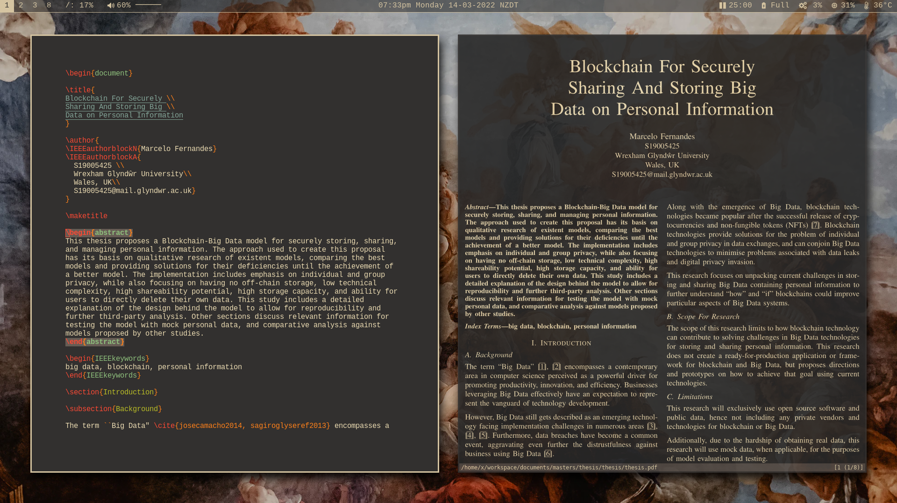
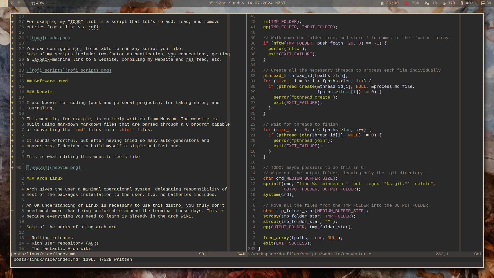

# Linux Rice

```
Created: 2020-08-30
Updated: 2024-07-06
```

## Introduction

When someone is "ricing" their unix system, they are making functional and
visual customisations to their desktop. These changes could be anything from
changing the colour of a status bar to completely restructuring their computer
environment.

_**Why?**_

- **Productivity**: You can customise your applications and keyboard shortcuts
  to satisfy your work-flow.
- **Performance**: You are in control of what gets installed on your
  application and not have to worry about unknown apps running on the
  background.
- **Privacy**: It is your system and the defaults in some distributions
  can contain software that can spy on your behaviour like Canonical has done
  in the past.
- **Visual Satisfaction**: Whatever colour scheme you like.
- **Because it is fun**.

## How does it look like?



```sh
$ neofetch
                   -`                    x@x
                  .o+`                   ---
                 `ooo/                   OS: Arch Linux x86_64
                `+oooo:                  Host: 20Q5S01400 ThinkPad L490
               `+oooooo:                 Kernel: 6.6.39-1-lts
               -+oooooo+:                Uptime: 1 hour, 32 mins
             `/:-:++oooo+:               Packages: 519 (pacman)
            `/++++/+++++++:              Shell: bash 5.2.26
           `/++++++++++++++:             Resolution: 1920x1080
          `/+++ooooooooooooo/`           WM: i3
         ./ooosssso++osssssso+`          Theme: Adwaita [GTK2/3]
        .oossssso-````/ossssss+`         Icons: Adwaita [GTK2/3]
       -osssssso.      :ssssssso.        Terminal: alacritty
      :osssssss/        osssso+++.       Terminal Font: LiterationMono Nerd Font
     /ossssssss/        +ssssooo/-       CPU: Intel i7-8565U (8) @ 4.600GHz
   `/ossssso+/:-        -:/+osssso+-     GPU: Intel WhiskeyLake-U GT2 [UHD Graphics 620]
  `+sso+:-`                 `.-/+oso:    Memory: 1571MiB / 7134MiB
 `++:.                           `-/+/
 .`                                 `/

du -h /
# 5.6G
```

## Workflow Tools

Most of my tools revolve around [rofi](https://github.com/davatorium/rofi)
which is an application launcher.

For example, my "TODO" list is a script that let's me add, read, and remove
entries from a list via rofi:


You can configure rofi to be able to run any script you like.
Some of my scripts include: two-factor authentication, vpn connections, getting
a wayback-machine link to a website, compiling my website and rss feed, etc.


## Software used

### Neovim

I use Neovim for coding (work and personal projects), for taking notes, and
journaling.

This website, for example, is entirely written from Neovim. The website is
built using markdown files that are parsed through a C program capable
of converting the `.md` files into `.html` files.

After having tried so many auto-generators and converters, I decided to build
myself a simple and fast one. It was also such a fun C project.

This is what editing this website feels like along with a snippet of the C
code used to compile the `.md` files into `.html`:



### Arch Linux

Arch has been my daily driver since 2019. Before that, I've used Linux Mint and
Ubuntu at work; back when I didn't care and didn't know the differences between
all the flavours of Linux. I have also had to use MacOS for a job where the
company mandated developers to use Apple machines.

I have tried other different flavours of Linux on virtual machines in the past,
but I decided to stick with Arch Linux given how simple it is to customise.

That means I can use my simple bash script to download and auto-configure my
system without manual intervention. I can also sync my environment between my
work laptop and my personal laptop with one command. Apart from the hardware,
all my machines are identical from a user's experience.

An basic understanding of Linux is necessary to use this distro. You don't need
much more than being comfortable around the terminal these days. This is
because everything you need to learn is already in the arch wiki and arch now
has assisted installation scripts via `archinstall`.

Some other perks of using arch are:

- Rolling releases
- Rich user repository (AUR)
- The fantastic Arch wiki
- No corporations behind it (community support only)
- Helpful community

### i3-gaps

i3-gaps is a fork of the i3wm (tilling window manager) for X11. Instead of
having stacked windows that overlap (like in microsoft windows, or macOs),
windows are organized side-by-side as default, having gaps between them.
The benefits are:

- Able to customise keyboard shortcuts to navigate through windows.
- Easy to setup.

### polybar

Polybar is was the easiest and most user-friendly status bar I could find. With
a lot of pre-configured setups and out-of-the-box integrations, getting up to
speed was very simple.

### rofi

A very simple and configurable application/script launcher.

### pywal

For setting colours and themes.

## More about Ricing

When it comes to finding inspiration for ricing in Linux, a good place to look
at is [/r/unixporn](https://www.reddit.com/r/unixporn/). Most of my setup came
from picking apart different rices that users have shared in that channel. It
is also a good place to visit once in a while to stay up-to-date with what the
rest of the community is using and trying.
