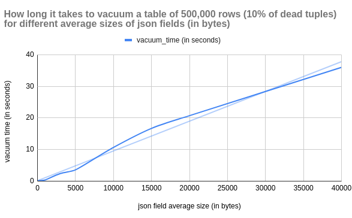
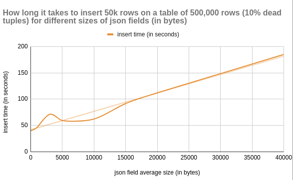
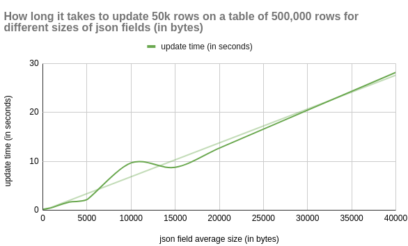
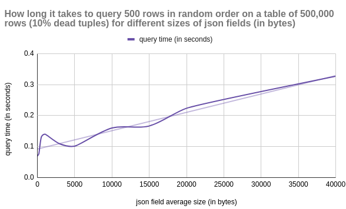

# About That Postgres Json Field

```
Created at: 2024-10-10
```

The json type was introduced in Postgres 9.2. Since then, the json type has
gone through multiple enhancements, including the addition of the jsonb type
(9.4).

> Because the json type stores an exact copy of the input text, it will
> preserve semantically-insignificant white space between tokens, as well as
> the order of keys within json objects. Also, if a json object within the
> value contains the same key more than once, all the key/value pairs are kept.
> (The processing functions consider the last value as the operative one.) By
> contrast, jsonb does not preserve white space, does not preserve the order of
> object keys, and does not keep duplicate object keys. If duplicate keys are
> specified in the input, only the last value is kept.
> [source](http://web.archive.org/web/20241007081857/https://www.postgresql.org/docs/15/datatype-json.html)

This sounds great, but there are downsides to storing json fields
(specially big ones) in Postgres.

The degradation of some database functions grows linearly as a function of
the json size.

To analyse this behaviour, I set up a sandbox script. The script creates **a
table with 500,000 rows**, **with varying sizes of json fields** and runs
common operations against it.

The script and the data are included verbatim at the bottom of this post.

## VACUUM



VACUUM becomes more resource-intensive for tables with large json’s.  Each
dead tuple linked to a large json field adds to the overhead.

This makes VACUUM run longer. Possibly delaying other maintenance tasks or
DDLs.

## INSERTS



## UPDATES



## SELECT (queries)



Big json fields can degrade query performance. Tables with such fields
take longer to read from disk and use more storage when cached in memory.

This makes querying these tables less efficient. SELECTs have to do more work
to scan the same amount of data.

If the json field doesn’t exceed a particular threshold (~2KB) it won’t be
stored in a toast table. Instead, it will be stored inline on the page.

If a table doesn't have a high ratio of HOT updates, the volume of dead
rows will increase. This further affects performance.

## Considerations

Consider omitting the json field from your SELECT queries when applicable. This
will remove the overhead added by querying and decoding the data from the TOAST
table.

If you don't update the json data after it has been stored, consider a
different type of storage. One option is storing the data on a bucket like S3.

Buckets can be a good option if you are satisfied with the following
trade-offs:


```
| Factor                   | Keep json in PostgreSQL                  | Move json to S3                              |
|--------------------------|------------------------------------------|----------------------------------------------|
| Database size            | Increases database size                  | Keeps DB lean; reduces size                  |
| Performance              | json querying is slower for large fields | Keeps queries fast; json retrieved separately|
| Cost                     | Higher storage costs                     | Cheaper for large; unstructured data         |
| Atomicity & Transactions | Full transactional consistency           | No transactional guarantees                  |
| Querying                 | Direct SQL querying on json              | No direct querying                           |
| Simplicity               | All data in one place                    | Separate management of S3 and DB             |
| Access Latency           | Low-latency access                       | Potential latency in fetching from S3        |
```

## Inspecting the TOAST table

You can find the name of a toast table with this query:

```
SELECT
    c.relname AS main_table,
    t.relname AS toast_table
FROM
    pg_class c
JOIN
    pg_class t ON c.reltoastrelid = t.oid
WHERE
    c.relname = 'my_table';
```

After you find the name of that toast_table, you can query the `pg_toast`
schema to find stats about the toast table (assuming the toast table name is
pg_toast_4532686):

```
SELECT *
FROM pg_stat_all_tables
WHERE relid = 'pg_toast.pg_toast_24683'::regclass;
```

And you can query its rows as a regular table:

```
SELECT *
FROM pg_toast.pg_toast_24683 LIMIT 100;
```

## The benchmark script


```python
import psycopg2
import time
import os
import json
import random
import string

"""
This code creates a benchmark for Postgres tables with
json fields.

For a table with NUM_OF_ROWS, for each value of JSON_SIZE_IN_BYTES:

- Check how long it takes to update PERCENTAGE rows in the table.
- Check how long it takes to insert PERCENTAGE rows in the table.
- Without vacuuming yet, check the average time to query NUM_QUERIES. There
  will be dead tuples impacting the performance from the operations above.
- Check how long it takes to vacuum.

"""

NUM_OF_ROWS = 500_000

JSON_SIZE_IN_BYTES = [
    10,
    100,
    200,
    500,
    1000,
    3_000,
    5_000,
    10_000,
    15_000,
    20_000,
    40_000,
]
PERCENTAGE = 0.1

NUM_QUERIES = 10_000
QUERY_LIMIT = 500


def get_cursor_and_connection():
    # Update connection details as per your PostgreSQL setup
    conn = psycopg2.connect(
        dbname="test_db",
        user="postgres",
        password="postgres",
        host="localhost",
        port="5441",
    )
    conn.autocommit = True
    return conn.cursor(), conn


def vacuum_table(cursor):
    print("- Vacuuming json_bench...")
    start_time = time.time()
    cursor.execute("VACUUM ANALYZE json_bench;")
    duration = time.time() - start_time
    print(f"- Vacuum took: {duration:.2f} seconds.")
    return duration


def create_table(cursor):
    print("- Creating table...")
    cursor.execute("""
        -- Idempotency for convenience.
        DROP TABLE IF EXISTS json_bench;
        CREATE TABLE json_bench (
            id SERIAL PRIMARY KEY,
            json_field JSONB
        );

        -- Disable autovacuum to not interfere with results.
        ALTER TABLE json_bench
        SET (autovacuum_enabled = false);

        -- Make sure the json field will be toasted at 2kb
        -- and compressed too.
        ALTER TABLE json_bench
        ALTER COLUMN json_field
        SET STORAGE EXTENDED;

        -- The default toast threshold is 2kb (comp time)
        -- #define TOAST_TUPLE_THRESHOLD 2048
    """)


def generate_json(json_size_in_bytes):
    return json.dumps(
        {
            "data": "".join(
                random.choices(
                    string.ascii_letters + string.digits, k=json_size_in_bytes
                )
            )
        }
    )


def populate_table(cursor, json_size_in_bytes):
    print(f"- Populating table with {NUM_OF_ROWS:,} rows...")

    json_data = generate_json(json_size_in_bytes)
    json_rows = [(json_data,) for _ in range(NUM_OF_ROWS)]

    start_time = time.time()
    cursor.executemany("INSERT INTO json_bench (json_field) VALUES (%s);", json_rows)
    duration = time.time() - start_time

    print(f"- Populating took: {duration:.2f} seconds.")
    return duration


def update_data(cursor, json_size_in_bytes):
    """
    This will generate some dead rows.
    """
    update_count = int(PERCENTAGE * NUM_OF_ROWS)
    print(f"- Updating {update_count:,} rows...")

    json_data = generate_json(json_size_in_bytes)

    update_query = """
    UPDATE json_bench
    SET json_field = %s
    WHERE id IN (
        SELECT id
        FROM json_bench
        ORDER BY id DESC
        LIMIT %s
    );
    """

    start_time = time.time()
    cursor.execute(update_query, (json_data, update_count))
    duration = time.time() - start_time

    print(f"- Update took: {duration:.2f} seconds.")
    return duration


def insert_data(cursor, json_size_in_bytes):
    insertion_count = int(PERCENTAGE * NUM_OF_ROWS)
    print(f"- Inserting {insertion_count:,} rows into the table...")

    json_data = generate_json(json_size_in_bytes)
    json_rows = [(json_data,) for _ in range(insertion_count)]

    start_time = time.time()
    cursor.executemany("INSERT INTO json_bench (json_field) VALUES (%s);", json_rows)
    duration = time.time() - start_time

    print(f"- Insertion took: {duration:.2f} seconds.")
    return duration


def benchmark_queries(cursor):
    print(f"- Bench marking {NUM_QUERIES:,} queries against the table...")
    start_time = time.time()

    for _ in range(NUM_QUERIES):
        cursor.execute(
            f"SELECT * FROM json_bench ORDER BY RANDOM() LIMIT {QUERY_LIMIT};"
        )
        cursor.fetchall()

    duration = time.time() - start_time
    print(f"- Average query time: {(duration/NUM_QUERIES):.5f} seconds.")
    return duration / NUM_QUERIES


def clear_cache():
    print("- Clearing cache by restarting docker container...")
    os.system("docker restart postgres15")
    print("- sleeping for 10s")
    time.sleep(10)


def query_dead_tuples(cursor):
    cursor.execute(
        "SELECT n_dead_tup FROM pg_stat_user_tables WHERE relname = 'json_bench';"
    )
    print(f"- There are {cursor.fetchone()[0]} dead tuples...")


def query_hot_updates(cursor):
    cursor.execute(
        "SELECT n_dead_tup FROM pg_stat_user_tables WHERE relname = 'json_bench';"
    )
    cursor.execute(
        """
        SELECT n_tup_hot_upd
        FROM pg_stat_user_tables
        WHERE relname = 'json_bench';
        """
    )
    print(f"- There were {cursor.fetchone()[0]} hot updates...")


def run_tests():
    results = {}
    print(
        f"\nReport details:\n"
        f"  - rows in the table: {NUM_OF_ROWS:,}\n"
        f"  - percentage of updates and inserts: {PERCENTAGE*100:.2f}%\n"
        f"  - number of queries to benchmark: {NUM_QUERIES:,} with limit {QUERY_LIMIT:,}"
    )

    for json_size in JSON_SIZE_IN_BYTES:
        print(f"\nRunning tests with json's of {json_size:,} bytes...")

        # Get a cursor to run queries.
        cursor, conn = get_cursor_and_connection()

        # Create the table and insert data.
        create_table(cursor)
        populate_table(cursor, json_size)

        # Vacuum so there are no dead rows.
        vacuum_table(cursor)

        # Update PERCENTAGE new rows to create some dead rows
        # for a more realistic scenario.
        update_duration = update_data(cursor, json_size)
        query_dead_tuples(cursor)
        query_hot_updates(cursor)

        # Insert PERCENTAGE new rows while we have dead rows
        insert_duration = insert_data(cursor, json_size)
        query_dead_tuples(cursor)
        query_hot_updates(cursor)

        # With the dead rows, check the query performance
        query_avg_duration = benchmark_queries(cursor)

        # Check how long vacuuming the dead rows takes
        vacuum_duration = vacuum_table(cursor)

        # Clear OS cache and get a new cursor
        clear_cache()
        cursor, conn = get_cursor_and_connection()

        results[json_size] = {
            "update_duration": update_duration,
            "insert_duration": insert_duration,
            "query_avg_duration": query_avg_duration,
            "vacuum_duration": vacuum_duration,
        }

    cursor.close()
    conn.close()

    # Print final results
    print("\nFinal Results:")
    for json_size, times in results.items():
        print(f"json size: {json_size:,} bytes")
        print(f" - Update duration: {times['update_duration']:.2f} seconds")
        print(f" - Insert duration: {times['insert_duration']:.2f} seconds")
        print(f" - Query AVG duration: {times['query_avg_duration']:.5f} seconds")
        print(f" - Vacuum duration: {times['vacuum_duration']:.2f} seconds")


run_tests()
```

## The results in CSV format

```
json_length,update_time,insert_time,avg_query_time,vacuum_time
10,0.22,41.2,0.0689,0.08
100,0.22,40.29,0.07287,0.1
200,0.24,40.73,0.07694,0.16
500,0.35,42.35,0.12824,0.2
1000,0.51,46.06,0.13995,0.36
3000,1.65,71.18,0.10875,2.4
5000,2.17,59.36,0.10136,3.57
10000,9.67,62.27,0.15999,10.67
15000,8.77,91.57,0.16642,16.69
20000,12.7,111.92,0.22364,20.71
40000,28.16,184.93,0.32687,35.98
```

## The machine that ran the tests

```
[~] neofetch
                   -`                    x@archlinux
                  .o+`                   -----------
                 `ooo/                   OS: Arch Linux x86_64
                `+oooo:                  Host: 20W0005AAU ThinkPad T14 Gen 2i
               `+oooooo:                 Kernel: 6.6.52-1-lts
               -+oooooo+:                Uptime: 3 days, 8 hours, 27 mins
             `/:-:++oooo+:               Packages: 1273 (pacman)
            `/++++/+++++++:              Shell: bash 5.2.37
           `/++++++++++++++:             Resolution: 1920x1080, 1920x1080
          `/+++ooooooooooooo/`           WM: i3
         ./ooosssso++osssssso+`          Theme: Adwaita [GTK2/3]
        .oossssso-````/ossssss+`         Icons: Adwaita [GTK2/3]
       -osssssso.      :ssssssso.        Terminal: alacritty
      :osssssss/        osssso+++.       Terminal Font: LiterationMono Nerd Font
     /ossssssss/        +ssssooo/-       CPU: 11th Gen Intel i5-1135G7 (8) @ 4.200GHz
   `/ossssso+/:-        -:/+osssso+-     GPU: Intel TigerLake-LP GT2 [Iris Xe Graphics]
  `+sso+:-`                 `.-/+oso:    Memory: 6629MiB / 15717MiB
 `++:.                           `-/+/
```
