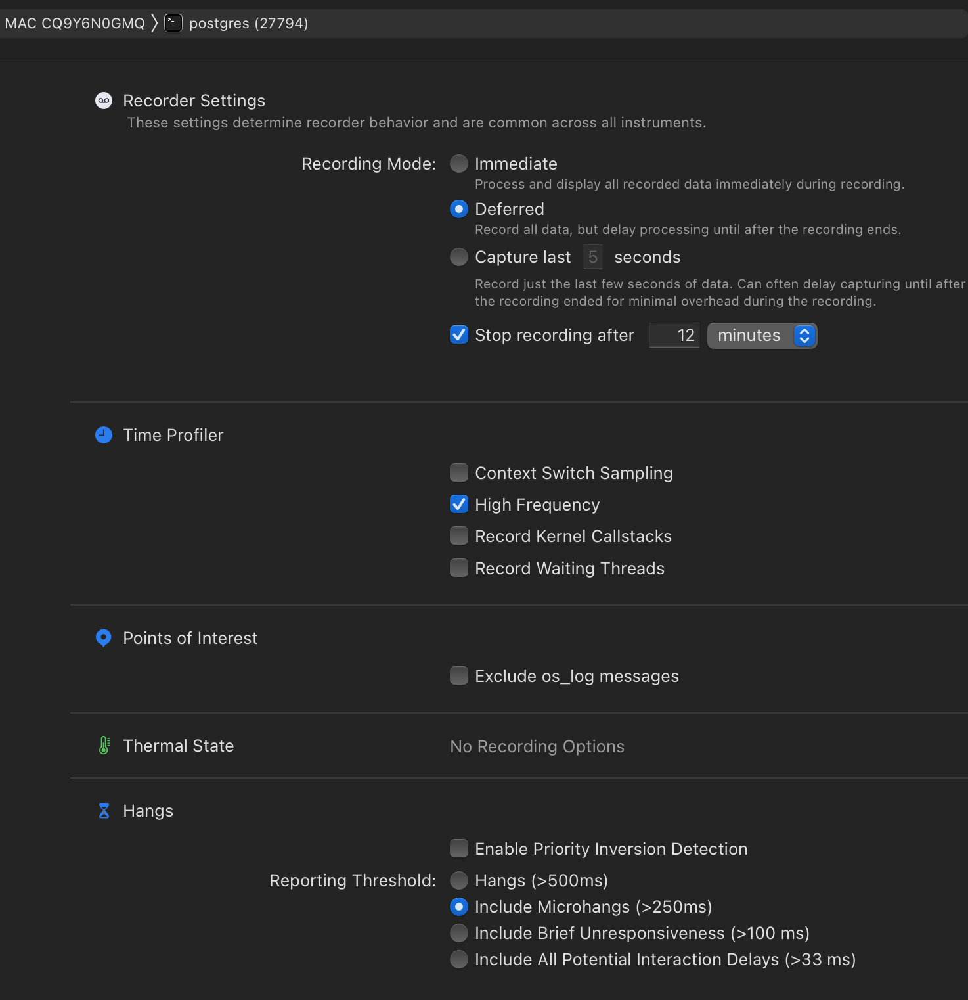
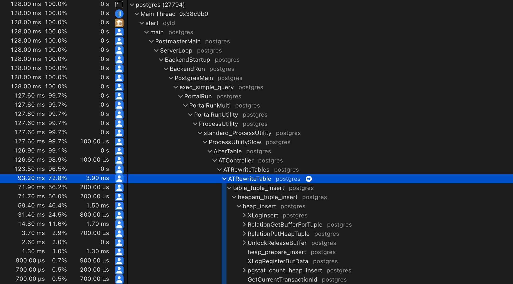
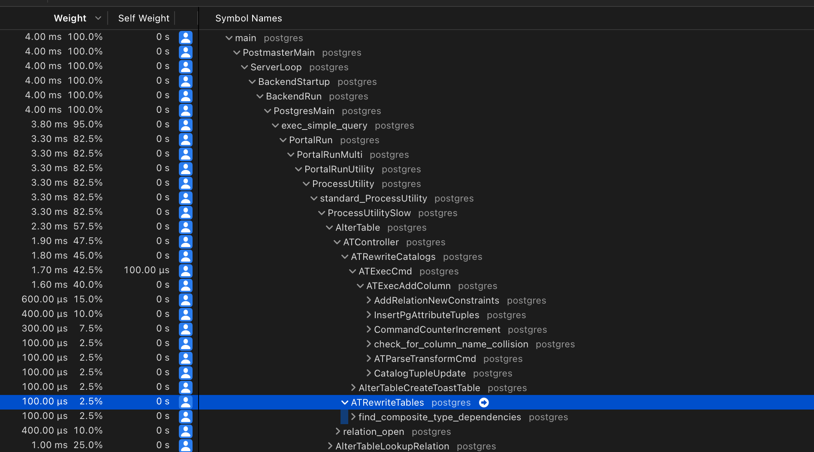

# Profiling a Django Migration in Postgres

```
Created at: 2025-02-17
```

In this post I want to start from the end. I want to look into the SQL for a
particular schema change, and then verify whether a Django migration that
produces this change is safe to run in production or not.

Let's start with a question:
_Is the following schema change safe to run in a production database?_

```sql
ALTER TABLE foo ADD COLUMN bar int NOT NULL DEFAULT 1234;
```

In this hypothetical scenario, `foo` is:

- Fairly large (over 100GB).
- Used in anger in production.
- Running on a supported Postgres version (> v12).

Without answering the question yet, I want you to consider this other
statement:

```sql
ALTER TABLE foo ADD COLUMN buzz int NOT NULL DEFAULT (random() * 10000)::int;
```

So, have you figured if either (or both) of those are safe to run?

If not, you might want to start thinking about what Postgres would have to do
in order to have a `NOT NULL` column with a `DEFAULT` value.

Would it need to scan the table and store those values in existing rows? What
if the new rows didn't fit in the page? Is there a way to do it so that
Postgres doesn't need to scan the table?

One of the worst things that can happen when you perform a schema change is for
it to end up rewriting the table. Rewriting takes time, and while the table is
being rewritten, the DDL statement will be holding an access exclusive lock,
not permitting any other sessions and transactions to read or write to the
table.

## Supposition: The table is rewritten

So starting with the first statement, let's investigate whether it rewrites the
table or not. We will first need to get the `foo` table up, and populate it.

```sql
-- Create the table
DROP TABLE IF EXISTS foo;
CREATE TABLE foo (id SERIAL PRIMARY KEY);

-- Insert 100_000 rows.
INSERT INTO foo (id) SELECT generate_series(1, 100000);
```

Next, we want to know what Postgres is doing internally. For that, we'll need
to profile what happens when the `ALTER TABLE` command is running.

Note: As I am writing this post on a Mac, I will use "Instruments" to profile
Postgres, but if you are on a Linux machine you can use `perf` instead. I wrote
a guide
[here](https://marcelofern.com/notes/databases/postgres/internals/profiling_postgres_on_linux.html)
for the Linux users.

The first step is to grab the process id of the `psql` shell we are going to
use for profiling:

```sql
SELECT pg_backend_pid();
```

Then, open the "Time Profiler" tool on Instruments.


And find the Postgres process. In terms of configuration I mostly use the
defaults. I only change the frequency to "High", and recording mode to
"Deferred":



Now we hit `RECORD`, and perform these statements on psql:

```sql
BEGIN;
ALTER TABLE foo ADD COLUMN buzz int NOT NULL DEFAULT (random() * 1000)::int;
```

And then we hit `STOP`. The profiler result would look something like this:



There is a suspicious call to `ATRewriteTable`... This is not good!

Let's see what the other alter table with a constant default does. But first,
let's rollback that transaction.

```sql
ROLLBACK;
```

And now let's run our Time Profiler and then execute the command:

```sql
BEGIN;
ALTER TABLE foo ADD COLUMN bar int NOT NULL DEFAULT 12345;
```



Wait a minute... Is this calling `ATRewriteTables`?

Yes! But this is a false positive... Calling this function doesn't mean that it
is actually rewritting the table. Perhaps a better name for that function
should be `ATMaybeRewriteTables`? ...

In any case, if `ATRewriteTables` is going to actually do anything, it will
call the `ATRewriteTable` (note the singular) function, where the magic
happens.

But also, scrolling down that function I see this pattern:

```c
	if (newrel || needscan)
	{
		if (newrel)
			ereport(DEBUG1,
					(errmsg_internal("rewriting table \"%s\"",
									 RelationGetRelationName(oldrel))));
		else
			ereport(DEBUG1,
					(errmsg_internal("verifying table \"%s\"",
									 RelationGetRelationName(oldrel))));
```

So this means that Postgres writes to the logger when it's rewriting or
verifying a table. This configuration can be turned on by:

```sql
SET client_min_messages=debug1;
```

So if we run the SQL statements again, we'll see that log message showing up in
the `psql` shell:

```sql
BEGIN;

ALTER TABLE foo ADD COLUMN buzz int NOT NULL DEFAULT (random() * 10000)::int;
-- DEBUG:  rewriting table "foo"

-- This one doesn't print anything, as the table is not rewritten.
ALTER TABLE foo ADD COLUMN bar int NOT NULL DEFAULT 12345;

ROLLBACK;
```

## The Django Equivalent

Say we have the following "dumb" model:

```python
class Foo(models.Model):
    pass
```

Let's add a new integer field with a default:

```python
class Foo(models.Model):
    bar = models.IntegerField(null=False, default=10)
```

Django will create the following migration automatically:

```py
# Generated by Django 5.1.6 on 2025-02-17 05:54

from django.db import migrations, models


class Migration(migrations.Migration):

    dependencies = [
        ('app', '0001_initial'),
    ]

    operations = [
        migrations.AddField(
            model_name='foo',
            name='bar',
            field=models.IntegerField(default=10),
        ),
    ]
```

Which results in these SQL statements:

```sql
BEGIN;
--
-- Add field bar to foo
--
ALTER TABLE "myfoo" ADD COLUMN "bar" integer DEFAULT 10 NOT NULL;
ALTER TABLE "myfoo" ALTER COLUMN "bar" DROP DEFAULT;
COMMIT;
```

Why is Django creating a default and dropping it immediately?
This happens due to the consequences of three considerations:

1. Django allows `default` to be a callable:
    ```py
    def my_default():
        import random
        return random.randint(0, 42)

    class Foo(models.Model):
        bar = models.IntegerField(null=False, default=my_default)
    ```
    In this case, Django grabs the first value returned by `my_default` as the
    value to generate the DDL statement. If you run `sqlmigrate` multiple
    times, it will even generate different outputs!
    ```sql
    -- ./manage.py sqlmigrate app 0004

    BEGIN;
    ALTER TABLE "foo" ADD COLUMN "bar" integer DEFAULT 15 NOT NULL;
    ALTER TABLE "foo" ALTER COLUMN "bar" DROP DEFAULT;
    COMMIT;

    -- ./manage.py sqlmigrate app 0004

    BEGIN;
    --
    -- Add field bar to foo
    --
    ALTER TABLE "foo" ADD COLUMN "bar" integer DEFAULT 4 NOT NULL;
    ALTER TABLE "foo" ALTER COLUMN "bar" DROP DEFAULT;
    COMMIT;
    ```
2. As a consequence of the above, the callable may contain a very complex logic
   that isn't able to be reproduced as SQL. This means that Django has to
   enforce the default in the application level, not in the database level.
3. If the above is true, why have a `DEFAULT` then? That's because adding a NOT
   NULL without a default in an existing table is an error in Postgres:
   ```sql
   ALTER TABLE foo ADD COLUMN buzz_buzz int NOT NULL;
   -- ERROR:  column "buzz_buzz" of relation "foo" contains null values
   ```

We can see these limitations as a consequence of Django's design to allow the
`default` argument to work with callables.

## Further Problems

If your database can be used by people from _outside_ the Django application,
the defaults won't be honoured. From a data-integrity perspective, it is best
to enforce rules on the database than on the application.

## A Little Plot Twist

Luckily, Django 5.0 now includes the parameter `Field.db_default` that allows
the default to be enforced on the database level!

So you can have this change:

```python
class Foo(models.Model):
    bar = models.IntegerField(null=False, db_default=10)
```

Which creates these changes:

```sql
BEGIN;
--
-- Add field bar to foo
--
ALTER TABLE "myfoo" ADD COLUMN "bar" integer DEFAULT 10 NOT NULL;
COMMIT;
```

Note how the `DEFAULT` is not dropped in this case.
