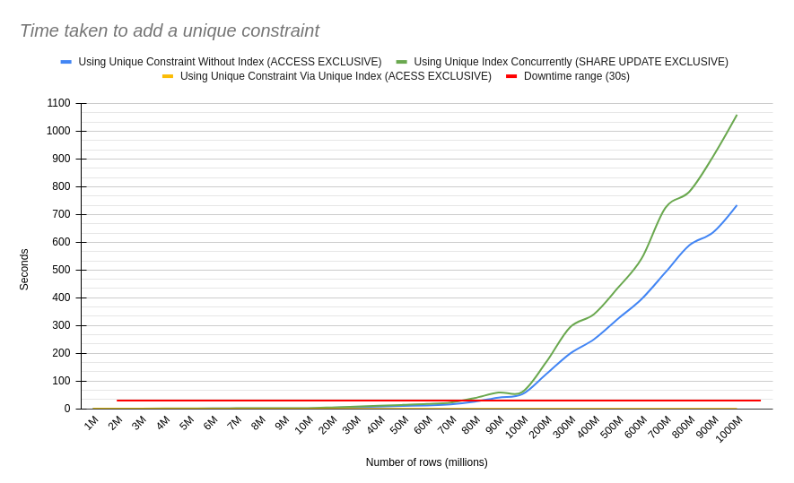

# Postgres Unique Constraints Without Downtime

```
Created at: 2024-10-01
```

The syntax for adding a unique constraint in Postgres is as follow:

```sql
ALTER TABLE "table_name"
ADD CONSTRAINT "unique_constraint_on_foo"
UNIQUE ("foo");
```

This constraint will prevent multiple rows having the same value stored in
the `foo` column.

However, this operation acquires an `ACCESS EXCLUSIVE` lock, blocking all reads
and writes to the table until it's finished.

If you are adding a unique constraint to a large table, the amount of time
spent to create the constraint might be prohibitive.

## How To Safely Add a Unique Constraint Without Downtime

From the Postgres documentation:

> PostgreSQL automatically creates a unique index when a unique constraint or
> primary key is defined for a table.

Creating this index on the background while holding an `ACCESS EXCLUSIVE` is
the problem we are trying to avoid.

What we want to do is **create the index first**, and **CONCURRENTLY**, so that
when we add the constraint to the table, the table can use the already existing
index. This will make the subsequent `ALTER TABLE` much faster to run.

If you have the following table:

```sql
CREATE TABLE example_table (
    id SERIAL PRIMARY KEY,
    int_field INT
);
```

You can create a unique index concurrently (this won't block any reads or
writes on this table), with the following command:

```sql
SET lock_timeout '0';

CREATE UNIQUE INDEX CONCURRENTLY IF NOT EXISTS unique_int_field_idx
ON example_table (int_field);
```

Side Note 1: If you are using any value of `lock_timeout` that is not zero, you
have to set it to zero before you create the index. This will prevent leaving
an invalid index behind if the operation fails due to a time out.

Side Note 2: You cannot use a partial index here. Postgres allows the creation
of partial unique indexes, but it does not allow the creation of partial unique
constraint. The documentation states
[source](https://web.archive.org/web/20240928225017/https://www.postgresql.org/docs/current/ddl-constraints.html):

>  A uniqueness restriction covering only some rows cannot be written as a
>  unique constraint, but it is possible to enforce such a restriction by
>  creating a unique partial index.

If you try to use a partial index to create a unique constraint, Postgres will
raise the following error:
```
ERROR:  "unique_int_field_idx" is a partial index
```

Therefore, if you need a partial unique restriction, just keep your index. It
will be enough.

Once this command finished, you can add the new constraint USING the index
above:

```sql
SET lock_timeout '10s'

BEGIN;

ALTER TABLE example_table
ADD CONSTRAINT unique_int_field UNIQUE USING INDEX unique_int_field_idx;

COMMIT;
```

The operation above takes virtually no time.

Note: I have reset lock_timeouts to a reasonable value (10s) and started a
transaction to add the constraint to the table. This is a safeguard. If there
is a long-running transaction that would block the ALTER TABLE statement, which
in turn would block all reads and writes, the statement will time out instead
of causing a potential outage.

## Why not just use the index for constraint validation?

Both the unique index and constraint raise the same error when an insert
attempt fails: "duplicate key value violates unique constraint."

So why would one bother even creating the constraint if the index suffice?

From an old (v9.4) Postgres documentation:
 
> Note: The preferred way to add a unique constraint to a table is ALTER TABLE
> ... ADD CONSTRAINT. The use of indexes to enforce unique constraints could be
> considered an implementation detail that should not be accessed directly. One
> should, however, be aware that there's no need to manually create indexes on
> unique columns; doing so would just duplicate the automatically-created
> index.

[source](https://www.postgresql.org/docs/9.4/indexes-unique.html)

This note has since been removed from Postgres since version 9.5.
The commit that removed the note ([049a7799dfc](https://github.com/postgres/postgres/commit/049a7799dfc)) says:

> docs: remove outdated note about unique indexes

There is no guidance on why that was outdated and how unique indexes should be
interpreted.

The differences remaining are:

- Constraints can be deferred.
- Indexes can be partial, which is useful if uniqueness is restricted to a
  subset of data. You **cannot** add a table constraint from a partial index.
  Make sure your index wasn't created with "WHERE ...".
- If you care about the SQL standard, constraints are part of it, whereas
  indexes aren't (they're an implementation detail).
- External tools that care about uniqueness being defined through constraints
  might care about it and not work properly if the constraint isn't defined on
  the schema.

## Timing Different Approaches

The Python script below times how long it takes to add a constraint using two
approaches:

- ALTER TABLE **without** a pre-existing index.
- ALTER TABLE **with** a pre-existing index.

Note: These results were taken from a **local** database without any
concurrency.

TLDR: Creating an index concurrently first, and then using it to create the
constraint takes a little longer in total, but is a much safer approach.

First, the results in, and then the script:



CSV:

```
rows,unique constraint without index,unique index,unique constraint using index
1000000, 0.18, 0.23, 0.0
2000000, 0.38, 0.51, 0.0
3000000, 0.57, 0.8, 0.0
4000000, 0.74, 1.06, 0.0
5000000, 0.9, 1.3, 0.0
6000000, 1.11, 1.55, 0.0
7000000, 1.25, 1.84, 0.01
8000000, 1.58, 2.14, 0.0
9000000, 1.61, 2.4, 0.0
10000000, 1.78, 2.52, 0.0
20000000, 3.72, 4.97, 0.0
30000000, 5.52, 8.07, 0.0
40000000, 7.93, 10.77, 0.0
50000000, 10.16, 13.91, 0.0
60000000, 12.17, 17.24, 0.0
70000000, 15.74, 22.68, 0.01
80000000, 25.58, 38.55, 0.0
90000000, 40.45, 58.64, 0.0
100000000, 52.37, 60.59, 0.0
200000000, 124.62, 168.0, 0.0
300000000, 198.78, 293.85, 0.0
400000000, 250.16, 340.47, 0.01
500000000, 323.56, 435.08, 0.0
600000000, 395.54, 541.21, 0.0
700000000, 491.53, 724.37, 0.0
800000000, 589.03, 782.12, 0.0
900000000, 635.95, 909.58, 0.0
1000000000, 734.21, 1059.35, 0.01
```

## The script

```python
import psycopg2
import time
import os


def get_cursor_and_connection():
    # Update connection details as per your PostgreSQL setup
    conn = psycopg2.connect(
        dbname="test_db",
        user="postgres",
        password="postgres",
        host="localhost",
        port="5441",
    )
    conn.autocommit = True
    return conn.cursor(), conn


def vacuum_table(cursor):
    """
    Vacuum is necessary to optimise the table
    structure before we perform the benchmark.

    It ensures that the performance tests are
    not affected by any leftover internal
    inconsistencies or unnecessary disk overhead
    from unvacuumed data.

    It also prevents autovacuum'ing from interfering
    on test results.

    The ANALYZE part is there to better inform
    Postgres on how to find the best planner
    for the ALTER TABLE / index
    """
    print("Vacuuming example_table...")
    cursor.execute("VACUUM ANALYZE example_table;")


def create_table(cursor):
    print("Creating table...")
    cursor.execute("""
        DROP TABLE IF EXISTS example_table;
        CREATE TABLE example_table (
            id SERIAL PRIMARY KEY,
            int_field INT
        );
    """)


def insert_data(cursor, num_rows):
    print(f"Inserting {num_rows} unique rows...")
    cursor.execute(f"""
        INSERT INTO example_table (int_field)
        SELECT s
        FROM (
            SELECT generate_series(1, {num_rows}) AS s
            ORDER BY RANDOM()
        ) AS shuffled;
    """)


def clear_cache():
    print("Clearing cache by restarting docker container...")
    os.system("docker restart postgres15")
    print("sleeping for 10s")
    time.sleep(10)


def add_unique_constraint(cursor, conn):
    print("Adding unique constraint directly...")
    start_time = time.time()
    cursor.execute("""
        ALTER TABLE example_table
        ADD CONSTRAINT unique_int_field UNIQUE (int_field);
    """)
    conn.commit()
    duration = time.time() - start_time
    print(f"Time taken to add unique constraint: {duration:.2f} seconds")
    return duration


def add_unique_constraint_with_index_first(cursor, conn):
    print("Creating unique index...")
    idx_start_time = time.time()
    cursor.execute("""
        CREATE UNIQUE INDEX CONCURRENTLY IF NOT EXISTS unique_int_field_idx
        ON example_table (int_field);
    """)
    conn.commit()
    idx_duration = time.time() - idx_start_time
    print(f"Time taken to add index: {idx_duration:.2f} seconds")

    print("Adding unique constraint using index...")
    start_time = time.time()
    cursor.execute("""
        ALTER TABLE example_table
        ADD CONSTRAINT unique_int_field UNIQUE USING INDEX unique_int_field_idx;
    """)
    conn.commit()
    constraint_duration = time.time() - start_time
    print(
        f"Time taken to add unique constraint with index first: {constraint_duration:.2f} seconds"
    )
    return idx_duration, constraint_duration


def run_tests(table_sizes):
    results = {}

    for num_rows in table_sizes:
        print(f"\nRunning tests with {num_rows} rows...")

        # Get a cursor to run queries.
        cursor, conn = get_cursor_and_connection()

        # Create the table and insert data
        create_table(cursor)
        insert_data(cursor, num_rows)
        conn.commit()

        # Vacuum the table after inserting rows
        vacuum_table(cursor)

        # Clear OS cache and get a new cursor
        clear_cache()
        cursor, conn = get_cursor_and_connection()

        # Test 1: Add unique constraint directly
        time_direct = add_unique_constraint(cursor, conn)

        # Clear OS cache again and get a new cursor
        clear_cache()
        cursor, conn = get_cursor_and_connection()

        # Test 2: Create index first, then add unique constraint
        create_table(cursor)  # Drop and recreate the table
        insert_data(cursor, num_rows)
        conn.commit()
        vacuum_table(cursor)

        # Clear OS cache and get a new cursor
        clear_cache()
        cursor, conn = get_cursor_and_connection()

        idx_duration, constraint_duration = add_unique_constraint_with_index_first(
            cursor, conn
        )

        results[num_rows] = {
            "direct_constraint": time_direct,
            "index_then_constraint": {
                "idx_duration": idx_duration,
                "constraint_duration": constraint_duration,
            },
        }

    cursor.close()
    conn.close()

    # Print final results
    print("\nTest Results:")
    for num_rows, times in results.items():
        print(f"Rows: {num_rows}")
        print(f" - Direct constraint: {times['direct_constraint']:.2f} seconds")
        print(
            f" - Index then constraint: \n"
            f"   - {times['index_then_constraint']['idx_duration']:.2f} seconds (idx)\n"
            f"   - {times['index_then_constraint']['constraint_duration']:.2f} seconds (constraint)"
        )


table_sizes = [
    1_000_000,
    2_000_000,
    3_000_000,
    4_000_000,
    5_000_000,
    6_000_000,
    7_000_000,
    8_000_000,
    9_000_000,
    10_000_000,
    20_000_000,
    30_000_000,
    40_000_000,
    50_000_000,
    60_000_000,
    70_000_000,
    80_000_000,
    90_000_000,
    100_000_000,
    200_000_000,
    300_000_000,
    400_000_000,
    500_000_000,
    600_000_000,
    700_000_000,
    800_000_000,
    900_000_000,
    1_000_000_000,
]
run_tests(table_sizes)
```
